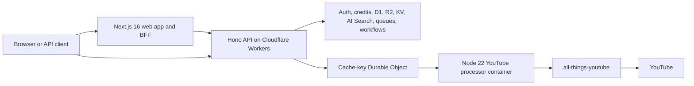

<p align="center">
  
</p>
<h1 align="center">video2ctx</h1>
<p align="center"><strong>Turn videos into useful context for LLMs and AI agents.</strong></p>
<p align="center">
  <a href="https://www.npmjs.com/package/all-things-youtube"></a>
  <a href="https://www.npmjs.com/package/@video2ctx/cli"></a>
  <a href="https://nodejs.org/"></a>
  <a href="./LICENSE"></a>
</p>
<p align="center">
  <a href="https://www.video2ctx.dev">Live product</a> ·
  <a href="https://docs.video2ctx.dev">Documentation</a> ·
  <a href="#agent-skills-and-cli">Agent Skills and CLI</a> ·
  <a href="./packages/all-things-youtube/README.md">npm library</a> ·
  <a href="#run-the-workspace-locally">Developer setup</a>
</p>

## What is video2ctx?

LLMs and agents can understand text easily. Video is harder. Useful information is spread across transcripts, channels, frames, comments, playlists, and other metadata.

video2ctx aims to make video data as easy for LLMs and agents to access and understand as text. It goes beyond transcripts to bring together the context around a video—where it came from, how it connects to other videos, and what its audience is saying.

This data is often scattered and difficult to access consistently. video2ctx makes it available through simple tools for developers, researchers, and agents. YouTube is the first supported video source, with room for more providers in the future.

**video2ctx is 100% open source.** You can use the hosted API, run the complete product yourself, or build on top of its components.

Available now:

- Search and inspect videos, channels, and playlists through normalized responses.
- Retrieve caption tracks, translated transcripts, timed segments or words, comments, and end-screen links.
- Ask questions against indexed sources and keep conclusions connected to citations.
- Organize exact video moments and notes into private research projects.
- Compare topic momentum, monitor new material, and export collected research.
- Access the data through the dashboard, hosted API, published agent skills, `@video2ctx/cli`, or the `all-things-youtube` npm package.

> **Project status:** video2ctx is under active development. The platform API is versioned under `/v1`, but product behavior and pricing may still evolve. The supported external provider is currently YouTube.

## Choose how to use it

| If you need…                                       | Start here                                                                                                                                                                                                           |
| -------------------------------------------------- | -------------------------------------------------------------------------------------------------------------------------------------------------------------------------------------------------------------------- |
| A visual research workspace                        | [Open video2ctx](https://www.video2ctx.dev)                                                                                                                                                                          |
| A hosted API for an agent or application           | [Create an API key](https://www.video2ctx.dev/dashboard/developer), then use the [interactive API reference](https://docs.video2ctx.dev/api-reference/introduction)                                                  |
| Local YouTube context from a supported agent       | Use [`youtube-ctx`](./.agents/skills/youtube-ctx) for direct data and progressive visual inspection with no video2ctx account, API key, hosted service, or npm installation                                          |
| The hosted platform from a supported agent         | Install [`@video2ctx/cli`](./packages/video2ctx-cli), then use [`video2ctx-platform`](./.agents/skills/video2ctx-platform) for production or cloud-backed YouTube data, account access, and recurring workflows             |
| A server-side TypeScript YouTube client            | Install [`all-things-youtube`](./packages/all-things-youtube/README.md) from npm                                                                                                                                     |
| To contribute to or self-host the complete product | [Run the workspace locally](#run-the-workspace-locally)                                                                                                                                                              |

## Agent Skills and CLI

For the complete hosted agent setup, install the CLI, authenticate, and add the companion skills:

```bash
npm install --global @video2ctx/cli
video2ctx auth login
npx skills add devhims/video2ctx
video2ctx whoami --json
```

The CLI and skills are complementary. The CLI owns browser authentication, hosted transport, retries, credential storage, and machine-readable commands. The skills teach agents which route to choose and how to use each operation safely.

The collection contains two skills with separate responsibilities:

- **`youtube-ctx`** handles one-off public YouTube context directly from the user's machine. Its direct branch covers search, transcripts, metadata, comments, channels, and playlists. Its visual branch scans a storyboard/transcript index first and extracts focused frames with local FFmpeg only when the requested detail requires them.
- **`video2ctx-platform`** handles authenticated production and cloud-backed work. Its data branch covers managed search, transcripts, video and channel metadata, caption tracks, comments, end screens, playlists, account and usage requests, and automatic fallback when direct local access fails. Its monitoring branch covers recurring checks, schedules, alerts, and notification preferences.

The local skill carries both Node executables. If local public YouTube access is all you need, install it without the hosted CLI. The `youtube-ctx` storyboard scan needs no additional dependency; install FFmpeg only for exact-frame verification:

```bash
npx skills add devhims/video2ctx
```

The browser flow stores a revocable CLI session in private local configuration. For unattended environments, set `VIDEO2CTX_API_KEY` to a personal key instead. Never place credentials in prompts, logs, screenshots, or source control.

After installation, an agent should use `youtube-ctx` for personal, low-to-moderate local text, metadata, and visual context, and `video2ctx-platform` for managed hosted YouTube data, production or cloud-backed applications, account access, direct-access fallback, or recurring work. See the [`@video2ctx/cli` README](./packages/video2ctx-cli/README.md) and the [published skills](./.agents/skills) for the complete contracts.

## Under development

- **Hosted visual context:** Bring local storyboard and frame extraction into managed jobs after media-compliance, artifact-retention, and metering work.
- **Hosted agent tools:** Continue expanding the hosted data and monitoring branches while keeping authentication revocable and local to the user's machine.

## Hosted API quick start

Create a personal API key in the developer dashboard. Send it as a bearer token:

```bash
export VIDEO2CTX_API_KEY='aty_…'

curl \
  --header "Authorization: Bearer $VIDEO2CTX_API_KEY" \
  https://api.video2ctx.dev/v1/providers/youtube/videos/dQw4w9WgXcQ
```

API keys, device-authorized CLI sessions, and browser sessions use the same account and credit balance. Metered responses include `X-Credits-Charged` and `X-Credits-Remaining` headers. `X-API-Key` remains supported for compatibility, but bearer authentication is preferred.

Useful entry points:

- Interactive Scalar reference: <https://api.video2ctx.dev/docs>
- OpenAPI 3.1 document: <https://api.video2ctx.dev/openapi.json>
- Service health: <https://api.video2ctx.dev/health>
- Detailed UI-to-API flows: [`reference/engineering/UI_API_REFERENCE.md`](./reference/engineering/UI_API_REFERENCE.md)

## Use the standalone library

The platform's public YouTube data layer is also published as a focused TypeScript package:

```bash
npm install all-things-youtube
```

```ts
import { getTranscript } from 'all-things-youtube';

const transcript = await getTranscript({
  videoId: 'S4tdkSVuxZA',
  lang: 'hi',
  granularity: 'word',
});

console.log(transcript.text);
```

YouTube's native storyboard contact sheets are available as a package primitive:

```ts
import { getStoryboard } from 'all-things-youtube';

const storyboard = await getStoryboard({
  videoId: '4vItmdk8F_M',
  outputDir: '/tmp/youtube-storyboard',
  maxSheets: 12,
});

console.log(storyboard.sheets);
```

The package requires Node.js 18 or newer, includes its own types, and does not require a YouTube Data API key. Keep it server-side: browser requests are commonly blocked by CORS and distribute upstream rate-limit pressure across users.

See the [package README](./packages/all-things-youtube/README.md) for its complete API, pagination, translation, retry, error-handling, and stability contracts.

## Run the workspace locally

### Prerequisites

- [Node.js 22](https://nodejs.org/) and npm
- [Docker](https://docs.docker.com/get-docker/) running locally for YouTube cache misses
- A Cloudflare account for the shared remote-preview workflow and remote-backed AI Search features

### 1. Clone and install

```bash
git clone https://github.com/devhims/video2ctx.git
cd video2ctx

npm ci --prefix packages/all-things-youtube
npm ci --prefix packages/youtube-skills
npm ci --prefix packages/video2ctx-cli
npm ci --prefix platform
npm ci --prefix platform/youtube-processor
npm ci --prefix web
npm ci --prefix docs

cp platform/.dev.vars.example platform/.dev.vars
```

Replace the `BETTER_AUTH_SECRET` placeholder in `platform/.dev.vars` with at least 32 random characters. The other blank integrations are only needed when you exercise their corresponding authentication, OAuth, billing, email, or proxy flows. Never commit `.dev.vars` or `.env.local` files.

### 2. Start the platform

Start the complete local stack with one command:

```bash
npm run dev
```

This applies local D1 migrations, starts the platform on port 8787, and starts
the web application on port 3000. It also pins the web proxy to the local
platform even when `web/.env.local` contains a hosted API URL. Open
<http://localhost:3000> when both services are ready.

The fully local path keeps D1 state on your machine. To run each service in a
separate terminal instead, use:

```bash
npm --prefix platform run db:migrate:local
npm --prefix platform run dev:local -- --port 8787
```

Wrangler builds and starts the private YouTube processor container on the first uncached provider request, so Docker must already be running.

### 3. Start the web application (manual setup only)

In a second terminal:

```bash
npm --prefix web run dev -- --port 3000
```

Open <http://localhost:3000>. Requests under `/api/platform/*` are proxied to <http://localhost:8787>. On localhost, the first-party UI automatically uses an isolated demo identity, so Google sign-in is not required for normal development.

For direct private API calls, provide any stable local-only demo identity:

```bash
curl \
  --header 'X-Demo-User: readme-local' \
  'http://localhost:8787/v1/providers/youtube/search?q=video%20research'
```

`X-Demo-User` is rejected in production.

### Remote preview resources

The default platform command uses the preview D1 database and Workers KV namespace declared in `platform/wrangler.jsonc`. This path requires Cloudflare authentication and touches shared preview resources:

```bash
npm --prefix platform run db:migrate:preview
npm --prefix platform run dev -- --port 8787
```

Production migrations are intentionally separate and must not be used for routine development.

## Architecture



The Worker owns authentication, authorization, rate limits, credit metering, caching, private research, and the public HTTP contract. Outbound YouTube work is isolated in a private Cloudflare Container. Identical cache misses are coalesced by a Durable Object before the request reaches a processor instance; cache hits never wake a container.

The processor image installs the pinned, published `all-things-youtube` version. Local library source is not copied into that production image. Publish and pin a library release before deploying platform behavior that depends on library changes.

For the complete request path and reliability model, see [`reference/engineering/IMPLEMENTATION.md`](./reference/engineering/IMPLEMENTATION.md).

## Repository layout

| Path                                                            | Purpose                                                                                                          |
| --------------------------------------------------------------- | ---------------------------------------------------------------------------------------------------------------- |
| [`web/`](./web)                                                 | Next.js 16 and React 19 product UI, authentication endpoints, and same-origin platform proxy; deployed on Vercel |
| [`platform/`](./platform)                                       | TypeScript/Hono Cloudflare Worker with auth, API keys, billing, D1, R2, KV, AI, queues, workflows, and OpenAPI   |
| [`platform/youtube-processor/`](./platform/youtube-processor)   | Private Node 22/Hono container for outbound YouTube operations and optional proxy egress                         |
| [`packages/all-things-youtube/`](./packages/all-things-youtube) | Publishable normalized YouTube client and public TypeScript data model                                           |
| [`packages/youtube-skills/`](./packages/youtube-skills)         | Private source, tests, and bundling for the self-contained direct YouTube skills                                 |
| [`packages/video2ctx-cli/`](./packages/video2ctx-cli)           | Independently published CLI for device login and authenticated hosted API access                                 |
| [`docs/`](./docs)                                               | Public Mintlify documentation site                                                                               |
| [`reference/`](./reference)                                     | Internal architecture, design, deployment, and agent guidance                                                    |
| [`.github/workflows/ci.yml`](./.github/workflows/ci.yml)        | Pull-request verification for the platform and web application                                                   |

## Configuration

Local secret placeholders are documented in [`platform/.dev.vars.example`](./platform/.dev.vars.example). Non-secret Cloudflare bindings and plan limits live in [`platform/wrangler.jsonc`](./platform/wrangler.jsonc).

| Variable                                                            | Used by   | Purpose                                                                                              |
| ------------------------------------------------------------------- | --------- | ---------------------------------------------------------------------------------------------------- |
| `BETTER_AUTH_SECRET`                                                | Platform  | Signs and secures authentication state; required for local auth initialization                       |
| `GOOGLE_CLIENT_ID`, `GOOGLE_CLIENT_SECRET`                          | Platform  | Google sign-in and optional YouTube OAuth                                                            |
| `YOUTUBE_OAUTH_ENCRYPTION_KEY`                                      | Platform  | Encrypts stored YouTube refresh tokens                                                               |
| `TURNSTILE_SECRET`                                                  | Platform  | Protects selected production endpoints                                                               |
| `STRIPE_SECRET_KEY`, `STRIPE_WEBHOOK_SECRET`, `STRIPE_PRO_PRICE_ID` | Platform  | Subscription checkout and webhook processing                                                         |
| `UPSTASH_REDIS_REST_URL`, `UPSTASH_REDIS_REST_TOKEN`                | Platform  | Stores the anonymous landing-page rolling quota                                                      |
| `LANDING_RATE_LIMIT_SALT`                                           | Platform  | HMAC-hashes visitor IPs before they are used as Redis keys                                           |
| `OUTBOUND_PROXY_URL`                                                | Processor | Optional HTTP(S) proxy for outbound YouTube traffic                                                  |
| `PLATFORM_API_BASE_URL`                                             | Web       | Overrides the platform origin; defaults to localhost in development and the public API in production |
| `NEXT_PUBLIC_PLATFORM_API_BASE_URL`                                 | Web       | Browser-visible platform origin used by the anonymous landing-page inspection                        |
| `NEXT_PUBLIC_TURNSTILE_SITE_KEY`                                    | Web       | Browser-visible Turnstile site key used by the Scale inquiry form                                    |

Do not place production secrets in Git or build variables. Add Cloudflare runtime secrets interactively as described in [`reference/engineering/IMPLEMENTATION.md`](./reference/engineering/IMPLEMENTATION.md#cloudflare-setup).

## Development and verification

Common commands, run from the repository root:

| Command                                                   | Purpose                                                                                     |
| --------------------------------------------------------- | ------------------------------------------------------------------------------------------- |
| `npm run build`                                           | Type-check/build the library, platform, and web application                                 |
| `npm test`                                                | Run the library and complete platform test suites                                           |
| `npm --prefix web test`                                   | Run web unit tests                                                                          |
| `npm --prefix platform run verify`                        | Install processor dependencies, type-check the Worker, and run platform and processor tests |
| `npm --prefix platform run test:container`                | Run only the processor contract tests                                                       |
| `npm --prefix packages/all-things-youtube run test:watch` | Run the library suite in watch mode                                                         |
| `npm run test:skills`                                    | Test, type-check, and verify the private direct-skill source and committed bundles          |
| `npm run skill:bundle`                                   | Regenerate the committed self-contained direct-skill executables                            |
| `npm --prefix packages/video2ctx-cli run verify`          | Test and build the hosted-service CLI                                                       |
| `npm pack ./packages/video2ctx-cli --dry-run`             | Verify the public CLI tarball contents before release                                       |
| `npm run docs:dev`                                        | Preview the Mintlify documentation site locally                                             |
| `npm run docs:generate`                                   | Regenerate the consumer OpenAPI file and internal endpoint inventory                        |
| `npm run docs:check`                                      | Fail when generated documentation artifacts are stale                                       |
| `npm run docs:verify`                                     | Validate the Mintlify build, links, and accessibility                                       |

Before opening a pull request, run:

```bash
npm run build
npm test
npm run test:skills
npm --prefix web test
npm run docs:check
npm run docs:verify
```

Pull requests also run the `Platform`, `Web`, and `Documentation` GitHub Actions checks. Keep changes focused, include regression coverage for behavior changes, and update the OpenAPI document and API docs when a route contract changes.

## Documentation

- [Mintlify documentation source](./docs) — dashboard guides, API quickstarts, and the generated API reference
- [`reference/engineering/IMPLEMENTATION.md`](./reference/engineering/IMPLEMENTATION.md) — backend architecture, storage, reliability, privacy, and Cloudflare setup
- [`reference/engineering/UI_API_REFERENCE.md`](./reference/engineering/UI_API_REFERENCE.md) — current UI request flows and platform route contracts
- [`reference/engineering/DEPLOYMENT.md`](./reference/engineering/DEPLOYMENT.md) — Git-triggered Vercel and Cloudflare production deployment
- [`web/README.md`](./web/README.md) — frontend-specific development and Vercel behavior
- [`platform/youtube-processor/README.md`](./platform/youtube-processor/README.md) — processor proxy, capacity, image, and verification details
- [`packages/all-things-youtube/README.md`](./packages/all-things-youtube/README.md) — standalone package reference

## Help and maintenance

Open an issue in this repository for reproducible bugs and focused feature requests. For API exploration and request/response details, start with the [interactive reference](https://docs.video2ctx.dev/api-reference/introduction).

The project is maintained by [Himanshu Gupta](https://github.com/devhims).

## Open source and service terms

The video2ctx application, platform, API, documentation, and agent tooling are open source under the [Apache License 2.0](./LICENSE). Copyright 2026 Himanshu Gupta.

The standalone [`all-things-youtube`](./packages/all-things-youtube) package is separately available under the [MIT License](./packages/all-things-youtube/LICENSE).

Use of the hosted video2ctx service is governed by the [Terms of Service](https://www.video2ctx.dev/terms) and [Privacy Policy](https://www.video2ctx.dev/privacy). The open-source licenses do not grant permission to use the video2ctx trademarks or branding in ways that imply endorsement.

video2ctx and `all-things-youtube` are independent projects and are not affiliated with, endorsed by, or sponsored by YouTube or Google. YouTube is a trademark of Google LLC. Use the software and service in accordance with the policies and laws that apply to your project.
