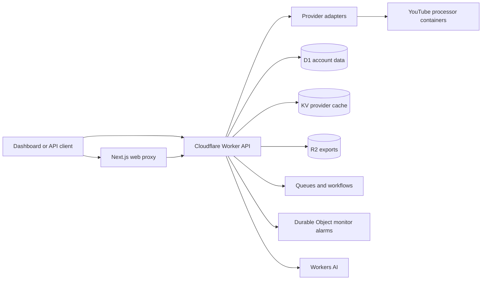

Provider data is normalized behind explicit provider routes. User-owned resources remain provider-neutral and are always scoped to the authenticated principal.

The platform uses D1 for durable account state, KV for provider caching, R2 for export objects, queues and workflows for asynchronous work, and one Durable Object identity per monitor schedule. The processor boundary isolates upstream YouTube extraction from the public Worker contract.

OpenAPI remains the source of truth for the hosted HTTP surface. The Mintlify consumer reference and internal endpoint inventory are generated from that document.
