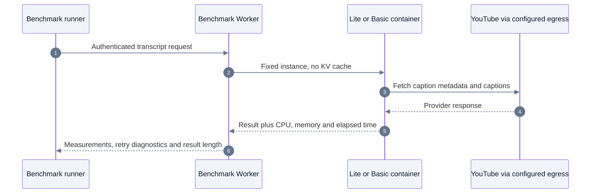

# Lite versus Basic transcript benchmark

Status: hosted comparison completed on 2026-09-23. All 128 operations succeeded.
Basic reduced warm median request latency by 48.4% serially and 60.5% at concurrency three.
See the [results and limitations](../../../reference/engineering/performance/containers-2026-09-23/README.md).
Temporary Cloudflare resources were removed. Production was subsequently upgraded to Basic; see the [production rollout and replays](../../../reference/engineering/performance/containers-2026-09-23/production-rollout.md).

This deployment isolates container sizing from API authentication, billing, KV caching,
request coalescing, and agent evidence persistence. It uses the production processor
Dockerfile, dependency lockfile, extraction app and runtime, with a separate measurement
entrypoint. Both tiers execute uncached word-granularity transcript requests. The
benchmark does not reproduce the complete public API or its cross-container fallback.
Confirm any improvement against the complete production path before a permanent switch.

Cloudflare runs the Worker, Durable Objects and containers. Our Worker authenticates the
benchmark and selects a fixed container. Our processor fetches and parses YouTube captions.
The runner measures the complete HTTP response and saves measurements without transcript text.



## Existing production evidence

Inspected 2026-09-23 using the authenticated API. Session
`d4a29455-faac-49f7-8bba-cda65b6ce6bc`, run
`b8066ff7-7e51-4737-b4cf-cf8f66556d58`:

| Video | Displayed tool duration | Processor attempts | Time inside extraction library |
| --- | ---: | --- | --- |
| `LMT-bknLmNo` | 9,864 ms | 1,933 ms NOT_FOUND; 6,055 ms success | 1,586 ms; 5,400 ms |
| `0qDlok29Wa0` | 8,851 ms | 1,738 ms NOT_FOUND; 5,388 ms success | 1,485 ms; 5,001 ms |
| `m8cOfSuBVkE` | 6,452 ms | 4,780 ms success | 3,963 ms |

All three tool calls started together. Both fallbacks moved from slot 0 to slot 1.
For `LMT-bknLmNo`, the interval from first-attempt start to final-attempt completion
was 8,235 ms, including 247 ms between attempts. The tool took another 1,629 ms
outside that interval. These timestamps cannot attribute that remainder to a specific
application component. They also do not establish whether a container was cold or CPU-bound.

The originally linked session `47526b02-49bb-4f5e-8982-d560aef26e2d` has run
`b91eead1-9deb-4515-8753-927d383a297e`. Its captured extractions took 3,809/4,391 ms
at the processor boundary versus 770/904 ms in the extraction library. This is
separate evidence of overhead outside the library, not proof of cold starts.

A local smoke replay used the same pinned library on the host's Node 25, direct egress,
and no Docker CPU limits. Six measured successes: 1,357, 1,570, 12,088 ms serially;
1,897, 1,049, 973 ms with three overlapping operations. The 12,088 ms sample included
a caption network retry. This validates the runner and demonstrates upstream variability;
it is not a Cloudflare sizing comparison or a statistically useful p95 estimate.
Private raw session responses and local samples are under ignored `.scratch/container-benchmark/`.

## Deployment scope

One new Worker, `video2ctx-container-benchmark`, with one Lite instance and one Basic
instance maximum. No production bindings, domains, databases, caches, queues or agent
sessions are modified. A dedicated secret protects every route. The runner stops both
test containers afterward. Delete the temporary Worker after collecting results.
Use the same production egress configuration in both tiers. A different proxy or
different container placement confounds the comparison; record placement from the
Cloudflare dashboard. `workerColo` identifies the Worker, not the container location.

The repository requires deployment-scope confirmation before changing shared Cloudflare
state. Once approved, from `platform/`:

```sh
npx wrangler deploy --config benchmarks/containers/wrangler.jsonc --dry-run
npx wrangler deploy --config benchmarks/containers/wrangler.jsonc
npx wrangler secret put BENCHMARK_TOKEN --config benchmarks/containers/wrangler.jsonc
# Only if production uses proxy egress, supply the same secret securely:
npx wrangler secret put OUTBOUND_PROXY_URL --config benchmarks/containers/wrangler.jsonc
```

Supply the benchmark token through the environment, never shell arguments or committed
files. From the repository root, with `BENCHMARK_URL` and `BENCHMARK_TOKEN` set:

```sh
node platform/benchmarks/containers/run.mjs
```

Default run: three forced container restart samples per tier; one warmup per tier;
ten alternating rounds across the three real videos, serially and at concurrency three.
There are 128 transcript operations total, without Worker-level fallback. Library retries
remain enabled. Request timeout is 150 seconds. Each group reports successes and failures,
plus successful-request p50/p95. Examine raw retry diagnostics separately. A restart is
not a guaranteed first-ever placement/image-download cold start; verify `uptimeAtStart`.
Container destruction here affects only the fixed benchmark instances.

The local mode needs installed processor dependencies and makes real YouTube requests:

```sh
ROUNDS=1 MAX_P95_MS=3000 node platform/benchmarks/containers/run.mjs --local
node --test platform/benchmarks/containers/run.test.mjs
platform/node_modules/.bin/vitest run --root platform test/container-benchmark.test.ts
```

`MAX_P95_MS` makes the command fail when any measured group's successful-request p95
exceeds that threshold. Any unsuccessful or empty transcript also fails the command.
The local replay was run with a 3-second threshold and exited 1 because of the network-retry
outlier. This is a reproducible measurement command, not a deterministic upstream service.

## Interpreting results

- Compare paired videos and phase/concurrency groups. Do not combine cache hits,
  restart samples, successful extractions, and failed extractions into one latency number.
- `bindingMs` includes container startup/routing, extraction and body transfer to the
  Worker. Subtract `metrics.durationMs` to estimate overhead outside the measured
  container handler; this is not a pure cold-start measurement.
- Container `durationMs` includes extraction, library retries and response serialization.
  Diagnostic `complete.elapsedMs` is the extraction library's duration.
- CPU and cgroup counters cover the entire process/container. Concurrent samples overlap;
  do not add their CPU times. Positive `throttled_usec` and stable CPU work with shorter
  wall time on Basic support CPU contention. Missing cgroup counters are unknown, not zero.
- RSS is a snapshot; cgroup memory peak covers the process lifetime. Inspect memory events
  and Cloudflare metrics for memory pressure/OOM. A Basic speedup alone cannot distinguish
  CPU from memory because both change together. The benchmark cannot record an in-process
  final measurement after an OOM kill; inspect platform logs for those failures.
- Suggested switch criterion: repeatable improvement across paired warm trials, at least
  20% and 1 second in median latency for the representative workload, no worse failure rate
  or tail latency, and confirmation on the complete API path. This is a proposed decision
  rule, not a measured result. Ten rounds give a preliminary comparison; repeat if noisy.

As checked on 2026-09-23, [Cloudflare pricing](https://developers.cloudflare.com/containers/platform/pricing/)
lists Lite as 1/16 vCPU, 256 MiB memory, 2 GB disk; Basic as 1/4 vCPU, 1 GiB memory,
4 GB disk. Memory/disk are charged on provisioned resources while running; CPU is charged
on active use. At current rates, one always-awake instance costs about $1.98/month for
Lite versus $7.21/month for Basic in memory+disk alone, using 30 days and before allowances,
CPU, egress, Worker and Durable Object charges. Two instances add about $10.45/month by
moving to Basic on that basis. Actual cost depends on how often the 30-minute idle timer
allows the containers to sleep.
