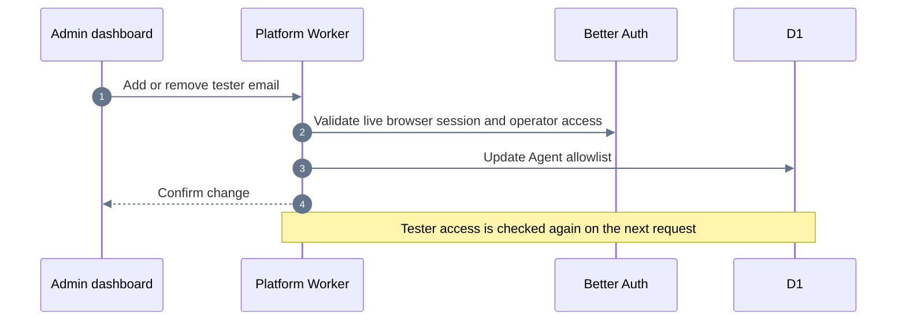

# Admin dashboard

Open **Dashboard → Admin** at `/dashboard/admin` to add, search, or remove Agent tester emails. It edits the existing D1 `agent_access_allowlist`; existing entries are preserved. Adding an email grants Agent testing access only. The account must verify its email, and its next dashboard refresh or Agent request picks up the change.

## Operator authorization

Better Auth's `admin()` server plugin and `adminClient()` client plugin are enabled. Migration `0016_better_auth_admin.sql` supplies their user and session fields. Existing users default to the `user` role.

Administrative access requires a live browser session and a currently verified, non-banned user who either has the Better Auth `admin` role or has an email in the existing `ADMIN_EMAILS_SECRET`. The latter is retained as a bootstrap path for existing operators. No new secret is required and no Agent tester is promoted automatically. To revoke an operator, remove both their admin role and any entry in the operator secret.

The shared gate bypasses Better Auth's session-cookie cache. Role changes, revoked sessions, verification changes, and bans are checked again on each administrative request. API keys, CLI bearer tokens, demo identities, and impersonated sessions cannot perform administrative operations. Ending impersonation remains available through the plugin's own session validation.

Native plugin endpoints under `/api/auth/admin/*` use the same browser-only gate. The current operator ID is passed to the plugin for that request only, allowing existing operator-secret accounts to use it without persisting an admin role. The built-in `/admin/remove-user` shortcut is disabled because it bypasses application billing, durable-state, and storage cleanup. The dashboard currently exposes Agent access management, not generic account-management controls.

The plugin enables account listing, creation and updates, role assignment, bans, session revocation, password changes, and impersonation through its API even though the dashboard has no controls for them. Treat both role-based and secret-based admins as trusted account operators. Admin status does not bypass billing limits or automatically grant Agent access, but admins can add themselves to the Agent allowlist.

## Application endpoints

| Method | Route | Purpose |
| --- | --- | --- |
| GET | `/v1/admin/access` | Check admin eligibility without listing accounts |
| GET | `/v1/admin/agent-access` | List/search tester emails with `q`, `limit`, and `offset` |
| POST | `/v1/admin/agent-access` | Add `{ "email": "tester@example.com" }` |
| DELETE | `/v1/admin/agent-access` | Remove `{ "email": "tester@example.com" }` |
| GET | `/v1/admin/jobs` | View recent jobs across accounts |

All responses are uncached. Mutations require JSON and an Origin matching `APP_ORIGIN`, in addition to the live operator check. Emails are normalized; adding or removing an entry repeatedly is safe. This also supports grants added directly in D1 with mixed case or spaces.

## Testing and rollout

The admin integration tests use the Worker runtime and local D1 to verify the bootstrap operator, the admin plugin, role revocation, verified-email checks, bans, session revocation, origin enforcement, pagination, and Agent/admin isolation. Browser tests cover grants, filtering, removal confirmation, errors, unauthorized accounts, and mobile layout.

The normal production deploy command applies pending migrations first. Existing allowlist entries need no migration or reinsertion. Admin UI changes also require the frontend deployment. Production inspection during development is read-only; local tests must never add or remove production tester emails.
