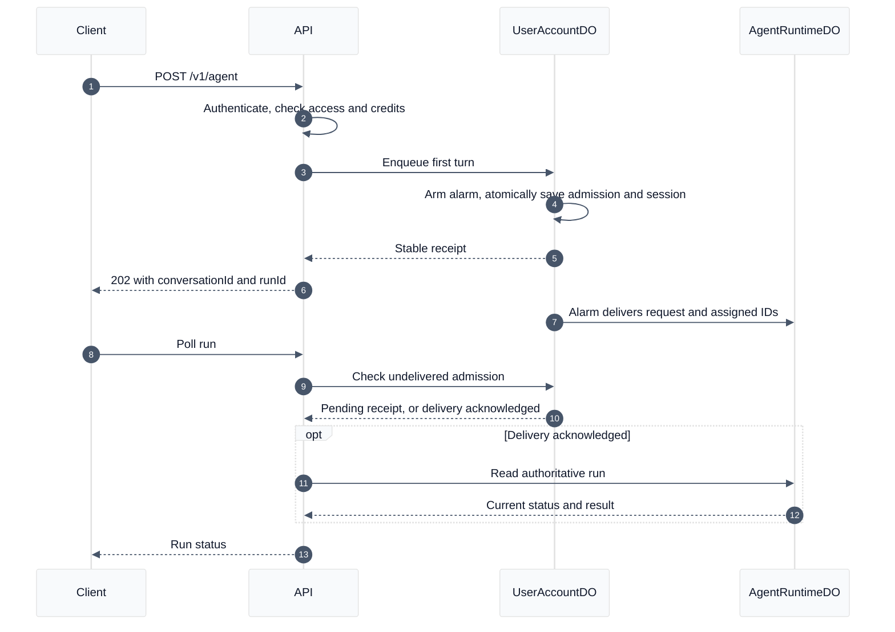

# Agent admission and startup

New conversations return HTTP 202 after UserAccountDO durably records the request,
run and message IDs, session entry, and deletion registry. A durable alarm starts
AgentRuntimeDO afterward. Conversation startup is no longer on the receipt's
critical path. Authentication, access control, and credit checks still run first.

## Guarantees and limits

- The fast path applies when the request omits conversationId and parentMessageId.
  Follow-ups retain synchronous parent and active-run validation.
- Retries with the original Idempotency-Key reuse the admission receipt and IDs.
  Existing conversations admitted before this change retain the original path.
- Polling and session restoration can read pending state before runtime startup.
  A follow-up while its first turn is queued returns HTTP 409.
- Each alarm delivers up to four admissions concurrently. Startup RPCs have a
  five-second wait bound; ambiguous failures retry the same identities with
  exponential backoff capped at 30 seconds. Delivery can complete after a timeout.
- The 60-second execution deadline starts at durable admission, not at eventual
  startup. Expired deliveries fail without starting inference. During a runtime
  outage, delivery acknowledgement and final status can take longer than this
  execution budget; pending status is not a promise of active inference.
- Admission does not reserve or charge credits. Existing runtime reservation and
  settlement safeguards remain authoritative.
- Account deletion includes queued conversations, blocks late admissions, and
  deletes queued request data. Runtime deletion tombstones prevent late delivery
  from recreating conversation data.
- Server-Timing exposes admission stages. `preflight` overlaps authentication
  stages and must not be added to them when calculating total time.

## Verification

Run `npm run build`, `npx vitest run`, and `npm run test:user-account` from platform.
The Workers integration suite covers durable receipts, delivery retries,
transaction rollback, deletion races, original deadlines, and interrupted startup.
Local HTTP measurements demonstrate the admission path only; production latency
must be measured after deployment under production authentication and networking.
