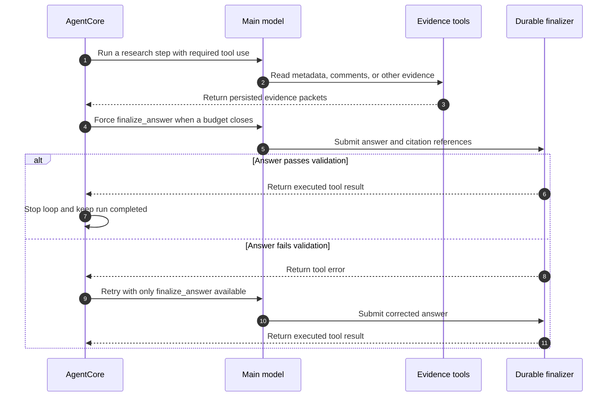

# How we made an AI agent respect its budget

An agent budget sounds simple. Give the model eight steps, cap its tool calls, and stop after 90 seconds.

That is enough to limit spending. It is not enough to produce a usable answer.

We learned this while testing our YouTube research agent with Kimi K2.7 Code on Cloudflare Workers AI. The agent classified the request correctly, selected the right tools, fetched valid evidence, and then reached its step limit without finalizing. The durable run failed with `AGENT_DID_NOT_FINALIZE`.

The original incident and examples below retain the Kimi model name because that is the model that exposed the failure. The current runtime uses GLM 5.3 Flash for classification, Agent Core, transcript analysis, finalization, and repair.

The model had been instructed to call `finalize_answer`. It simply did not do so before the loop ended.

The fix was to stop treating finalization as a prompt-writing problem. We made it part of the runtime control logic.

## The system we were testing

The public endpoint admits a durable run and passes the request to AgentCore. A classifier first selects a capability such as `topic_research` or `inspect_video`. AgentCore then runs a tool-calling loop with only the tools registered for that capability.

Evidence tools return typed packets. The finalizer checks that the answer cites excerpts that were actually persisted. Only a successful `finalize_answer` execution marks the durable run as completed.

This distinction matters:

> Generating an answer is model behavior. Completing a run is an application state change.

The model may attempt the state change, but the application decides whether it is valid.

## The original failure

The first version used two stop conditions:

```ts
stopWhen: [
  isStepCount(8),
  hasToolCall('finalize_answer'),
]
```

The capability instructions also told the model to call `finalize_answer` when it had enough evidence or was close to its budget.

There were two problems.

First, all eight steps were available for research. If the model kept searching or reading evidence, the eighth step could end the loop before an answer existed.

Second, `hasToolCall('finalize_answer')` only proved that the model emitted a tool call. It did not prove that the tool input passed schema validation, citation validation, or execution. A malformed finalizer call could stop the loop even though the durable run was still incomplete.

The live failure made the gap obvious. Kimi called the metadata and comments tools successfully, but the loop exhausted its steps without a validated final answer.

## Prompts describe policy, runtimes enforce it

Telling a model to respect a budget is useful. It helps the model plan. It cannot be the enforcement mechanism.

A production agent needs the runtime to answer these questions before every model call:

- How many model steps remain?
- How much wall-clock time remains?
- How many non-terminal tool calls have already run?
- Has the model attempted finalization without producing an executed result?
- Which tools should still be available in the next step?

We moved those decisions into a small loop-control module. It returns one of four reasons to finalize:

```ts
type FinalizationReason =
  | 'last_step'
  | 'time_budget'
  | 'tool_budget'
  | 'cost_budget';
```

The decision is deterministic:

```ts
function getFinalizationReason(input): FinalizationReason | null {
  if (input.stepNumber >= input.maxSteps - 1) {
    return 'last_step';
  }

  if (input.hardBudgetMs - input.elapsedMs <= 12_000) {
    return 'time_budget';
  }

  if (countNonTerminalToolCalls(input.steps) >= 11) {
    return 'tool_budget';
  }

  if (input.modelCostMicros >= 900_000) {
    return 'cost_budget';
  }

  return null;
}
```

The model no longer decides whether the budget has ended. It only decides what to do while research capacity remains.

## Count every model call in one cost ledger

The run now has a $1 estimated model-inference budget. The durable ledger counts classifier, AgentCore, tool-argument repair, and transcript-analyst calls together. Recovery reads the same rows, so restarting a fiber does not reset the recorded spend.

The estimator uses the published GLM 5.3 Flash rates: $0.15 per million uncached input tokens, $0.03 per million cached input tokens, and $0.50 per million output tokens. We persist the model identifier, token counts, and estimated cost in integer microdollars to avoid floating-point accumulation errors.

AgentCore enters finalization at an estimated 90 cents. The remaining ten cents are intended for the final answer or a bounded repair. This is a practical control, not an exact billing boundary. Token usage arrives after a model response, and parallel requests can finish after another request crosses the limit.

Each model request also carries `agent_run_id` as AI Gateway metadata. A Cloudflare AI Gateway spend-limit rule can split on that value and enforce a second $1 boundary outside the Worker. Cloudflare documents the same concurrency caveat because gateway spend limits are eventually consistent. See [Workers AI pricing](https://developers.cloudflare.com/workers-ai/platform/pricing/) and [AI Gateway spend limits](https://developers.cloudflare.com/ai-gateway/features/spend-limits/).

## Reserve capacity for finalization

We kept eight as the nominal model-step limit, but changed the meaning of the final step. Step eight is reserved for finalization.

We also added two repair steps. Those steps are not extra research capacity. They exist only in case the finalizer call cannot execute.

```ts
const MAX_MODEL_STEPS = 8;
const FINALIZATION_RETRY_STEPS = 2;

stopWhen: [
  isStepCount(MAX_MODEL_STEPS + FINALIZATION_RETRY_STEPS),
  hasExecutedToolResult('finalize_answer'),
]
```

When the runtime decides to finalize, it removes every other tool and requires the terminal tool:

```ts
prepareStep: ({ stepNumber, steps }) => {
  if (hasTerminalToolCallWithoutResult(steps)) {
    return forceFinalization(finalizationModel);
  }

  const reason = getFinalizationReason({
    stepNumber,
    maxSteps: MAX_MODEL_STEPS,
    elapsedMs: Date.now() - startedAt,
    hardBudgetMs: 90_000,
    steps,
  });

  if (!reason) return undefined;
  return forceFinalization(finalizationModel);
}
```

The forced configuration is small:

```ts
function forceFinalization(model) {
  return {
    model,
    activeTools: ['finalize_answer'],
    toolChoice: {
      type: 'tool',
      toolName: 'finalize_answer',
    },
  };
}
```

At that point the model cannot spend another step on search, comments, transcripts, or metadata. The only legal action is to submit a structured answer.

## Stop on execution, not intention

The most important change was replacing `hasToolCall` with an executed-result check.

```ts
function hasExecutedToolResult(toolName: string) {
  return ({ steps }) =>
    steps.at(-1)?.toolResults?.some(
      result => result.toolName === toolName,
    ) ?? false;
}
```

This makes the completion condition match the application invariant. The loop stops only after the finalizer returns a tool result. If schema parsing or citation validation throws an error, there is no result and the loop continues into a repair step.

The sequence now looks like this:



## The repair path mattered in the real test

Our final live test did more than show a happy path.

The request asked the agent to inspect YouTube's first video using only metadata and one page of comments. Kimi selected `inspect_video`, called `get_video`, called `get_video_comments`, and did not retrieve a transcript.

Its first finalizer call cited a comment identifier that did not exist in the persisted evidence packet. The durable finalizer rejected it:

```text
Citation comment:...:11 does not reference persisted evidence.
```

That rejection would previously have ended in a failed run or consumed the remaining loop budget. With the new control logic, AgentCore detected a terminal tool call without an executed result. It removed every tool except `finalize_answer` and retried.

The retry corrected the citation identifier. The finalizer then persisted the answer, ten citations, two evidence-tool records, and a completed run.

This was the failure path we wanted to see. The application caught a model mistake, returned the error to the loop, and gave the model one constrained opportunity to repair it.

## Repair malformed tool arguments before execution

AI SDK's `repairToolCall` solves a different problem. It runs when a model selects a known tool but emits arguments that fail the tool's input schema.

Our repair callback gives the invalid arguments, validation error, and selected tool schema to the low-reasoning model. A structured-output call returns corrected arguments. That repair call receives the schema but no executable tools, so it cannot trigger the provider operation while repairing its input. AgentCore executes the corrected call once through the normal durable tool path.

The two repair mechanisms now have separate jobs:

- `repairToolCall` repairs malformed arguments before a tool executes.
- The terminal-only retry repairs a final answer that executed and failed application validation, such as a citation referencing an unknown excerpt.

## Use a cheaper reasoning mode for repairs

Our first port still had a latency problem. A failed finalizer plus two medium-reasoning Kimi retries could consume the 90-second AgentCore timeout.

We kept medium reasoning for research and switched forced finalization to the same model with low reasoning:

```ts
runAgentCoreWithModel({
  model: createAgentModel(env, sessionAffinity, 'medium'),
  finalizationModel: createAgentModel(env, sessionAffinity, 'low'),
});
```

Finalization is a constrained task. The evidence already exists, the output schema is known, and the validation error explains what needs repair. Spending the same reasoning budget as open-ended research added latency without improving the control decision.

This is not a universal rule that finalizers should use smaller models. It is a reminder to budget each phase according to the work it performs.

## The budgets are related but not interchangeable

We enforce several limits because each one prevents a different failure:

| Budget | Runtime enforcement | Failure it prevents |
| --- | --- | --- |
| Model steps | Reserve the last nominal step for finalization | Endless model-tool loops |
| Finalization retries | Two terminal-only repair steps | One malformed answer failing the whole run |
| Tool calls | Count non-terminal calls and reserve the finalizer slot | Parallel tools exhausting the durable call budget |
| Wall-clock time | Force finalization before the total timeout | A valid run dying during answer production |
| Tool concurrency | Limit provider operations separately | Fan-out overloading the provider |
| Estimated model cost | Persist all model usage and force finalization near $1 | One run consuming unbounded inference spend |

A step budget alone cannot control tool cost because one model step may call several tools in parallel. A tool budget alone cannot protect latency because one model call may take most of the wall-clock allowance. A time limit alone can stop work, but it cannot guarantee that the final state is coherent.

The runtime needs all of them.

## What we test now

The control logic has pure tests and loop-level tests.

The pure tests verify that finalization triggers on:

- The last nominal step
- The remaining time threshold
- The non-terminal tool-call limit
- The model-cost finalization threshold
- A terminal call that has no matching result

The loop tests use a mock model to prove that:

- Seven research steps leave step eight for an executed final answer
- A generated finalizer call is not treated as completion
- An invalid finalizer call moves to the repair model
- Malformed provider-tool arguments are repaired before execution
- The repair step can execute `finalize_answer` and stop the loop

The live Workers AI test verifies the whole path through classification, capability tools, provider reads, evidence persistence, citation validation, repair, and durable completion.

This split is useful. Unit tests prove the control rules without model variance. The live test proves that the provider and model honor the forced tool configuration.

## Practical rules for agent builders

1. Do not ask a model to enforce its own hard limits.
2. Reserve answer-production capacity before research begins.
3. Treat a tool call and a tool result as different states.
4. Stop on the state change your application requires.
5. Remove unrelated tools when the agent enters a terminal phase.
6. Give structured-output failures a bounded repair path.
7. Count tool calls separately from model steps.
8. Include expected model latency when setting a time reserve.
9. Persist evidence before finalization so validation can be deterministic.
10. Test the rejected-answer path, not only the first successful answer.

## When to use a separate finalization call

For this agent, a forced terminal tool works well. It keeps the evidence history in the same model conversation, lets the application validate citations, and avoids another orchestration layer.

A separate structured finalization call may be cleaner when the research loop has a large context, when the final answer needs a different model, or when the provider cannot reliably force one tool. The same rule still applies. The runtime must own the transition from research to finalization.

## The broader lesson

Agents are often described as loops, but a production agent is also a state machine. Research, finalization, repair, and completion have different legal actions and different budgets.

Once we represented those phases in runtime code, the behavior became predictable:

- Research can be flexible.
- Finalization is mandatory.
- Repair is narrow and bounded.
- Completion requires a validated state change.

That is how we made the agent respect its budget without expecting the model to police itself.

## Source files

- AgentCore loop: [`platform/src/agents/agent-core.ts`](../../platform/src/agents/agent-core.ts)
- Budget decisions and terminal-result checks: [`platform/src/agents/runtime/loop-control.ts`](../../platform/src/agents/runtime/loop-control.ts)
- Generic cost calculations: [`platform/src/agents/runtime/model-budget.ts`](../../platform/src/agents/runtime/model-budget.ts)
- Model selection and pricing: [`platform/src/agents/model.ts`](../../platform/src/agents/model.ts)
- Durable finalization and citation validation: [`platform/src/agents/agent-runtime-do.ts`](../../platform/src/agents/agent-runtime-do.ts)
- Regression tests: [`platform/test/youtube-agent-loop-control.test.ts`](../../platform/test/youtube-agent-loop-control.test.ts)
