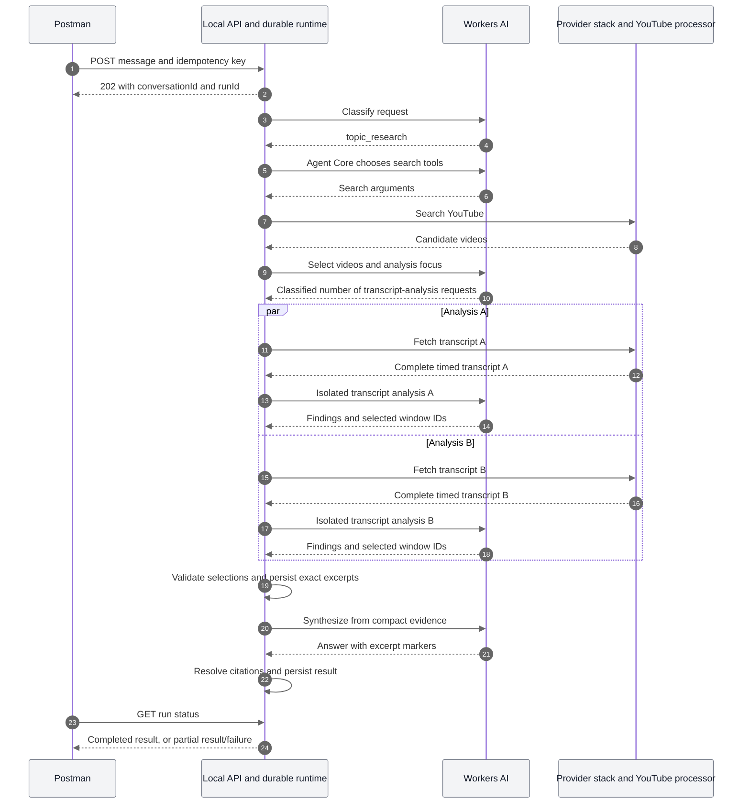
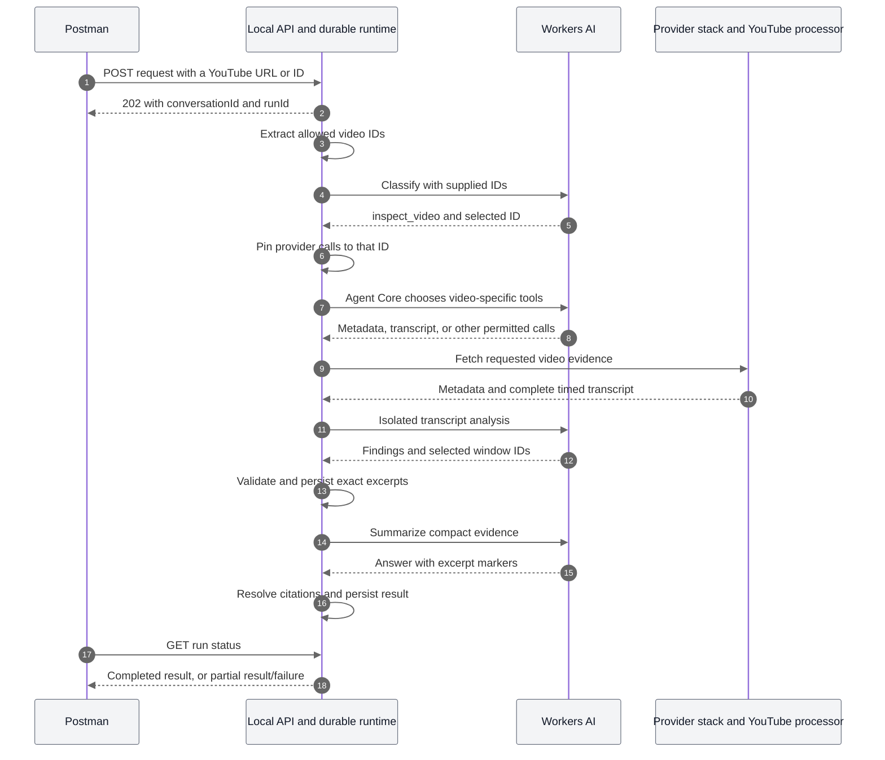
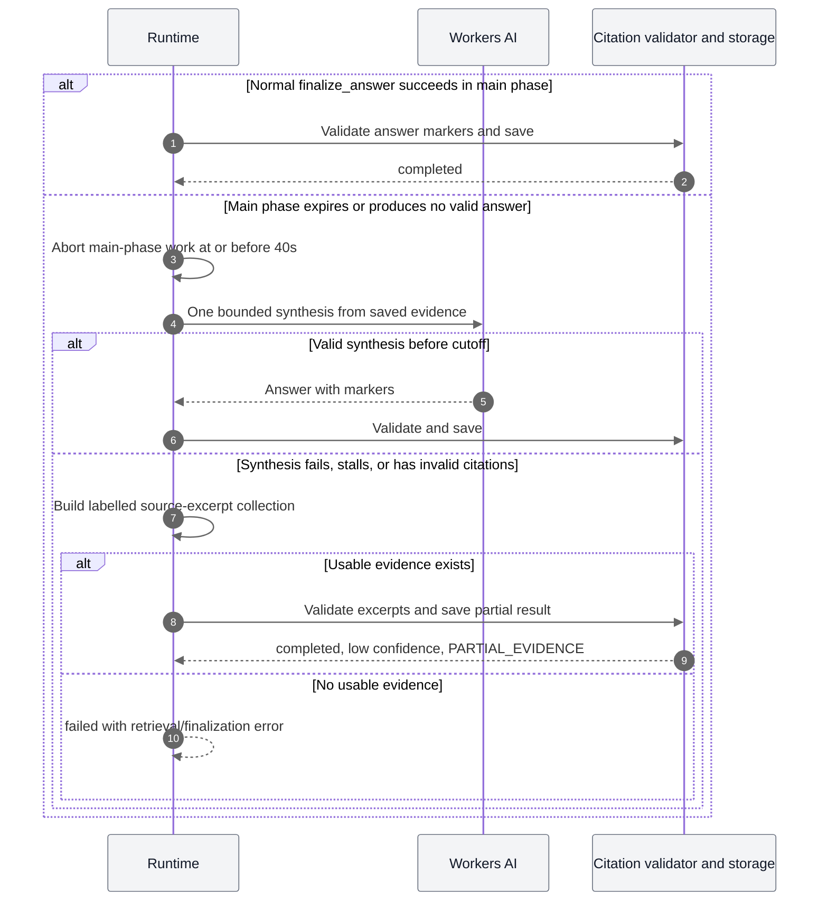

# Research and inspection: current architecture and limits

Implementation reference updated on 2026-09-11. This describes implemented behavior, including the separate finalization window and partial-evidence fallback.

## Shared architecture

Both paths enter through POST /v1/agent. The request contains a message and optional conversation/parent identifiers; an Idempotency-Key header identifies an admission retry. Authentication and the credit balance check happen before durable admission. Local testing uses an explicitly enabled loopback authentication bypass.

The HTTP Worker checks access and admits the run into an AgentRuntimeDO, one durable runtime per user-scoped conversation. UserAccountDO maintains the user's session catalog. D1 stores identity, entitlements, and the credit ledger. AgentRuntimeDO SQLite stores runs, routes, evidence, tool calls, model usage, and events. The Agents SDK fiber handles execution and recovery. Recovery preserves each phase's persisted deadline, without granting a new window.

A classifier chooses topic_research, inspect_video, clarification, or rejected. Rejections stop unsupported tasks without research or synthesis and expose a reason with the OUT_OF_SCOPE warning. The classifier and Agent Core receive bounded completed conversation history. New executable routes require useStoryboard, which controls whether get_video_storyboard is offered during research. The classifier also chooses researchVideoCount from 1 to 8 for research and 1 for inspection; requiredVideoCount separately records an explicit user source-count requirement. These choices are persisted; legacy routes without it retain their prior tool access. The selected capability supplies instructions and a permitted tool set to the same ToolLoopAgent implementation. The classifier is a model call outside the Agent Core step count.

Fireworks is the default GLM provider, using accounts/fireworks/models/glm-5p3-flash with low reasoning for classification, Agent Core and transcript analysis. `AGENT_GLM_PROVIDER=workers-ai` restores the retained Workers AI provider and configured AI Gateway using @cf/zai-org/glm-5.3-flash. `AGENT_FINALIZER_PROVIDER=fireworks` independently selects the native Fireworks AI SDK provider for the reserved finalizer and terminal argument repair. It requires the `FIREWORKS_API_KEY` Worker secret and fails explicitly if configuration is missing or unsupported.

`AGENT_FINALIZER_MODEL` selects `glm-5p3-flash` (default), `deepseek-v4-flash-0731`, or `gpt-oss-120b`. GLM and DeepSeek enable native thinking with a 1,024-token budget. GPT-OSS uses native `reasoningEffort: low`, which does not impose a separate reasoning-token cap. The adapter adds 1,024 tokens of reasoning headroom to the caller's answer allowance because Fireworks includes reasoning in `max_tokens`. This is a combined ceiling, not a guaranteed reservation of all requested answer tokens. Completed usage is recorded against the returned model and its configured prices, including cached input. When a separate finalizer is configured, ordinary completion and malformed terminal arguments also hand off to it. GLM research drafts are not persisted as final answers. Changing the provider does not change any phase deadline. Available configuration is not evidence that a model meets a production reliability target.

Provider tools call the platform provider stack in process. Cache misses go through the YouTube processor container, which owns outbound YouTube calls. Postman does not call YouTube or Workers AI directly. Locally, the Docker/Wrangler egress bridge is an additional dependency; it has repeatedly failed while ordinary host HTTPS still worked.

## Research sequence

For a supplied channel URL or handle, classification preserves the channel identifier. Initial discovery resolves its identity before fetching its Videos tab and running the one channel-filtered search in parallel. All reads use the ordinary durable provider tools. If channel resolution fails, unrestricted search is disabled; missing channel-catalog evidence adds `CHANNEL_INSPECTION_INCOMPLETE`. Supplying only a channel name does not establish a verified channel identity.

This is a typical successful flow, not a rigid script. Research still has a flexible model-driven tool loop. One search_youtube invocation is enforced per research run, including a failed invocation and across recovery. After use, the tool is removed from the next model step; an execution guard also blocks duplicate searches in the same batch. Provider-internal retries have separate behavior. The trends composite is no longer exposed to the agent. Metadata, comments, channel, and playlist tools may also be selected. The application bounds distinct transcript-analysis semantic keys, currently video ID plus focus, by the classified researchVideoCount. Repeating identical input reuses evidence; changing focus can consume another slot for the same video.

## Inspection sequence

Inspection first reads video metadata when it is not already available and the metadata tool is enabled, then uses transcripts and optional sampled storyboard images. It does not accept local MP4 uploads. Its provider adapter rejects calls for another video. Missing or ambiguous video identification can route to clarification. It has no separate one-analysis-per-run cap; identical transcript requests are reused, while different focus requests remain subject to the shared time and tool budgets.

## Tool sets

| Tool | Research | Inspection |
|---|---|---|
| search_youtube | Yes | No |
| browse_youtube | Yes | No |
| get_video | Yes | Yes |
| get_video_transcript | Yes | Yes |
| get_video_comments | Yes | Yes |
| get_video_tracks | No | Yes |
| get_video_storyboard | Yes | Yes |
| get_channel | Yes | No |
| get_channel_videos | Yes | No |
| get_channel_playlists | Yes | No |
| get_playlist | Yes | No |
| finalize_answer | Yes | Yes |

Research has ten evidence tool types plus finalization. Inspection has five evidence tool types plus finalization. Number of tool types is different from number of permitted calls.

## Effective limits

| Limit | Current behavior |
|---|---|
| Total run deadline | Up to 100 seconds across classification (20), research (40), and finalization (40), excluding queueing and persistence |
| Research phase | Up to 40 seconds after classification; includes planning, tools, and analyses |
| Forced early finalization | At a model-step boundary, when <=12 seconds remain in the main phase, nominal step 8 is reached, transcript/tool budget is exhausted, or estimated model cost reaches the reserve threshold |
| Finalization phase | Up to 40 seconds from handoff, including synthesis and any citation repair; early research completion starts it sooner |
| Persistence | Separate 30-second timeout outside model-processing windows; billing settlement retries durably |
| Agent Core steps | Eight nominal; finalization is forced by the eighth. Stop ceiling is ten including two retry allowances. Time can stop execution much earlier |
| Durable tool calls | Twelve total: at most eleven evidence calls, reserving one successful finalization slot |
| Research transcript analyses | Classified researchVideoCount, from 1 to 8; historical decisions fall back to two/four by breadth; identical requests reuse results |
| Inspection video scope | Exactly one pinned video; no separate one-analysis cap |
| Research search_youtube calls | One per run, including failures |
| Provider concurrency | Four evidence executions |
| Analyst concurrency | Up to four for research, bounded by the classified count; two for inspection |
| Classifier timeout | 20 seconds from classification start, including retries; persisted across recovery |
| Agent Core/finalizer output | Shared SDK ceiling: 1,500 tokens per generation for standard answers, 2,500 for explicitly detailed requests. Terminal tool-argument repair uses the same ceiling |
| Analyst output | Five findings by default; single-video numbered requests raise the limit to the classified count, up to twenty. Three supporting windows per finding, 2,400 output tokens; structured source quotes, identities and measurements, no generated summary |
| Analyst own timeout | 90-second helper default, overridden in practice by the earlier parent phase/run cancellation |
| Tool-argument repair | Separate model call with a 15-second own timeout, bounded by parent cancellation. Nonterminal repairs allow 2,000 tokens; terminal repairs use the selected answer ceiling |
| Answer length | Concise by default, expanded for explicit detail requests; native per-generation token ceilings and a schema ceiling of 20 blocks |
| Model cost | $1 estimated admission budget; $0.10 reserved threshold for finalization. This uses locally configured token prices and completed usage, not a hard vendor billing ceiling |
| Conversation memory | Up to eight completed ancestor turns, bounded to 64,000 characters |
| Recovery evidence prompt | Up to 40,000 characters of compact evidence |

Transcript analysis receives the selected caption language/provenance and any title/channel already obtained for that video. Captions remain unchanged. Analysts are instructed to treat transcription errors and ambiguous names or measurements as source limitations; metadata can support a spelling correction, but it is not evidence for a lab result.

Each finding can carry source-quoted identities and quantities with value, unit, basis, and claimed/measured/reported status. Local checks validate quote containment and explicit values/units. If a comparison contains unsupported details, the original prose is removed and independently supported measurements are retained with an uncertainty note. Unsupported findings without usable measurements are dropped. The existing single repair attempt is used if no finding survives. Projection and citation aliasing retain these fields for finalization. Both finalizer paths check explicit mass/percentage changes and known cross-source identities before persistence; a failed check can use the existing repair budget. These are targeted consistency checks, not general semantic verification or independent validation of a video's claims.

The generic Agent Core helper still has a 90-second default. Both public paths override it with the remaining main-phase budget. Neither that default nor the analyst's 90-second helper timeout grants extra time to these endpoints.

## Finalization and fallback

The finalizer resolves inline excerpt IDs against saved source records and exact text. The application constructs the returned citations; the model no longer duplicates packet/source declarations. Unknown or conflicting references are rejected. These checks establish provenance, not the truth of a claim or the quality of an interpretation.

The reserved finalization phase uses `Output.object` with native provider `response_format: json_schema`. Its `answer-blocks-v3` schema contains confidence, blocks and warnings. The application supplies the classified intent and retains persisted artifacts. Every research/inspection block requires one to twelve references in both the transmitted schema and local validation. Clarification has a separate schema and is normally rendered directly from classification. JSON-schema support does not replace citation membership validation or guarantee factual grounding.

Classification supplies a required `answerDetail` enum (`standard` or `detailed`) through its tool schema. The application maps that choice to `maxOutputTokens`; the Workers AI provider forwards it as `max_tokens`. Persisted legacy routes without this field use standard. Every research-loop generation can naturally emit the final answer tool, so the selected ceiling applies to each loop generation, reserved synthesis and terminal-tool argument repair. Evidence-tool argument repairs retain their separate 2,000-token ceiling.

Both answer paths share qualitative writing guidance about relevance, concise recommendations, explicit requested scope and evidence limitations. The native schema limits answer blocks and references and permits at most three distinct model warnings. It does not impose a per-block character ceiling; complete paragraphs are checked against the existing 20,000-character rendered answer limit. Local validation rejects obvious sentence continuations across block boundaries and repeated warning phrases. These checks are conservative heuristics, not a grammar or factual verifier.

For an explicitly requested numbered list, classification may preserve `numberedItemCount`. Reserved synthesis must return labels 1 through that count, or explicitly disclose `ANSWER_SCOPE_SHORTFALL`. Other formats are not inferred from arbitrary numbers in the request. These checks detect missing numbered items, not whether each item is useful or fully supported. A token ceiling is a truncation boundary, not a guarantee of a complete answer or a wall-clock latency bound.

A failed structured response gets at most one repair within the same 40-second finalization deadline. Repair receives the failed candidate and specific validation errors, with instructions to preserve valid content. Diagnostics record the schema version, validation stage, finish reason, candidate length and bounded issue paths/codes, without logging the candidate text. Test captures must preserve these structured issue arrays.

Partial results contain quoted source excerpts, not a model-invented recommendation. They use status completed, confidence low, and warning code PARTIAL_EVIDENCE. When content was retrieved but synthesis failed, FINAL_SYNTHESIS_UNAVAILABLE identifies that outcome explicitly. Discovery-only fallback uses NO_CONTENT_EVIDENCE. A completed durable run or a low-confidence answer alone does not identify successful synthesis; inspect the warning codes.

## What the response counters mean

modelStepCount counts completed Agent Core steps. Classifier calls, transcript analyst calls, argument repair calls, reserved finalizer calls, retries inside model requests, and interrupted steps do not all appear in this number. A step can ask for multiple tools.

toolCallCount counts durable tool-call rows. Failed evidence calls count. Successful finalization counts. Rejected finalization attempts are not stored as completed tool rows. Reused evidence may avoid another row. Provider-internal HTTP retries do not appear as separate tools: one search call can cause multiple YouTube attempts and processor-slot retries.

The recovery finalizer and deterministic fallback occur outside Agent Core's step ceiling. Synthesis and repair share the original finalization deadline; saving uses the separate persistence timeout. The three model phases total at most 100 seconds; queueing and persistence can extend end-to-end completion.

## Remaining limitations

- Research sources are YouTube sources; this is not a general web/GitHub research engine.
- Minimal tools and short answers are instructions. The loop can deviate within its enforced budgets; the one-search_youtube limit is enforced in code.
- The classified number of analyses trades breadth for latency. Long transcripts and slow inference can still lead to partial results.
- Saved evidence is required for a useful fallback. Total retrieval failure cannot produce a supported answer.
- The recurring local Docker egress reset affects both paths on cache misses. Remote model availability is another independent dependency.
- Phase deadlines stop model processing; validated answers can still be saved within the separate persistence allowance. Cancellation cannot guarantee an external service has stopped all work already sent to it.
- Agent responses expose settled provider-credit usage. The runtime reserves credits and settles completed evidence operations idempotently, including when a run fails.

## Source map

- Admission and polling: platform/src/routes/agent/agent.index.ts
- Durable state and execution: platform/src/agents/agent-runtime-do.ts
- Capability selection: platform/src/agents/research/capability-router.ts
- Shared orchestration: platform/src/agents/research/research-agent.ts
- Main loop: platform/src/agents/agent-core.ts
- Step/tool decisions: platform/src/agents/runtime/loop-control.ts
- Deadline enforcement: platform/src/agents/runtime/deadline.ts
- Transcript extraction: platform/src/agents/providers/youtube/transcript-analyst.ts
- Citation assembly: platform/src/agents/finalizer.ts
- Partial result: platform/src/agents/research/evidence-fallback.ts

## Storyboard evidence

Both paths can call `get_video_storyboard`. A call with `videoId` and no selection returns metadata without downloading images or running vision. The model receives total sheet count, frames per sheet, tile and grid dimensions, sampling interval, last sampled timestamp, and total frames. It then supplies a focused visual question and chooses `maxSheets` for a spread overview, `sheetIndexes` for explicit zero-based source sheets, or `timestampsMs` for sampled moments. The agent chooses how many sheets to inspect. Each call allows up to 20 sheets and 8 MiB of JPEG bytes within the shared research time and cost budgets. Oversized selections fail explicitly; they are never silently sliced. Follow-ups can inspect other sheets while budget remains. Metadata is not visual content evidence. Source frame indexes remain unchanged across non-contiguous selections. Temporary files are deleted on success and failure. Paths and signed image URLs do not reach the main agent.

An isolated GLM-5.3-Flash model reads the images and returns at most five visual findings, each tied to up to three supplied frame indexes. The native visual output schema enumerates only the supplied frame IDs, including gaps between sheets. The application also validates indexes and computes timestamps from the original mapping. Model evidence keeps one excerpt per distinct visual finding before repeated frame citations, so early findings cannot consume the excerpt budget and hide later findings. Requested timestamps and sampled ranges reach the finalizer. Visual observations are labelled as such, rather than represented as transcript quotations. Raw images are not stored in evidence packets. This is sampled coverage, not complete video coverage. Cropping or selecting a storyboard does not improve source resolution.

The visual call has a 20-second timeout, no automatic model retry, and shares the collection phase's cancellation signal. Classification, research, transcript analysis, visual analysis and nonterminal tool repair use GLM. AGENT_GLM_PROVIDER selects fireworks (default) or workers-ai independently of the finalizer. Fireworks GLM uses native low reasoning with unchanged research output ceilings and interleaved reasoning history; all usage records retain the actual provider model ID. The checked-in finalizer configuration selects DeepSeek V4 Flash 0731 on Fireworks, using its native structured output and bounded thinking profile. Fireworks requires FIREWORKS_API_KEY. Model usage uses the selected provider pricing. Visual analysis uses low reasoning effort and the run session affinity. Visual work remains inside the research phase's 40-second budget. The removed agent tools do not remove the standalone public endscreen or trends API routes.

### Storyboard selection release dependency

The processor uses a locked local dependency on `packages/all-things-youtube`. Wrangler builds the library source in a separate Docker stage and includes its compiled output in the production container, so publishing to npm is not a deployment prerequisite. A Dockerfile-specific allowlist limits the repository-root context to the library source and processor build inputs. The build checks STORYBOARD_SELECTION_VERSION; the processor also rejects library responses without selection metadata, preventing silent fallback to leading sheets.

## Production access and rollout

All `/v1/agent` and `/v1/agent/*` requests first require the existing Better Auth principal and data-read permission for scoped credentials. A shared server-side gate then checks:

- `AGENT_RUNTIME_ENABLED=false`: disable all agent routes with `503 AGENT_DISABLED`.
- `AGENT_RUNTIME_ENABLED=true`, `AGENT_ACCESS_MODE=admins`: only accounts whose current, verified Better Auth email is in `ADMIN_EMAILS_SECRET` can use agent routes. Others receive `403 ADMIN_REQUIRED`.
- `AGENT_RUNTIME_ENABLED=true`, `AGENT_ACCESS_MODE=all`: allow authenticated users with the required credential scope. Account ownership and credit checks still apply.

Missing access mode defaults to `admins`. An invalid mode or unavailable account lookup fails closed. The current production configuration enables the admin rollout and uses the private `ADMIN_EMAILS_SECRET` Worker secret for its allowlist. The authenticated account ID resolves the email from the database on every restricted request, covering browser sessions, CLI sessions, and API keys without trusting a supplied email header or cached admin claim.

This uses a private email allowlist and Better Auth user records; it does not install Better Auth's separate admin-management plugin or create new administrative APIs. No auth schema migration is required. For unauthenticated local Postman testing, explicitly set `AGENT_ACCESS_MODE=all` along with the existing local-only authentication bypass. Production never permits that bypass.

These settings take effect when the platform is deployed; changing checked-in configuration alone does not update a running production Worker.

Set the allowlist with `npx wrangler secret put ADMIN_EMAILS_SECRET` from `platform/` and enter the value at the prompt. Never place its value in Wrangler vars, fixtures, or documentation. For local admin testing, set it in the ignored `.dev.vars` file.

## Run response and answer completeness

Compact and legacy receipts and run views expose `request.message` from the persisted request, including queued admissions and retries. No schema migration is needed because the input was already stored. Completed research stores a `research_coverage` artifact and the compact result exposes it as `coverage`, containing targetVideos, reviewedVideos, and an optional explicit requiredVideos. Reviewed means distinct videos with usable transcript excerpts.

An internal research target shortfall is informational. Explicit unmet user source counts, model-declared answer scope shortfalls, and incomplete synthesis still produce partial answers. Legacy RESEARCH_COVERAGE_SHORTFALL warnings alone no longer change the compact outcome. Transcript warnings carry videoId and warning deduplication includes it. Sentence-final decimal punctuation is accepted by numerical grounding; malformed decimals and changed units remain rejected. Repaired numerical findings retain all validated quantities, and synthesis guidance calls for paired values with the same measurement basis.
