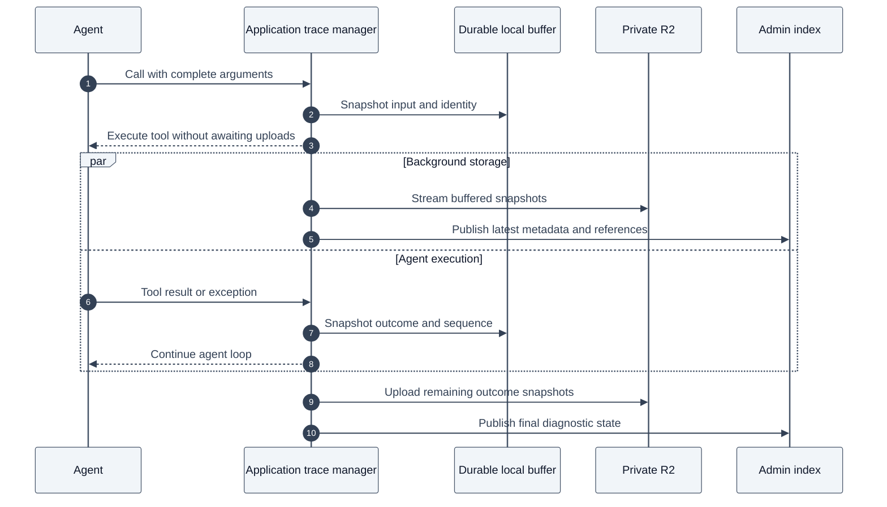
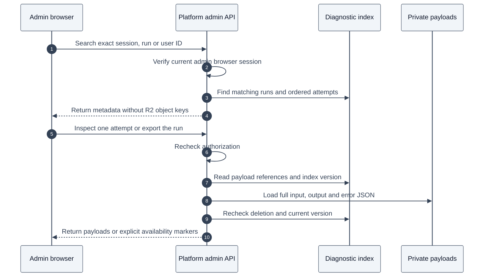

# Administrative agent tool traces

The diagnostic trace is separate from the compact activity shown to users. Maintainers can find runs across sessions and inspect complete tool-boundary JSON in Admin > Tool call traces. The existing activity stream keeps its filtered inputs and evidence counts.

The application captures calls, pairs their results and enforces access. Cloudflare D1 provides the administrative index. The existing private `RESEARCH` R2 bucket stores full input, output and error payloads. The model selects tools and arguments; it does not own persistence.

## Capture and inspection

1. At the SDK validation boundary, rejected tool calls are captured as failed attempts before argument repair begins. Unknown tools and invalid arguments remain visible even though they never execute. Malformed JSON is saved as the original argument string. A successfully repaired execution shares the call ID and gets a new attempt. Before an executable model tool starts, the manager snapshots its SDK-parsed arguments. Programmatic retrieval and analysis calls explicitly supply their complete validated inputs.
2. The session Durable Object assigns a trace UUID, attempt number and monotonically increasing call sequence. It serializes the input immediately into persistent local SQLite chunks. Each chunk is at most 128 KiB, avoiding the 2 MB SQL row limit and preserving UTF-8 bytes. Serialization and local writes remain on the execution path, but the tool does not await trace R2 uploads or D1 publication.
3. The tool begins immediately after local capture. Existing evidence caching, billing and budgets remain authoritative. A nested evidence execution sharing a model call ID does not create a duplicate outer attempt. Child retrieval/analysis calls with distinct IDs are recorded independently.
4. The complete returned tool value is snapshotted locally before returning it to the agent. Exceptions save identity, code when present and message. Headers, SDK execution context and raw HTTP bodies are not included. The manager assigns the result sequence and terminal state. Inputs/results can include nested JSON, long strings, continuation values and full evidence packets without trace-specific truncation. Later mutation of an argument or returned object cannot change its saved snapshot.
5. A single background publisher per session uploads snapshots while the agent continues. The application registers that work with `DurableObjectState.waitUntil` and arms an SDK recovery schedule before remote I/O. It processes metadata in batches of 32 attempts and streams one payload at a time from local chunks through a known-length stream to R2. Object keys remain `agent-traces/<runtime-id>/<run-id>/<trace-id>/input.json`, `output.json` and `error.json`. After R2 confirms an upload, its buffered chunks are removed. Local payload references remain available for D1 publication retries.
6. D1 indexes calls by run, user and session. The publisher reads the latest local revision after awaiting R2, then publishes that version. Admin inspection becomes available as background publication completes. A brief delay is expected; publication is not a condition for completing an agent run.
7. Admin reads require a current verified browser admin session through the existing admin middleware. API keys, ordinary users, banned/unverified accounts and impersonated sessions cannot read this data. Payloads load on selection, not in the user activity stream. Responses use `Cache-Control: no-store`.
8. The JSON Lines download orders `tool/call` and `tool/result` records by sequence. It includes a versioned header, call IDs and attempts. It supports offline diagnosis without invoking tools. An unmatched call in a terminal run is displayed as interrupted rather than claiming a result exists.

The manager captures and schedules work. R2 and D1 provide storage; they do not drive tool execution. The recovery schedule uses the existing Agents SDK alarm machinery, without replacing its alarm or interfering with run reconciliation.

### Administrative reads

The browser calls platform admin routes, not R2 directly. The Worker checks the current browser session and live administrative authorization. It looks up payload references in D1, reads private R2 objects and rechecks the D1 version before returning payloads. A concurrent revocation returns a deletion marker; a concurrent settlement returns an unavailable marker so the caller can refresh. The read path does not call the session Durable Object or execute tools.

Classification records the returned `classify_request` arguments and the application's validation verdict. Research bundles, context searches/history reads, finalizer context tools and final-answer persistence are also traced. The trace records values at the tool boundary; it does not add provider data that the tool itself omitted, original wire-format argument whitespace, model reasoning or a complete model prompt history.

The call/result pairing, immutable snapshots, event sequencing and separation of recorded history from its display are inspired by the [DeepSeek Harness session design](https://github.com/deepseek-ai/deepseek-harness/blob/master/docs/subsystems/session.md). This feature does not replace the agent's execution state with that harness, or provide resumable inference replay.

## Recovery and deletion

Each tool retry creates a new attempt with new R2 keys. Earlier attempts are retained. R2 failures keep full snapshots in the durable buffer and mark temporary capture unavailability in the admin index. Successful upload retries clear the storage failure marker. D1 failures keep a local publication outbox. Both recover through the 15-second SDK schedule and on restart. The consumed recovery schedule is replaced before joining an existing publisher, including one started by `onStart`, so SDK idempotence cannot deduplicate recovery onto a schedule about to be removed.

`waitUntil` provides immediate background execution, not durable delivery. Current Cloudflare guidance distinguishes [Worker context](https://developers.cloudflare.com/workers/runtime-apis/context/) (30 seconds after an HTTP response ends) from [Durable Object state](https://developers.cloudflare.com/durable-objects/api/state/) (prevents eviction until settlement or up to 15 minutes). A DO remains active during normal pending I/O without requiring `waitUntil`; registering the publisher makes its post-RPC lifetime explicit. Persisted snapshots and [alarm recovery](https://developers.cloudflare.com/durable-objects/api/alarms/) handle interruption. The recovery callback explicitly rearms a schedule so a prolonged outage does not rely on the platform's finite automatic retries. This does not require a new Queue binding.

Index versions prevent an older write from replacing a newer settlement or deletion. Authoritative run status is synchronized from the session, including watchdog and restart reconciliation. Inputs not captured before a reset, and tool outputs not yet produced or snapshotted, cannot be recovered. Local capture failures are marked without intentionally altering tool behavior. The durable buffer still has the platform's per-object storage limit; sustained outages can grow the backlog.

Deleting session evidence conservatively revokes every diagnostic payload in that session, since context reads and aggregate outputs can embed several assets. Revocation clears buffered payload chunks synchronously. The existing durable private-blob cleanup queue removes R2 objects. A late write cannot reattach revoked references, and a put that finishes after deletion is queued for cleanup again. Account deletion revokes payloads and clears local traces. The D1 index references the auth user with `ON DELETE CASCADE`.

No historical input backfill is attempted. Old activity records omitted arguments and cannot reconstruct complete calls. Diagnostic capture starts with newly executed calls after deployment. Runs that never reach a tool call have no entry in the diagnostic call index.

## Routes and deployment

- `GET /v1/admin/agent-traces`: recent runs, exact run/session/user ID search, status filter and pagination.
- `GET /v1/admin/agent-traces/:runId`: ordered attempt metadata.
- `GET /v1/admin/agent-traces/:runId/calls/:traceId`: full payload for one attempt.
- `GET /v1/admin/agent-traces/:runId/export`: ordered JSON Lines download.

The inspector and export explicitly reject runs above 500 attempts rather than silently returning partial history. Query the D1 index directly for such an exceptional run. Individual payloads remain in R2.

Apply `platform/migrations/0019_agent_tool_traces.sql` to the target DB before deploying the platform and web changes. No new bucket or Worker binding is required. Use the repository's local migration path for development. Preview/production migrations and deployments require an explicitly confirmed target. Deploying code alone cannot backfill old inputs.

## Verification

Local Workerd tests use actual D1, R2 and Durable Object SQLite for full payload restoration, repeated attempts, nested call ownership, concurrent event sequencing, storage failures, index retries and deletion races. Background-storage tests hold R2 and D1 writes open while tools finish, recover multi-megabyte Unicode snapshots through a fresh manager, verify immutable snapshots, exercise alarm retries across outages and drain multiple publication batches. Admin auth tests cover live roles, rejected credentials, missing traces, exports and deleted payloads. AI SDK mock-model tests verify complete execution values and rejected calls, including unknown tools, malformed JSON, invalid arguments and repairs. Classification coverage checks that rejected calls are not duplicated. Browser tests cover inspection, export downloads, desktop/mobile layout and the existing admin access flow. Refresh reloads the selected payload together with the run status and timeline, including calls published since the run was opened.
