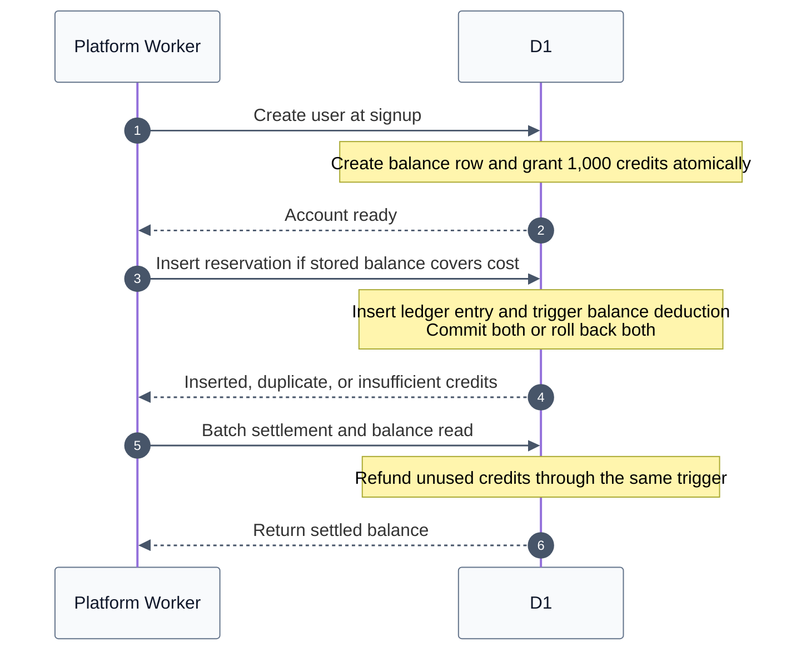

# Credit accounting

`credit_ledger` records every credit change. `credit_accounts.available_credits`
stores each user's spendable balance, including deductions for outstanding
reservations. Request-time balance reads and reservation checks use this single
account row, rather than summing the user's history.

The application inserts ledger entries. D1 triggers maintain the account balance
within the same SQL statement. There is no asynchronous synchronization or second
application write that can fail independently. Ignored duplicate ledger entries
do not fire the insertion trigger, so retries cannot apply the same change twice.
Payment webhooks retain their existing D1 batch, including billing state and the
processed-event record; the balance trigger participates in that transaction.



Concurrent reservations check the balance inside their conditional insert. A
successful reservation updates that balance before another write can spend it.
Do not move the sufficient-funds check into a separate application read.

Metered API requests reserve credits in one D1 call. Settlement and the resulting
balance read share a second D1 batch, so the remaining-balance header adds no
network round trip. Normal API and agent credit operations do not read the
billing plan or attempt onboarding grants. A standalone balance read is one
SELECT with no writes. See [stored video API latency](./API_LATENCY.md) for
measurements and response timing headers.

## Migration and rollout

Apply `platform/migrations/0017_credit_accounts.sql` before deploying the updated
Worker. The migration backfills all users from their existing ledger, including
zero and negative balances, and installs triggers for new users and ledger
inserts, updates, and deletes. It neither grants credits nor rewrites history.
The backfill is the one-time full-history calculation and should be budgeted for
when applying the migration to a large database.

Existing Worker versions remain compatible with the migrated schema: their
ledger writes also fire the triggers. A Worker rollback should retain the new
table and triggers. Preview and production migration/deployment scope must be
confirmed before changing shared state.

Apply `platform/migrations/0018_signup_credit_grant.sql` before deploying the
Worker that removes lazy grants. The standard `deploy:production` command runs
account migrations first. New user creation, the balance row, and the 1,000-credit
signup grant commit together. A grant failure rolls back signup so it can retry;
an account cannot be created successfully without its grant.

Migration 0018 also grants credits once to older Starter accounts that have no
`onboarding:v1` grant. It fills their balance to 1,000, preserves higher balances,
and skips Builder accounts. Already granted accounts are not refilled, even if
they have spent their allowance. Existing adjustments count toward this one-time
catch-up. The unique ledger operation prevents an old Worker from granting twice
during rollout. Retain the trigger on Worker rollback.

The SQL trigger uses the current 1,000-credit signup policy. Future allowance
changes must update the trigger in a new migration and update
`STARTER_ONBOARDING_CREDITS` together; changing the environment variable alone
only affects entitlement display and refund policy. Builder top-ups, refund
resets, and per-operation credit prices are unchanged.

## Manual credits

Append an `adjustment` to the ledger, with a positive integer to grant credits or
a negative integer to deduct them. Use a stable operation ID for retries of one
adjustment and a new ID for each distinct adjustment. Do not update
`credit_accounts` directly, and do not use `INSERT OR REPLACE` for ledger writes.
Use the existing unique constraint with `ON CONFLICT DO NOTHING` instead.

```sql
INSERT INTO credit_ledger (
  id, user_id, operation_id, entry_type, credits, metadata_json, created_at
)
VALUES (
  :entry_id, :user_id, :operation_id, 'adjustment', 10000,
  '{"reason":"Manual credit bonus"}', :timestamp_ms
)
ON CONFLICT(user_id, operation_id, entry_type) DO NOTHING;
```

Only insert this row. The trigger adds 10,000 to the account balance atomically.
New users already have their signup grant before any manual adjustment.

## Reconciliation

Run this read-only audit after migration or during maintenance. An empty result
means every user has a stored balance matching the ledger. It intentionally
scans history and does not belong on the request path. No recurring job is
installed by this change.

```sql
SELECT u.id AS user_id,
       a.available_credits,
       COALESCE(SUM(l.credits), 0) AS ledger_balance
FROM user AS u
LEFT JOIN credit_accounts AS a ON a.user_id = u.id
LEFT JOIN credit_ledger AS l ON l.user_id = u.id
GROUP BY u.id
HAVING a.user_id IS NULL
    OR a.available_credits != COALESCE(SUM(l.credits), 0);
```

Investigate any discrepancy before repairing the projection. Application
corrections should append ledger adjustments to preserve the audit trail.
Maintenance edits/deletes also update the projection, and deleting a user
cascades to both their account and ledger.
