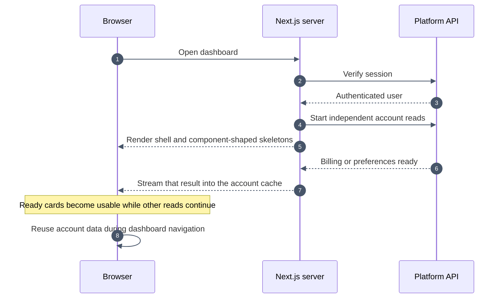

# Dashboard loading and performance

Settings previously waited for projects, monitors, usage, billing, notifications, and notification preferences together. One slow request delayed the whole page. The API keys and Admin pages also fetched this entire bundle just to populate their sidebars.

A browser regression test reproduced the problem by holding the Projects response open. Settings did not render within the test's two-second assertion window even though billing and preferences were available. This is a controlled dependency test, not a measurement of production latency.

## Implemented

- The authenticated dashboard Server Component starts independent account reads before browser hydration. The responses stream as separate promises into the client provider. API keys, Admin, and Agent routes initially request only projects and usage for their sidebars.
- A user-scoped provider retains account results between dashboard routes. Concurrent consumers share pending reads. Loaded data remains visible during background refreshes.
- Each section depends on its own response. Settings renders its heading and account controls immediately, then fills billing and notification cards independently. Errors do not masquerade as empty results or leave failed cards pulsing forever.
- Client results stay fresh for 60 seconds. Mounting a consumer or focusing the window after that window triggers revalidation. Mutations refresh the affected resource or update it directly. Newer local updates cannot be overwritten by an older in-flight read.
- Server responses use `no-store`; no account data enters a shared cross-user cache. The provider is keyed to the authenticated user and a successful sign-out replaces the document.
- Skeletons use the same layout classes as project/monitor rows, API-key rows, approved-email rows, session assets, and settings cards. Sidebar counts and empty-state copy wait for confirmed data.

The platform still owns authentication, authorization, billing, persistence, and API error semantics. The Next.js application starts reads early, renders partial results, and manages a short-lived browser cache. Interactive forms and live agent streams remain Client Components.

## Verification

The delayed-request regression now verifies Settings controls are usable while Projects is still unresolved. The navigation regression checks Settings → API keys → Settings: no browser account refetches and one shared sidebar project read. Settings is now a dynamic route, so returning can start another server read for its cards; the warm browser cache remains usable while that read is pending. Other cases cover independent cards, failed cards, empty versus failed API-key responses, desktop/mobile layouts, and reduced motion.

Cache unit tests exercise duplicate-read suppression, server seeding, errors and retry, mutation/read races, stale server seeds, and isolation between provider instances.

Production latency has not been profiled. No claim is made about a percentage improvement to real-world load times.

## Settings route and render-time streaming

Settings now lives at `/dashboard/settings`. Its page authenticates through the request-memoized session guard, starts billing and notification-preference reads directly against the platform, and passes each promise to a separate Suspense boundary. The client cards consume those promises during rendering with React `use()`, so their initial content is included in the server response. Interactive checkout, preference editing, email confirmation, and account deletion remain client-side.

The route imports only Settings cards and the dashboard shell. It does not import `WorkspaceClient`, Trend Lab, or source inspection. A `loading.tsx` boundary supplies matching card skeletons during route navigation. A slow billing read does not delay notification controls or account controls. Failed reads display the platform error with a card-specific retry.

The shared provider accepts rendered server results without a duplicate browser request. It ignores those initial results if a browser read or mutation already owns the resource. Warm route visits display cached cards without suspending on a new server promise. When an entry is stale, revalidation can consume that new promise instead of starting a duplicate browser read. Account data remains scoped to the authenticated provider; server reads remain `no-store`.

Legacy `?section=settings` links redirect to the new route and preserve other query parameters, including checkout status and email consent. Source queries, completed research, selected source options, project selection, and Trend Lab results survive route navigation in provider memory. They are discarded on document reload or account-provider replacement. Interrupted source datasets return with a retryable cancellation state.

Settings requests billing and preferences, plus projects and usage for the sidebar. It does not read monitors or the notification inbox. The rest of the workspace no longer fetches billing.

Additional regression checks inspect the server HTML for rendered plan/preference content, verify Settings does not load the workspace page script, count route-specific API reads, preserve research drafts and legacy query parameters, exercise card retry and mutation retention, and hold return-visit server reads pending while cached controls remain usable.

This is the first route migration. Projects, Monitors, Sources, and Trend Lab still share the main workspace. API keys still load through the authentication client's list method. The authenticated layout still awaits feature-access checks, so improving that shell dependency remains separate work.

## Next improvements, in priority order

1. **Measure production request timings.** Record time to authenticated shell, billing readiness, preferences readiness, and navigation completion. Compare web-to-platform latency with the platform's own handler duration before changing deployment regions or queries.
2. **Split the main workspace into route-sized modules.** Trend Lab, source inspection, Projects, and Monitors still share a large client module; Settings has been extracted. Separate route entries and lazy imports can keep unrelated JavaScript out of the initial Settings bundle. Preserve current search results and drafts during navigation, and keep existing query-string URLs compatible.
3. **Move read-only presentation into smaller Server Components where useful.** Static headings, API guidance, and initial list rendering are candidates. Keep inputs, mutations, cancellation, and live streams as client islands. Do not replace independent reads with one server-side `Promise.all` gate.
4. **Profile session/access verification.** The server verifies the session and feature access before showing protected content, and the client rechecks access during navigation. Investigate redundant checks with timings while preserving prompt revocation and API authorization. Do not cache permissions solely for speed.
5. **Audit larger lists and media after measuring.** Paginate large project/monitor collections and reserve image dimensions. Use virtualization only when realistic account sizes show rendering cost; it is unnecessary for short lists.

These priorities follow Next.js guidance on [Server and Client Components](https://nextjs.org/docs/app/getting-started/server-and-client-components), [independent data fetching and streaming](https://nextjs.org/docs/app/getting-started/fetching-data), and [lazy loading](https://nextjs.org/docs/app/guides/lazy-loading).
