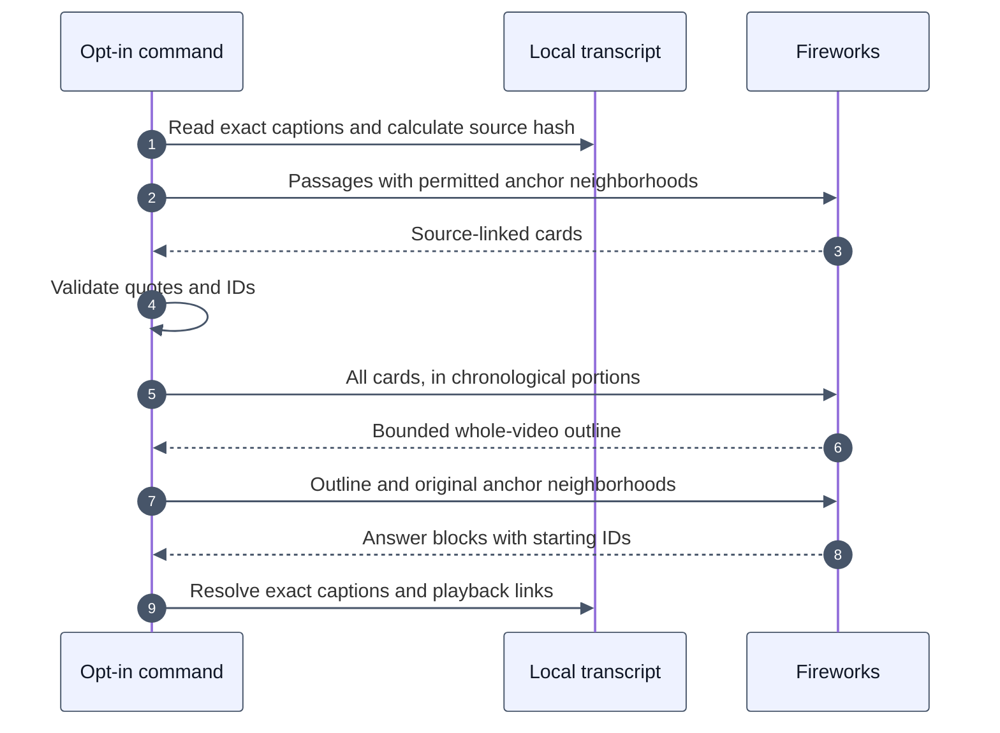

# Experimental source-linked transcript overview

This opt-in local experiment prepares an overview of an entire saved transcript before answering questions. It does not change deployed search, the analyst, the finalizer, account billing, or timestamp retrieval. It requires the compact transcript work in PR #178.

The application controls source partitioning, coverage slots, identifier validation and citation resolution. Fireworks generates the summaries and answers. A summary is derived evidence, not a verbatim transcript or a guarantee that every fact has been retained.

## Why a separate overview path

The React experiment found that a top-k selection could omit whole lessons even when the hierarchy contained them. Summaries also mixed the final Alert exercise with an earlier Button exercise. The resulting answer could cite the earlier exercise or a later solution instead of the Alert introduction.

The tested correction gives every chronological portion space in the overview and keeps explicit source anchors. It is inspired by hierarchical retrieval, but this route does **not** implement RAPTOR's UMAP/GMM semantic tree. It does not need embeddings. The earlier tree did not establish an advantage for overview answers.

[RAPTOR's retriever](https://github.com/parthsarthi03/raptor/blob/master/raptor/tree_retriever.py) selects a token-bounded set of nodes. That alone cannot guarantee whole-video coverage or exact starting citations. [GraphRAG global search](https://microsoft.github.io/graphrag/query/global_search/) is a useful precedent for separating whole-dataset synthesis from focused retrieval. Neither supplies this application's caption validation.

## One example throughout

The saved React tutorial has 2,151 captions. Its final Alert exercise starts at segment 1996, around 1:14:21.

1. Split whole captions into small passages. Prefer sentence endings after 100 `cl100k_base` tokens, otherwise finish a passage at 160 tokens. A single long caption stays intact. Empty and oversized captions are omitted, recorded, and break passages. The React fixture produces 132 passages.
2. Summarize batches of twelve passages. Each card records its passage, a short summary, and an original starting segment. Up to eight preceding captions help locate the local introduction. Validate that the anchor is in that card's neighborhood and its quoted text matches the complete original caption, or an exact consecutive passage beginning with that complete caption, after whitespace normalization. Store the original text unchanged. Invalid cards get one correction call containing only their own passages. A second rejection stops the build.
3. Divide the ordered cards into at most six chronological portions. Generate up to three lessons per portion, for at most eighteen outline lessons. Each lesson must use an anchor from its own portion. This reserves space for the ending. It does not prove semantic completeness within each portion.
4. Retrieve all outline lessons plus ten original captions beginning at each anchor. Only anchor IDs are selectable as starting citations. Neighboring captions provide context. Source ranges are omitted from model-facing summary cards so a range boundary cannot accidentally become the citation.
5. Generate an answer and resolve each selected ID to the original caption text and millisecond timestamps. The playback URL uses the caption start, floored to seconds. Report outline anchors absent from the answer for inspection. This is a structural signal, not an automatic answer-quality score.

For the Alert lesson, the desired output selects 1996. The application supplies that original caption and links to `t=4461`. It rejects an invented ID or an available neighbor that is not a permitted starting anchor. It cannot prove that 1996 is the semantically best introduction just because the ID exists.



The normal production path remains unchanged. This diagram describes only an explicitly invoked local experiment.

## Run it

From `platform/`, install dependencies with `npm ci`. Provide `FIREWORKS_API_KEY` in the process environment. Do not commit keys, source transcripts, checkpoints or raw answers. Use a private directory, preferably under the repository's ignored `.scratch/` directory. Run one process per work directory.

Input is a normalized JSON transcript with `videoId` and `segments`, each containing `text`, `startMs`, and `endMs`. Extra provider fields are ignored. The normalized video ID, caption order, text and timestamps determine the source hash.

```sh
npm run experiment:overview -- build \
  --transcript /absolute/path/transcript.json \
  --work-dir ../.scratch/react-overview

npm run experiment:overview -- retrieve \
  --transcript /absolute/path/transcript.json \
  --work-dir ../.scratch/react-overview

npm run experiment:overview -- answer \
  --transcript /absolute/path/transcript.json \
  --work-dir ../.scratch/react-overview --mode overview \
  --question 'Summarize the whole video, including the final exercise.'

npm run experiment:overview -- answer \
  --transcript /absolute/path/transcript.json \
  --work-dir ../.scratch/react-overview --mode full \
  --question 'Summarize the whole video, including the final exercise.'
```

`build` makes paid calls, then saves `index.json`. Completed generation checkpoints are reused on reruns; all source checks run again. Checkpoints are keyed by source, model, format, prompt, output schema and input. They are not accepted as a complete index until validation succeeds. If both initial and correction outputs fail, the build stops; inspect the offending checkpoint instead of treating the index as available. A changed source, model or format requires another directory. Do not edit a checkpoint to bypass validation.

`retrieve` is offline. It validates the index and writes compact input to `retrieved-overview.json`, including a local `cl100k_base` token count. This is a tokenizer estimate, not the model provider's usage.

`answer` makes a fresh paid call each time. `full` uses every usable original caption as a same-model control. This small harness uses the production model factory but its own answer schema and prompt; it is **not a deployed-production or full agent/finalizer benchmark**. Compare both arms with the same model, source and question. The command defaults to DeepSeek V4.1 Flash with reasoning disabled. `--model glm-5p3-flash` uses the existing GLM profile and failover policy; use a separate work directory. The usage record includes the responding model when available.

`--mode cards` supplies all source cards plus four original captions per anchor. It is a focused-question diagnostic, not relevance-ranked semantic search. Timestamp questions should continue to use the existing timestamp-based transcript tool. The experimental command does not retrieve from YouTube or R2.

## Usage, recovery and bounds

`usage.jsonl` records started, usage, completed and failed events with call IDs. Sum the `usage` events once per call to compare input, cached input, output and reasoning tokens. Count card generation, outline generation, corrections and answers separately. Keep failed attempts in the cost calculation. A failed or interrupted request may have incurred charges without returning usage; its record says usage may be incomplete. This is a local audit log, not a Fireworks invoice or account credit ledger.

The command checks cancellation between stages and propagates SIGINT/SIGTERM to the current request. Each model call has a 150-second timeout and SDK retries disabled. Local files use restrictive permissions and completed files are renamed atomically. Checkpoints let a long build resume after interruption. There is no background Worker task or production asset cache in this PR.

Bounds are 20 MB per input file, 40,000 captions, 1,024 passages, twelve cards per generation call, six reduction calls, eighteen outline lessons and twenty answer blocks. Each stage permits at most one source-validation correction. Missing/unusable source captions are recorded explicitly. Generated summaries have safety caps; source captions retain the existing 16,000-character limit. No concurrent transcript loads or unbounded task fan-out are introduced.

## Evidence and limits

The earlier controlled React experiment used the real checkout agent/finalizer with preloaded evidence and additional retrieval disabled. Three corrected overview runs included the final Alert exercise and cited segment 1996. One still omitted Vite setup. All three focused exercise controls also selected 1996 with the full transcript. This is a small diagnostic sample, not a general production failure or success rate.

| Earlier controlled overview, mean of three | Input tokens | Output tokens |
| --- | ---: | ---: |
| Full transcript | 48,377 | 1,798 |
| Source-linked outline | 12,029 | 2,402 |

Preparing the source cards and outline used 48,234 input and 17,200 output tokens, an estimated $0.04389 at the rates recorded in that experiment. The original semantic tree cost another $0.01754 but was unnecessary for this global route. These historical measurements must not be presented as measurements of this newly packaged command. Its requirement for at least one complete quoted caption and isolated repair can change build cost and outputs.

The committed tests check source coverage, local anchor bounds, omission gaps, stale versions, exact citation resolution, coverage slots, bounded correction and cancellation. They cannot detect every inaccurate summary, omitted teaching point or overly broad citation. See [validation](./EXPERIMENTAL_TRANSCRIPT_OVERVIEW_VALIDATION.md) for the packaged implementation's checks.

Before production integration, test multiple subjects and languages, evaluate summary fidelity and starting citations independently, and design durable index ownership, metering, deletion and cancellation. Index construction can outlast the production answer deadline. Do not enable it there by importing this command or moving a local build into the finalizer.
