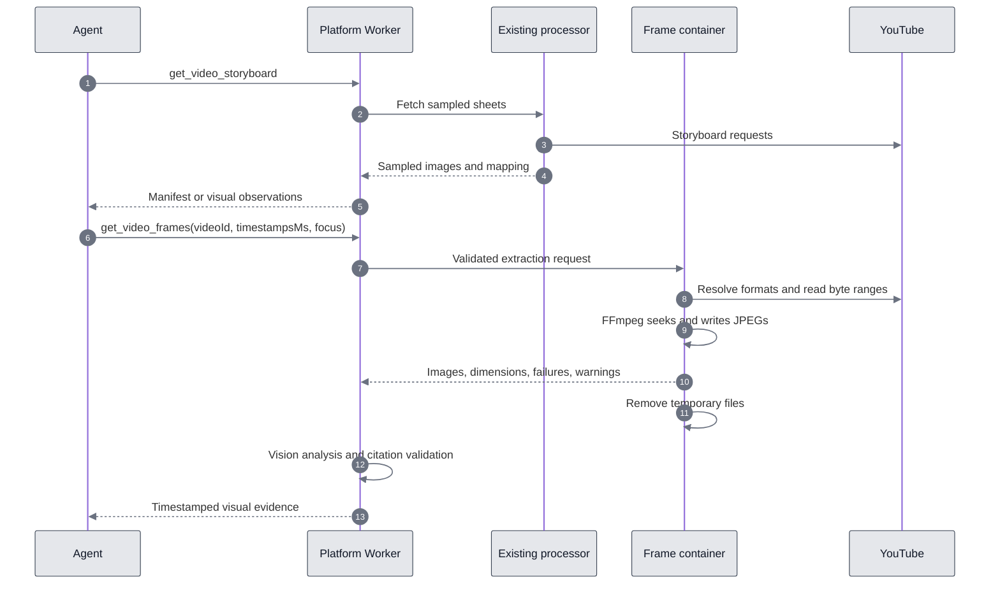

# YouTube frame extraction

An agent uses storyboards to find relevant moments, then asks for individual video frames when it needs to read text, a chart, code, or a specific interface state. Frame extraction does not analyze the whole video or prove motion between images.

## Existing local skill

The skill is `youtube-ctx`. Its visual entry point is `watch.mjs`, generated from `packages/youtube-skills/src/watch/`. The published instructions are in `.agents/skills/youtube-ctx/references/visual.md`.

1. `index` retrieves metadata, a timed transcript, and storyboard contact sheets. The agent must open the images to inspect them. A tile maps to `(firstFrameIndex + row * columns + column) * intervalMs`.
2. `frames` accepts selected timestamps. The workflow validates the video ID, bounds the selection to 30 timestamps, rejects live videos, and checks timestamps against known duration.
3. The extractor requests playable media through iOS, Android, Android VR, and mobile-web client profiles. It considers direct video URLs. It does not decipher signature-cipher formats.
4. A token-protected HTTP server on loopback forwards FFmpeg byte-range requests to YouTube using the configured fetch transport. It caches up to 4 MiB of the stream prefix and shares a 256 MiB transfer allowance across the extraction request.
5. FFmpeg seeks before decoding, extracts one JPEG with quality setting 2, and scales down without upscaling. Each FFmpeg process has a 30-second timeout. The first timestamp probes a format; the remaining timestamps use at most two parallel extractors.
6. Results report dimensions, requested timestamps, per-frame failures, and quality warnings. The agent must open the returned JPEGs, then clean its temporary workspace.

Local extraction continues to prefer progressive formats for seekability, with a default maximum width of 1280 and a limit of 1920. The shared implementation now supports an internal `preferResolution` option. The hosted job enables it, while retaining one progressive fallback in the four-candidate shortlist. This prevents higher-resolution adaptive formats that reject range access from crowding out a usable fallback.

There is no full-video file download or staging step. FFmpeg streams media through the range proxy and saves only JPEGs. This does not guarantee that fewer bytes than the whole media stream are transferred: requests can be open-ended, upstream `200` responses are accepted even when a range was requested, and a short video may fit within the transfer allowance. The 256 MiB allowance bounds media reads in the proxy, not a percentage of the source video. The hosted job also has a 60-second deadline.

`timestampMs` labels the requested seek position. The implementation does not measure the decoded frame's presentation timestamp. Do not describe it as proof of millisecond-level synchronization. High-resolution output is also best effort: a successful live test returned a 640 by 360 fallback after YouTube rejected higher-resolution URLs.

## Hosted flow

The platform Worker's existing agent API owns authentication, permissions, admission limits, credits, input validation, and the agent response. The new private `YouTubeFramesContainer` owns frame-related YouTube traffic, the loopback range proxy, FFmpeg, and temporary files. The existing processor continues to handle storyboards and other provider reads. No YouTube media requests originate in the Worker.



Frame extraction is available only through `get_video_frames` inside the existing agent API. There is no public data API frame endpoint. The private container's `/frames` route is reached through its Worker binding. The built-in agent tool passes JPEGs to an isolated visual analyst, then returns observations with timestamped citations. It persists the evidence and compact image metadata. After successful analysis, it saves the original JPEG bytes in R2 storage for dashboard previews. Media URLs and container paths are not persisted. The existing visual classifier, pinned-video checks, analyst concurrency limit, model budget, and research deadline apply.

## Agent tool and private container contract

During a request to `POST /v1/agent`, the agent can call `get_video_frames` with:

```json
{
  "videoId": "dQw4w9WgXcQ",
  "timestampsMs": [30000, 68000],
  "maxWidth": 1920,
  "focus": "Read the on-screen text at these moments."
}
```

The selection contains 1 to 6 nonnegative integer millisecond timestamps. Duplicates are removed and timestamps are sorted. Each timestamp must be strictly before the known video duration. `maxWidth` defaults to 1920 and accepts 320 to 1920. The tool passes `focus` to the visual analyst and sends only the video ID, timestamps, and maximum width to the container. The caller cannot supply media URLs, local paths, proxy configuration, or executable names.

Successful private container responses contain `videoId`, `frames`, `failures`, and `meta`. Each frame contains `timestampMs`, `mimeType`, `width`, `height`, optional source dimensions, and `imageBase64`. The response accounts for every unique requested timestamp exactly once, either as a JPEG or an explicit failure. The Worker checks this mapping before running vision. The agent receives visual findings and image metadata, with no JPEG bytes in its evidence packet.

The agreed price is 2 credits per successful batch of 1 to 6 frames, including visual analysis and partial results, through the existing agent usage and reservation lifecycle. Failed extraction or analysis does not charge for that tool call. An identical request reused within the same agent run incurs no additional charge. Other successful tools in the run retain their own charges. Viewing a saved preview does not charge credits or repeat extraction.

## Resource bounds and deployment

- Dedicated binding `YOUTUBE_FRAMES`, two fixed routing slots, at most two `lite` instances, five-minute idle sleep.
- One active extraction job per container. Saturation returns `503 PROCESSOR_BUSY` and the private response includes `Retry-After: 1`.
- A 4 KiB request limit, 4 MiB per JPEG, 8 MiB total JPEG limit, and 12 MiB serialized response limit.
- A 60-second extraction deadline. A separate process group allows the parent to kill the Node job and FFmpeg descendants together on deadline or cancellation. The parent removes the temporary directory after the process exits.
- A 70-second Worker transport deadline, additionally bounded by the agent's cancellation signal. A busy response can try the other slot because no extraction started. Expensive extraction is not replayed after transport or extraction failures.
- Optional `OUTBOUND_PROXY_URL` is passed as a runtime secret and used for both metadata and media requests. Upstream exception text is excluded from public extraction errors.

The Docker build context is the repository root, restricted by `platform/youtube-frames/Dockerfile.dockerignore`. It copies the shared watch TypeScript source and bundles it against the exact published extraction-library version in the container lockfile. It does not compile the library from repository source. The final image runs as `node` and includes FFmpeg. Tini reaps orphaned descendants after process-group termination.

Both Wrangler configurations add migration `v6` for `YouTubeFramesContainer`. Deployment creates shared Cloudflare resources and requires the separately agreed deployment scope. The initial production deployment was explicitly requested and completed on September 12, 2026 (Asia/Kolkata).

### Production deployment verification

- Worker: `video2ctx`, version `227ff28d-71f3-431f-8e5a-a02de97f1a6d`.
- Container application: `video2ctx-youtubeframescontainer`, ID `a03ccb53-aa01-447e-aba9-74241c9a2204`.
- Registry image digest: `sha256:6bfc81906e66fabfba1e020e43e0c71e7390e129e3ea5bd1e666ffd5005abd63`.
- A temporary deployment configuration pinned the existing YouTube processor to its deployed image digest. Wrangler reported no changes to that processor. Existing Worker secrets were preserved and no D1 migrations were run.
- Live extraction for `dQw4w9WgXcQ` at 14, 15, and 16 seconds returned three valid 1920 by 1080 JPEGs with no failures or warnings in 17.6 seconds, excluding initial container startup. These JPEGs totaled 462,443 bytes; this measures image output, not downloaded media bytes.
- A second request with timestamps `[30000, 14000, 14000]` and maximum width 640 returned two valid 640 by 360 JPEGs at 14 and 30 seconds in 25.1 seconds. Timestamp sorting and deduplication passed.
- Private health checks passed before and after extraction, and the container reported no active job afterward. Invalid timestamps returned 422. Cloudflare reported a healthy instance with no health errors.
- The tests used a temporary token-protected Worker bound to the production container. Its unauthenticated access check returned 401. It was removed after testing; no public frame route was added to the data API.
- The initial live agent attempt using the existing CLI profile stopped at `/v1/agent/access` with 401. A subsequent API-key test passed, as recorded below.
- Pre-deployment type checking, 12 focused platform tests, and all 6 frame-container tests passed.

### Live agent verification with an API key

On September 12, 2026, the key supplied in `.env.agent-test.local` authenticated successfully against `https://api.video2ctx.dev`. The key was loaded at runtime and excluded from logs and artifacts. Agent access returned 200, and the removed data API frame route returned 404 with the same authenticated key.

Run `9d9cf344-f62d-44d8-9224-73cfbe6b9f7a`, session `cd590466-2383-81ce-98b2-70d67d3f87a5`, requested descriptions of the frames at 14, 30, and 60 seconds of `dQw4w9WgXcQ`. Admission returned 202; the run completed by the 41.9-second polling observation and charged 3 credits total.

The persisted progress snapshot records a completed `get_video_frames` call with `timestampsMs: [14000, 30000, 60000]`. That tool completed in 26.0 seconds and produced three evidence excerpts. The response contains a `youtube_frame_analysis` artifact with three 1920 by 1080 frames, no extraction failures, and three matching timestamped citations. The only other recorded tools are metadata retrieval and finalization; no transcript or storyboard tool ran. This verifies that the deployed agent used individual-frame evidence to answer the request.

For independent visual checking, the same production container was queried through a temporary token-protected verification Worker. One three-frame retrieval timed out after the container's 60-second deadline; individual-frame requests were then used to retrieve comparison JPEGs. Comparison files are separate extractions at the same requested timestamps and dimensions. At the time of this test, the agent did not persist its original JPEG bytes or hashes, so this check does not establish byte-for-byte identity with the images passed to its visual analyst.

All three comparison requests succeeded at 1920 by 1080. Each JPEG was opened and visually inspected against the corresponding answer and citation:

| Requested time | Agent's description | Independent visual check |
| --- | --- | --- |
| 14 seconds | Person in dark sunglasses, light blue shirt with chest pockets and rolled sleeves, belt and light blue trousers; chain-link fence and shadows. | Matches the image, including the clothing, belt, fence, shadows, and black side bars. |
| 30 seconds | Close-up with reddish hair, brown-framed dark sunglasses, light blue collar, open mouth, and chain-link fence. | Matches the close-up and background. |
| 60 seconds | Person seen from behind with blonde hair and a yellow hair accessory, sleeveless black dress, pale blue-lavender patterned background; image is blurry. | Matches the visible outfit, rear view, hair accessory, background, and softness. The exact shape of the accessory is unclear, so “hair accessory” is more defensible than specifically “bow.” |

No material visual mismatch was found in this three-frame test. The authenticated agent path, successful frame-tool trace, evidence artifacts, citations, and manual image comparison passed. This is one live test, not a guarantee across all videos. The separate retrieval timeout remains evidence of variable extraction latency.

Local verification artifacts are under `/tmp/video2ctx-frame-smoke/`: `verification-summary.json`, `agent-events.txt`, `image-manifest.json`, and `images/{14000,30000,60000}.jpg`. The temporary verification Worker was removed after testing. No production code changes were needed for this verification.

## Verification

```sh
npm ci --prefix platform/youtube-frames
npm --prefix platform/youtube-frames run build
npm --prefix platform/youtube-frames test
npm --prefix platform run build
npm --prefix platform test
npm run test:skills
npm run docs:check
npm run docs:verify
docker build -f platform/youtube-frames/Dockerfile -t video2ctx-youtube-frames:local .
```

The automated tests cover agent-only exposure, agent credit usage, request validation, response coverage, timestamp citations, visual isolation, scope restrictions, process-tree termination, cleanup, and resolution fallback. The existing `WATCH_FFMPEG_TEST=1` test exercises a real FFmpeg seek through the range proxy; `YOUTUBE_LIVE=1` exercises the upstream service and can fail when YouTube rejects media access.

Cloudflare references: [Container class](https://developers.cloudflare.com/containers/reference/container-class/) and [Worker best practices](https://developers.cloudflare.com/workers/best-practices/workers-best-practices/).

## Dashboard frame previews

New frame calls save the exact JPEGs sent to the visual analyst after analysis succeeds. The expanded dashboard tool trace shows a thumbnail grid with timestamps and dimensions, plus an enlarged viewer. The trace contains only preview descriptors, never base64 image data. Historical calls without saved images explain that previews were not saved.

Objects live under `agent-frames/{collectionId}/{assetId}.jpg` in the existing RESEARCH bucket. Collection IDs are derived from the account ID; each asset ID has 256 random bits. URLs contain no session IDs, run IDs, prompts, or raw account IDs. Images remain available until account deletion. The deletion flow drains active agent work before deleting both private research data and the account’s frame collection. Failed or cancelled uploads roll back their batch; storage failures leave successful visual evidence usable with a `FRAME_PREVIEW_UNAVAILABLE` warning.

`GET /v1/agent/frames/{collectionId}/{assetId}` is public. Anyone with the unguessable URL can view the JPEG without a login or API key. The handler is mounted before authentication and can read only JPEG keys in the frame namespace. The R2 bucket itself is not public. There is no listing route or data API frame endpoint. Session reads and new extraction requests still require authentication. Responses use `image/jpeg`, `no-store`, `nosniff`, and `noindex, nofollow`. The dashboard loads original images through its existing API proxy with Next.js image optimization disabled.

### Preview deployment verification

The preview backend was deployed on September 12, 2026 to Worker version `d252c94e-4034-405c-9dc1-f70c9df51462`, using `wrangler deploy --containers-rollout=none`. Both container images were preserved. The dashboard preview UI is included in PR #37 and requires the web deployment after merge.

Validation passed: platform and web type checking, the web production build, 31 web tests, all 17 dashboard browser tests in Chrome, 30 Worker runtime integration tests, and focused persistence, public-route, cleanup, trace, and routing tests. Screenshots were inspected on desktop and mobile. The full platform suite passed before the final routing clarification; the 44 routing tests passed afterward.

The first preview smoke run (`f30a76cb-3af6-4300-b7c4-cd6b120e69c4`) returned metadata only. The classifier had interpreted “do not use storyboards” as `useStoryboard: false`, which disables both visual tools. The classifier instruction now explicitly enables individual-frame requests even when the user declines storyboards.

The repeated request passed after that clarification. Run `a7c684ae-c469-48df-82e2-1ca86ec5f0df` in session `a10c268b-10ee-896a-91ec-b805a3edf9f0` extracted frames at 14,000 and 30,000 ms from `dQw4w9WgXcQ`. The completed trace contained both preview descriptors. Anonymous GETs returned valid 1920 by 1080 JPEGs of 109,199 and 97,810 bytes. Both saved originals were opened and compared with the answer; the shirt, sunglasses, fence, framing, and pillarbox descriptions matched the visible images. The run charged 3 credits, comprising metadata plus the frame batch. Anonymous session reads still returned 401, and the data API frame path returned 404.
