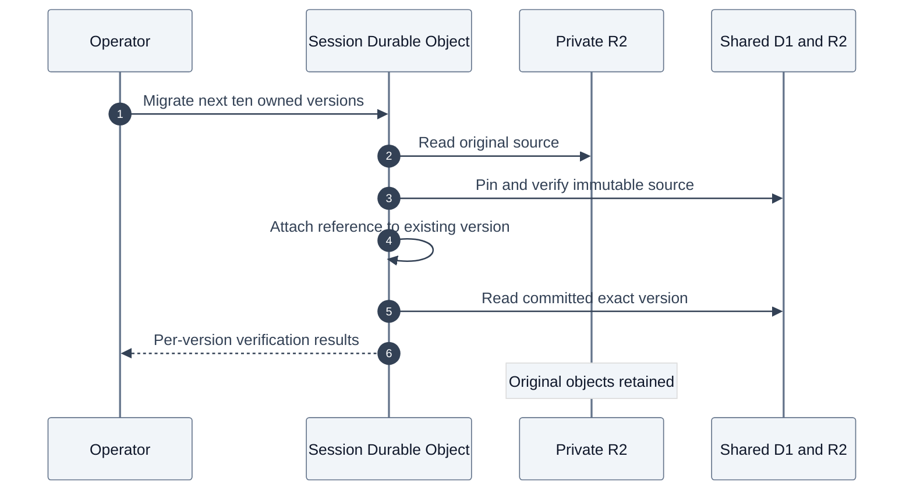

# Migrate existing session asset references

Copying public assets into `video2ctx-video-assets` does not switch a session's reads. Its Durable Object must also attach the immutable shared catalog reference to the existing session version. This operator sweep performs that step for every session listed in the account dashboard catalog, including dormant sessions. Citation identities and session ownership stay unchanged.

The sweep never deletes, overwrites or clears an original private object or its stored key in `all-things-youtube-private`. After linking, normal asset reads use the shared version. Private analysis and memory remain session-owned. Existing JPEG preview URLs and historical run snapshots keep their current storage; they are not converted by this command. Older previews already copied into the shared bucket remain copies until a separate preview-link migration.

## Prerequisites

Deploy the PR containing `AgentRuntimeDO.migrateSessionAssets` and `UserAccountDO.listSessionAssetMigrationTargets` first. Apply catalog migration `0003_historical_asset_versions.sql` before deploying. The normal production deployment command includes D1 migrations.

The operator must have Wrangler access to the production account. The runner explicitly targets account `9079b7cc8d9e8cf76bcca7559b82b5c5`, Worker `video2ctx` and account database `4f173c2a-8c42-49ef-b36d-07a91533f029`. The application's deployed bindings choose the R2 buckets and video catalog. This is an explicit production operation, independent of deployment.

## Run and verify

From the repository root:

```sh
mkdir -p .scratch/session-asset-cutover
npm --prefix platform run assets:sweep -- --production --mode migrate --report "$PWD/.scratch/session-asset-cutover/migrate.jsonl"
npm --prefix platform run assets:sweep -- --production --mode verify --report "$PWD/.scratch/session-asset-cutover/verify.jsonl"
```

Each command starts a temporary authenticated Wrangler remote preview on localhost port 8799 and stops it on exit. It does not deploy another Worker or start agent/model/provider calls. The temporary helper has account D1 and DO bindings, with no direct R2 bindings. A random token protects its requests; credentials and Wrangler logs live only in a private temporary directory removed on exit. Existing report files are never overwritten. Audit files contain session and version IDs with statuses, not prompts, source payloads or reference overlays.

1. Enumerate all account IDs from D1 and dashboard session IDs from each UserAccountDO. Pagination uses stable IDs, so changing session recency cannot skip a session.
2. Visit each session through its normal derived DO identity and owner check. Fetch up to ten asset versions at a time, including superseded versions. A failed asset does not stop later pages or sessions.
3. For an unlinked public source, verify/persist its immutable catalog version and atomically attach the reference to its existing session version. Do not advance public freshness/current pointers or remove private blobs.
4. Read the committed shared reference directly. When an original private blob is present, compare canonical JSON, including the session envelope. Never count a private fallback as shared-read success.
5. Write per-asset results and a final scope summary. Run `verify` independently to audit the same read path without linking or fetching new source data.



## Completion and retries

`shared_verified` means the committed immutable reference was readable from the shared catalog and R2. `unlinked`, `unreadable`, `mismatch`, and `changed` are failures requiring review or retry. Unsupported/private payloads remain in private storage and cannot produce a successful full cutover report.

The runner returns a nonzero exit status if any session fails, its asset count/generation changes during pagination, or the discovered account/session inventory changes. Rerun with a new report path after resolving failures or allowing active changes to settle. Repeating a sweep is safe: existing references are verified, not replaced. Cursor pagination advances past failed records; a new invocation starts from the beginning and retries them.

A final `complete: true` certifies the discovered raw-asset inventory at the time each session was checked. It is not a global transaction across live sessions, proof that every historical preview link has switched, or permission to delete the original bucket. New sessions/assets created after the audit need their own checks. Keep the independent verification report and obtain the user's confirmation before planning removal of original copies.
