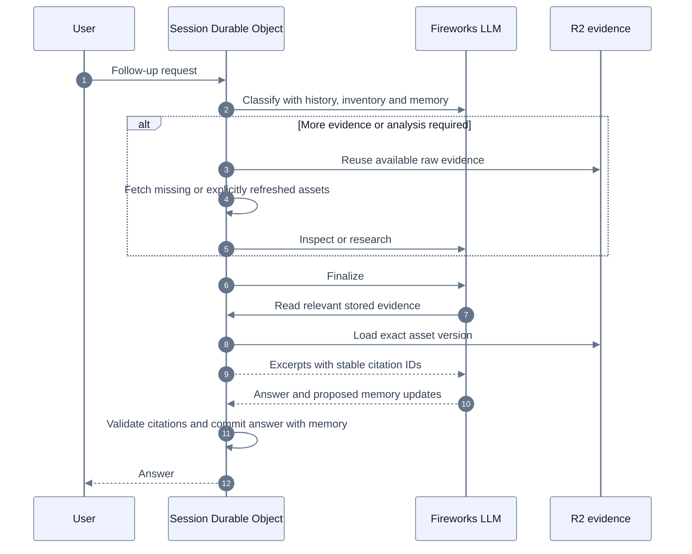

# Session evidence and memory

The existing conversation-scoped AgentRuntimeDO owns source availability and derived memory. R2 holds raw payloads. Fireworks performs classification, analysis and finalization; it does not own persistence or retrieval policy.

## Flow

1. The classifier receives eight completed conversation turns, a compact inventory with coverage and collection times, and bounded derived memory. It never receives raw transcripts or images through the inventory.
2. Classification chooses research, single-video inspection or direct finalization. Explicit requests to fetch again set `refreshEvidence` and require an executable route.
3. Retrieval checks the session store before the provider. Complete nonempty transcripts are keyed by video and requested/resolved language; comments by video and continuation; frames by video, timestamp and width; storyboard sheets by video, manifest version and sheet index. Raw images and transcripts are persisted before any analyst call. A refresh advances compatible language aliases while preserving older versions for historical citations.
4. Stored payloads are not automatically injected into every run. Finalization can read saved transcript pages or existing analysis through `read_session_evidence`. It can list more inventory when the prompt omitted assets. Inventory and memory are hints, not evidence for factual claims. A direct finalizer can request one inspection of an already-known video if evidence proves insufficient. Research and that inspection end in the same finalizer.
5. Citation validation resolves immutable excerpt IDs against persisted packets. Validated memory updates are committed in SQLite with the completed answer. Findings require existing evidence references; context and open questions are stored separately. Matching kind/topic replaces an earlier memory, allowing user corrections.

## Refresh and deletion

An empty or partial transcript is available to the current run with warnings, but never enters reusable session storage. Failed refreshes leave the previous complete version intact. Fresh transcript and comment requests bypass the shared provider cache. A refresh retrieves each successful asset once during that run.

Deleting an asset removes its aliases, derived packets, dependent findings, historical source excerpts and image previews. Historical messages remain; affected answers have unavailable source markers and are omitted from future assistant context. Deleting all assets also removes all memory. Deletion increments a generation before asynchronous cleanup. Older retrievals and memory snapshots cannot restore deleted state. R2 cleanup uses a durable queue and retries when the object starts again.

The dashboard exposes inventory, raw payload viewing, individual deletion, bulk deletion and forgetting memory entries. Ownership is enforced by the HTTP principal, user-scoped Durable Object identity, and an ownership check inside the object.

## Scope and Cloudflare choices

This change adds no new deployed binding: it uses existing Durable Object SQLite and RESEARCH R2. Existing historical run packets remain readable; old runs are not retroactively converted into raw asset storage. Newly retrieved complete assets become reusable automatically.

Cloudflare's [Session API](https://developers.cloudflare.com/agents/concepts/conversation-state-and-memory/) is available in the installed SDK but remains experimental. Its context blocks and search providers are useful general-purpose abstractions; this implementation keeps a small typed store to enforce evidence-reference validity and source-dependent deletion without duplicating the established conversation history. [Agent Memory](https://developers.cloudflare.com/agent-memory/) is a separate managed service currently documented as private beta. Neither is required for deployment.

Vectorize can later index transcript passages or visual observations for semantic lookup. It must return asset versions and excerpt IDs which are checked against this authoritative store. Vector results must never restore a deleted source or become citations independently. Current lookup supports transcript paging and exact case-insensitive text filtering, plus persisted analysis reads; it is not semantic search.

Stable system instructions and tool schemas precede changing request context. Memory updates do not mutate prompts mid-call. Finalizer tool reads append results to the model conversation. Cache hits and latency remain inference-provider behavior and are not guaranteed by this storage design.

## Validation

Synthetic provider/model tests exercise retrieval reuse, language aliases, explicit refresh, partial transcripts, analyst failure recovery, overlapping frame and storyboard selections, citation collisions, deletion races, ownership, atomic memory persistence, and model-driven evidence reads. Local Workerd tests use actual SQLite and R2 emulation. Dashboard tests exercise viewing and deletion. These tests do not measure live Fireworks reliability or claim an exactly-once remote fetch after a process crash before persistence.
