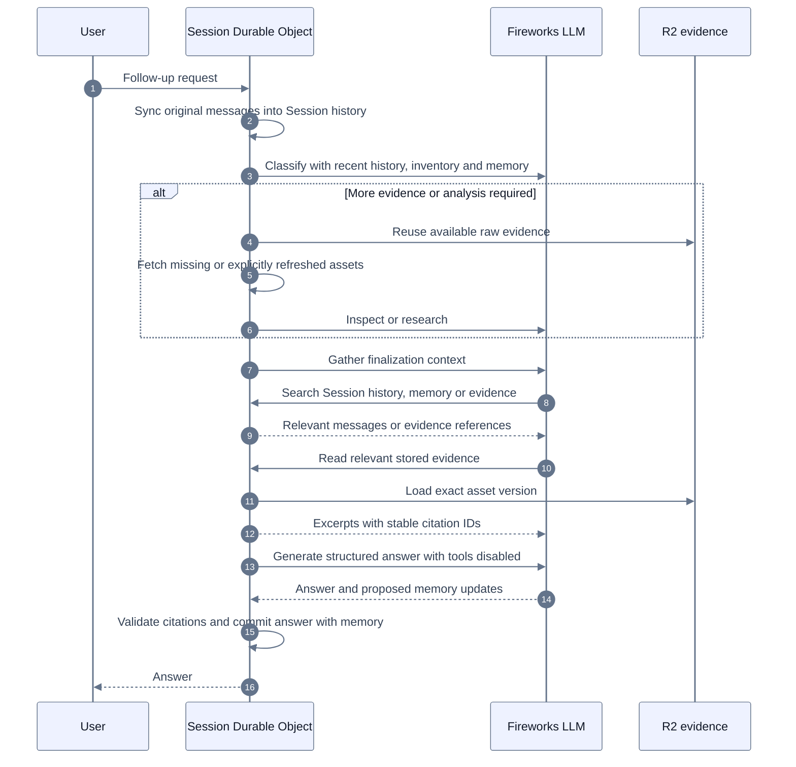

# Session evidence and memory

The existing conversation-scoped AgentRuntimeDO owns source availability and derived memory. Cloudflare Agents Session provides searchable conversation history and the model-facing searchable-context tools. R2 holds raw payloads. Fireworks performs classification, analysis and finalization; it does not own persistence or retrieval policy.

## Flow

1. Before classification, original user messages and completed answers are indexed into the SDK Session history. Existing run records remain authoritative for execution and dashboard restoration. Failed-run user messages are included; answers whose evidence was deleted are excluded. Backfill reads changed runs incrementally, and subsequent updates only rewrite changed text. The classifier receives eight completed conversation turns, a compact inventory with coverage and collection times, the indexed message count, and bounded derived memory. It never receives raw transcripts or images through the inventory.
2. Classification chooses research, single-video inspection or direct finalization. Context answers carry a history/video/mixed scope; exact-first-message and all-user-message requests also carry an explicit history selection. Persisted older routes remain readable. Explicit requests to fetch again set `refreshEvidence` and require an executable route.
3. Retrieval checks the session store before the provider. Complete nonempty transcripts are keyed by video and requested/resolved language; comments by video and continuation; frames by video, timestamp and width; storyboard sheets by video, manifest version and sheet index. Raw images and transcripts are persisted by retrieval tools that never invoke an analyst. For single-video inspection, the main model reads the returned timed captions directly. Research passes saved transcript versions to `analyze_video_transcripts`; visual interpretation uses `analyze_video_frames` or `analyze_video_storyboard` with saved frame or sheet versions and a focus. These analysis tools load exact session payloads, never call YouTube, and persist derived evidence separately. A new question can reuse the same raw assets without a retrieval tool call. A refresh advances compatible language aliases while preserving older versions for historical citations.
4. Research, inspection and finalization can use the SDK-generated `search_context` tool for `history`, `memory`, and `evidence`. `read_session_history` lists original messages chronologically with role filtering and pagination, including messages beyond the eight-turn prompt window. Stored payloads are not automatically injected into every run. Finalization can read saved transcript pages or existing analysis through `read_session_evidence`. It can list more inventory when the prompt omitted assets. Inventory and memory are hints, not evidence for factual claims. A direct finalizer can request one inspection of an already-known video if evidence proves insufficient, except for history-only requests. Research and that inspection end in the same finalizer.
5. The unified finalizer first gathers context without an answer JSON schema, then generates structured answer blocks in a separate call with tools disabled. History requests receive the first chronological page before model inference. Exact-first-message answers must contain that original text verbatim. Context gathering is limited to four model steps; answer generation gets one attempt and one repair within the existing deadline and cost limit. Known fragment-only and promise-only non-answers trigger repair rather than successful persistence. These narrow checks do not prove semantic completeness for arbitrary answers. Context tool names and finish reasons are logged without message contents.
6. After context gathering, the finalizer schema restricts answer and memory evidence IDs to supplied excerpt references (short aliases or full IDs). Inventory asset IDs and unrelated history citations are not accepted. Citation validation still resolves immutable excerpt IDs against persisted packets. Validated memory updates are committed in SQLite with the completed answer. Findings require existing evidence references; context and open questions are stored separately. Matching kind/topic replaces an earlier memory, allowing user corrections.

## Refresh and deletion

An empty or partial transcript is available to the current run with warnings, but never enters reusable session storage. Failed refreshes leave the previous complete version intact. Fresh transcript and comment requests bypass the shared provider cache. A refresh retrieves each successful asset once during that run. Analysis rejects versions that have not been retrieved in the current refresh run. Missing, deleted, wrong-kind or out-of-scope assets fail before inference; analysis also checks availability after inference. A failed analysis leaves successful retrieval and its raw assets available for another analysis.

Deleting an asset removes its aliases, derived packets, dependent findings, historical source excerpts and image previews. Historical messages remain; affected answers have unavailable source markers and are omitted from future assistant context. Deleting all assets also removes all memory. Deletion increments a generation before asynchronous cleanup. Older retrievals and memory snapshots cannot restore deleted state. R2 cleanup uses a durable queue and retries when the object starts again.

History and context search use the same session Durable Object as evidence, with no cross-account search endpoint. Search indexes are derived data, never citation authority. Deleting a source removes raw transcript index entries, analyzed excerpt entries, dependent memory entries and affected answers from SDK history. Source-table SQLite triggers keep index deletion and memory replacement synchronous; generation checks protect lazy R2 index backfills. Account deletion clears SDK history and its index.

The dashboard exposes inventory, raw payload viewing, individual deletion, bulk deletion and forgetting memory entries. Ownership is enforced by the HTTP principal, user-scoped Durable Object identity, and an ownership check inside the object.

## Scope and Cloudflare choices

This change adds no new deployed binding: it uses existing Durable Object SQLite and RESEARCH R2. Existing historical run packets remain readable; old runs are not retroactively converted into raw asset storage. Newly retrieved complete assets become reusable automatically.

Cloudflare's [Session API](https://developers.cloudflare.com/agents/concepts/conversation-state-and-memory/) is used through `runtime/session-search.ts`, the only adapter importing `agents/experimental/memory/session`. The existing dependency is pinned to `agents@0.21.0`.

- `AgentSessionProvider` stores a searchable projection of user messages and completed answers. `Session.search()` searches its SQLite FTS index. History search in this pinned version matches a literal phrase. A paginated reader returns 20 messages per page because keyword search cannot enumerate every message reliably. The finalizer allows four context steps followed by a separate answer call and, if validation fails, one repair; all share the existing deadline and cost budget. It must state when pagination is incomplete. Results cover the session and can include other conversation branches; they are not asserted to be the active branch alone.
- `Session.create(...).withContext(...)` supplies read-only searchable contexts and generates `search_context`. There is no unrestricted model write tool. Memory proposals still pass through citation validation and the completed-answer commit.
- Evidence and memory use custom FTS5 context providers. Unlike the built-in `AgentSearchProvider`, these providers can synchronously delete entries with the authoritative source tables and resolve matches into valid evidence packets. Queries match all literal words, with ranked results capped at 20. Transcript passages are indexed before analysis; saved storyboard/frame observations and comment excerpts are indexed when their evidence packet is saved. This does not index image pixels.
- Existing stored transcript assets are indexed lazily one at a time if necessary. This does not extract evidence retroactively from old run records. Search loads only matching excerpts into the model conversation; paging remains available through `read_session_evidence`.

Session compaction and frozen context prompts are not enabled. The application retains the requested eight-turn prompt window, now supplemented by searchable history. Compaction would require a separate summarization policy and model budget. Dynamic memory remains outside the stable system instructions. [Agent Memory](https://developers.cloudflare.com/agent-memory/) is a separate managed service and is not used.

Vectorize could later implement semantic lookup behind the same context-provider interface. Vector results would still have to resolve to current authoritative asset versions and excerpt IDs. Current retrieval is lexical FTS5 search, transcript paging/text filtering, and persisted analysis reads.

Stable system instructions and tool schemas precede changing request context. Memory updates do not mutate prompts mid-call. Finalizer tool reads append results to the model conversation. Cache hits and latency remain inference-provider behavior and are not guaranteed by this storage design.

## Validation

Synthetic provider/model tests exercise retrieval reuse, language aliases, explicit refresh, partial transcripts, analyst failure recovery, overlapping frame and storyboard selections, citation collisions, deletion races, ownership, atomic memory persistence, and model-driven evidence reads. Local Workerd tests use actual SQLite and R2 emulation. Dashboard tests exercise viewing and deletion. Additional tests run the real SDK Session search tools against SQLite, verify history beyond eight turns, role-filtered pagination, correction/deletion, isolation, lazy-index races, and model-driven search through both resumed finalization and inspection. These tests do not measure live Fireworks reliability or claim an exactly-once remote fetch after a process crash before persistence.

Frame tool results expose `sessionReused` in the activity trace when all requested images came from session storage. The dashboard labels retrieval and analysis as separate operations. Retrieval keeps its existing credit charge, including when subsequent analysis fails. Saved-asset analysis adds no provider credit charge. Retrieval and analysis each have a persisted limit of 11 tool records per run; the main loop, transcript target, concurrency, time and model-cost limits still apply. The finalizer remains the last step in every path.

Session restoration projects assistant answers through the same numbered citation formatter as compact run responses. Canonical run results and model history retain immutable citation markers; user message text is never rewritten. Finalization logs distinguish missing evidence from conflicting evidence without logging the answer or citation identifier.
