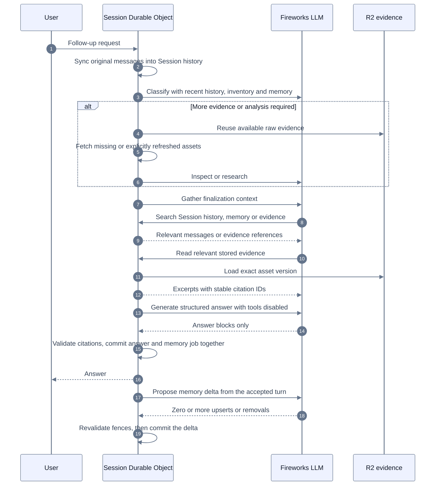
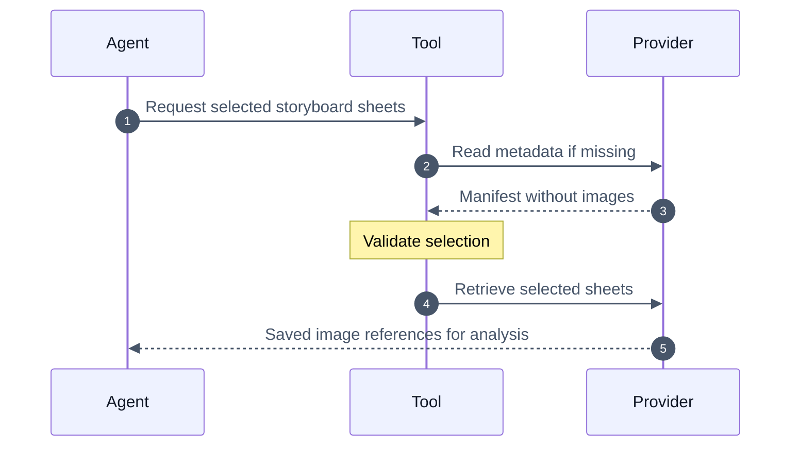

# Session evidence and memory

The existing conversation-scoped AgentRuntimeDO owns source availability and derived memory. Cloudflare Agents Session provides searchable conversation history and the model-facing searchable-context tools. The shared D1 catalog locates immutable public source versions in R2; the session keeps ownership, citations, search projections and private analysis. Fireworks performs classification, analysis and finalization; it does not own persistence or retrieval policy.

## Flow

1. Before classification, original user messages and completed answers are indexed into the SDK Session history. Existing run records remain authoritative for execution and dashboard restoration. Failed-run user messages are included. Answers whose evidence was deleted stay included, with deleted citations shown as `[source deleted]`. Changing the indexing rule version re-indexes every run once. Backfill reads changed runs incrementally, and subsequent updates only rewrite changed text. The classifier receives eight completed conversation turns, a compact inventory with coverage and collection times, the indexed message count, and bounded derived memory. It never receives raw transcripts or images through the inventory.
2. Classification chooses research, single-video inspection or direct finalization. Specific-video comparisons carry `comparisonVideoIds` independently of the retrieval route. With one missing transcript, inspection fetches that video and preserves every comparison subject; with several missing transcripts, research uses those subjects without discovery. A narrow guard repairs the previously failing "compare this video with a new one" form if the earlier subject is dropped. Other comparison phrasing is resolved by classification. Context answers carry a history/video/mixed scope; exact-first-message and all-user-message requests also carry an explicit history selection. Persisted older routes remain readable. Explicit requests to fetch again set `refreshEvidence` and require an executable route.
3. Retrieval checks the session store before the provider. Complete nonempty transcripts are keyed by video and requested/resolved language; comments by video and continuation; frames by video, timestamp and width; storyboard sheets by video, manifest version and sheet index. Raw images and transcripts are persisted by retrieval tools that never invoke an analyst. For single-video inspection, the main model reads the returned timed captions directly. Research selects sources and a focus once using `research_video_transcripts`. Its application scheduler retrieves missing transcripts or reuses selected saved versions, then starts each analysis as soon as that transcript is saved. Retrieval and analysis have separate concurrency limits, so slow provider requests cannot occupy ready analysis slots. Each child retrieval and analysis persists independently; completed evidence remains available to finalization when a sibling fails or the research deadline cancels unfinished work. Saved-only follow-up analysis can use `analyze_video_transcripts`; visual interpretation uses `analyze_video_frames` or `analyze_video_storyboard` with saved frame or sheet versions and a focus. These analysis tools load exact session payloads, never call YouTube, and persist derived evidence separately. A new question can reuse the same raw assets without a retrieval tool call. A refresh advances compatible language aliases while preserving older versions for historical citations.
4. Research, inspection and finalization can use the SDK-generated `search_context` tool for `history`, `memory`, and `evidence`. `read_session_history` lists original messages chronologically with role filtering and pagination, including messages beyond the eight-turn prompt window. Stored payloads are not automatically injected into every run. Finalization can read saved transcript pages or existing analysis through `read_session_evidence`. It can list more inventory when the prompt omitted assets. Inventory and memory are hints, not evidence for factual claims. Finalization cannot request another inspection or fetch new provider evidence. Routing selects research or inspection when fresh evidence is needed. If stored context is insufficient after finalization begins, the answer states that gap. Research and inspection end in the same finalizer.
5. The unified finalizer first gathers context without an answer JSON schema, then generates structured answer blocks in a separate call with tools disabled. History requests receive the first chronological page before model inference. Exact-first-message answers must contain that original text verbatim. Finalization stores one 60-second main deadline shared by context gathering and the first answer. Context gathering remains limited to four model steps but has no separate time cap. The first answer may use all remaining main time. If gathering exhausts the main deadline, collection stops and the response-only allowance can use the original inputs and evidence packets delivered before the cutoff. Context tool-call messages, including history pages read through tools, are only appended when gathering completes successfully; they are lost on a context timeout. The initial synchronous history page, if already read, remains available. Context collection runs before the answer attempts and is not repeated by repair. A retry reuses completed context messages and any partial answer only when they exist. Recovery reloads persisted evidence and conversation inputs, but neither prior in-memory context messages nor partial answer text are checkpointed. Recovery after the main deadline skips model-driven collection and R2 preloads. It still reads the initial history page synchronously and restores only the newest saved complete-transcript packet per comparison subject from SQLite, for current versions within the duration limit. Paged reads, query reads and older full-read packets are excluded from that restoration so repeated excerpts cannot crowd out the transcript. Transcript preloads save those packets in session storage, while the finalizer callback itself only updates in-memory evidence. A comparison whose preload never finished may still lack a subject and must state that shortfall. Recovery starts directly in the remaining response allowance, without logging a failed first attempt or inventing repair feedback. A retry keeps the unused main time or gets 20 seconds from its start, whichever ends later, bounded by the persisted main deadline plus 20 seconds and the existing cost limit. A hung non-streaming context call can consume the entire main budget, leaving at most 20 seconds for an answer. Streaming text and reasoning deltas reset a 15-second idle timer; headers and empty events do not. A progressing stream keeps its time until the attempt deadline. Recovery cannot extend the hard deadline. A timed-out stream retains up to 32,000 characters of partial JSON for a shorter repair; partial drafts are never committed as answers. Non-streaming calls have no content-progress signal and use only their absolute attempt deadlines. Standard/detailed structured answers allow 3,000/4,000 output tokens, with another 1,000 for repair, plus provider reasoning headroom. Comparison finalization preloads the current saved transcript for every subject in parallel, without provider calls, capped at 5,000 excerpts per subject. Full reads retain the same citation IDs as paged reads. Short citation aliases are assigned before measuring the prompt budget; comparisons divide a 160,000-character evidence allowance across subjects. If a transcript exceeds its allowance, the projection retains as many sampled passages across its timeline as fit and flags incomplete coverage. Validation requires citations for every subject or an explicit answer-scope shortfall. Known fragment-only and promise-only non-answers trigger repair rather than successful persistence. These narrow checks do not prove semantic completeness for arbitrary answers. Context tool names and finish reasons are logged without message contents. Finalization diagnostics include streaming mode, time to first content, idle time, text/reasoning character counts, and a distinct FINALIZATION_STALLED code, without logging model content. A provider call that fails without reported usage emits `agent_finalization_usage_unavailable`; its unreported cost remains unknown and is not included in observed model cost. The 15-second idle threshold has not been validated against production p99 first-content latency across reasoning profiles.
6. After context gathering, the finalizer schema permits answer fields only, rejects unexpected inspection requests for repair, and restricts answer evidence IDs to supplied excerpt references (short aliases or full IDs). Inventory asset IDs and unrelated history citations are not accepted. Citation validation still resolves immutable excerpt IDs against persisted packets. Neither the first answer call nor its repair has a memory field; unsolicited memory output is stripped by the schema and the persistence contract has no memory input.
7. Memory is maintained by a separate updater call after an answer is accepted, whether or not that answer needed a repair. Acceptance has one await, before any validation read. The citation checks, the accepted result and a durable `agent_memory_jobs` row then commit in one synchronous SQLite transaction, so cancellation, evidence deletion or a concurrent finalize cannot interleave. The first committed answer wins; a duplicate finalize returns it. Out-of-scope rejections, application fallback answers that only explain unavailable evidence or a failed finalization, and failed or cancelled runs create no job. A persisted backstop alarm is armed before an in-process drain starts, and object startup re-arms pending work, which covers the gap between commit and dispatch and work lost to eviction. Memory work never affects the answer's status or credit settlement.
8. The updater receives only the stored user request, the accepted answer, its validated citations and the most recent existing memories, bounded to 40 entries and 8,000 characters, 24 citations, 4,000 question and 12,000 answer characters. It never receives repair feedback, rejected candidates, conversation history or provider failures. It returns zero to four upserts or removals; empty output is a no-op and unrelated memories are left unchanged. Proposals are authorized against that same bounded projection: findings must cite a supplied citation, context must include a quote found in the supplied request, and an existing memory can be corrected or retired only if the model was shown it. Deterministic filters drop obvious credentials, contact details and leaked finalizer control text. These are structural checks, not semantic sanitization: a quote proves the user wrote those words, not that the stored paraphrase is entailed by them, and the prompt alone guards against inferred personal traits.
9. A job stores the run's deletion generation, the accepted answer hash and the updater version. Forgetting a memory or deleting any evidence since the run began fences that run's memory, so a stale snapshot cannot restore deleted state. Before writing, the job revalidates the accepted answer and the memory version it read. A concurrent memory write makes the snapshot stale and the job is retried once with a fresh snapshot. Ordering is guaranteed per normalized kind and topic (trimmed, case-insensitive): each records the turn that last wrote or removed it, so an older explicit branch finishing later cannot overwrite or resurrect that entry. This is not semantic conflict detection; a differently named topic with contradictory text is stored alongside it. Memory remains session-wide across explicit branches, as before; it is not branch-scoped. Writes and their fences run in one SQLite transaction; the model call never runs inside one.
10. Each job allows two updater attempts with SDK retries disabled, 800 output tokens, and an application-owned 20-second wall-clock deadline per attempt. Fireworks GLM can switch once to DeepSeek for the run, so two updater attempts can make up to three provider requests in total. The wall-clock deadline rejects even if a provider ignores abort, and abandoned responses never apply memory changes. The updater attempt is counted durably before generation; each provider request gets a separate durable `memory.request_started` event before dispatch. Admission is checked before each request, including the fallback. Observed costs plus a 20,000-micro allowance for each started request without reported usage and one for the new request must stay within the existing 1,000,000-micro run limit. Reservations count requests rather than updater attempts, so a completed backup cannot erase an outstanding primary. Older attempts without request-start events and crash gaps retain one conservative reservation each. The allowance covers the bounded prompt, about 45,000 characters at up to one token per character, plus the output limit at the configured DeepSeek Priority rates. It is an estimate, not a provider-enforced ceiling; an unusually token-dense prompt could exceed it.
11. Usage observation is attached to each provider promise, independently of the abort race that accepts or rejects its result. Observed usage is recorded once per provider request in `agent_model_usage` (`memory_update`), including a call that responds after its deadline or after its job finished, while its run still exists. Managed requests use distinct `memory-update:<attempt>:<requestId>` accounting IDs; legacy single-request attempts retain `memory-update:<attempt>`. Each recorded request is reported once as its own zero-credit `agent-memory:<runId>:<callId>` ledger adjustment with its provider cost, so late cost is not omitted. Memory cost is excluded from the run's credit settlement; user credits still charge evidence retrieval only. Account deletion aborts in-flight work, waits for the bounded drain, closes usage recording, reports what was observed, then removes the data; a late response afterwards recreates nothing. Cost that is never observed is unavoidable and unrecorded: a crash before the provider responds, a call that never responds, or a response after account deletion closed recording. Durable attempt counts bound how often this can happen, but inference is not exactly-once. Durable deltas are idempotent per job.

```mermaid
%%{init: {'theme':'base','themeVariables':{'primaryColor':'#eef2ff','primaryTextColor':'#111827','primaryBorderColor':'#64748b','actorBkg':'#eef2ff','actorTextColor':'#111827','signalColor':'#64748b','signalTextColor':'#334155','labelBoxBkgColor':'#eef2ff','labelTextColor':'#111827','sequenceNumberColor':'#ffffff'}}}%%
sequenceDiagram
    autonumber
    participant User
    participant App as Session Durable Object
    participant Model as Fireworks LLM
    participant Store as R2 evidence
    User->>App: Follow-up request
    App->>App: Sync original messages into Session history
    App->>Model: Classify with recent history, inventory and memory
    alt More evidence or analysis required
        App->>Store: Reuse available raw evidence
        App->>App: Fetch missing or explicitly refreshed assets
        App->>Model: Inspect or research
    end
    App->>Model: Gather finalization context
    Model->>App: Search Session history, memory or evidence
    App-->>Model: Relevant messages or evidence references
    Model->>App: Read relevant stored evidence
    App->>Store: Load exact asset version
    App-->>Model: Excerpts with stable citation IDs
    App->>Model: Generate structured answer with tools disabled
    Model-->>App: Answer blocks only
    App->>App: Validate citations, commit answer and memory job together
    App-->>User: Answer
    App->>Model: Propose memory delta from the accepted turn
    Model-->>App: Zero or more upserts or removals
    App->>App: Revalidate fences, then commit the delta
```

## Run billing

This changes the earlier rule that reusing session evidence was free. A run now pays the existing cached credits-table price for saved source content it delivers to a model, once per operation-sized unit per run. Citations play no part in the charge. `runtime/evidence-billing.ts` owns the per-run ledger in session SQLite. Every entry point requires a run, so dashboard, Sources, Projects and saved-run reads never reach it.

- Units follow the operation that produced the asset. A transcript version is one transcript operation and a comments page is one comments operation. The saved frames of one video delivered by one call are one frames operation, and the saved sheets of one manifest delivered by one call are one storyboard operation. A manifest alone is not priced. Earlier provider metadata maps to the video operation. Derived evidence (analysis, observations, comment excerpts) is priced through the saved asset versions it came from.
- `agent_evidence_deliveries` records each asset key the run received. A call charges a unit only if at least one of the unit's assets is new to the run, so pages, filtered reads, search hits, preloads, retries, repairs and restart recovery do not charge it again. Overlapping frame or sheet selections charge once per call that adds an asset. A batch groups the assets of each admitted unit before committing its receipt. If any newly delivered asset in the unit has no retrieval claim, its cached charge remains even when a provider claim covering another asset settles. Empty, unavailable and budget-withheld packets do not contribute to the grouping.
- Provider work keeps its table price, even when its content hash matches an asset the run already has. A same-run join onto this run's own retrieval is free once that retrieval completes. A join that completes first holds one provisional cached charge, stored as a provisional row in `agent_evidence_charges`. The retrieval's completion records its settled claim in `agent_evidence_claims` and removes that row. A shared fetch therefore costs exactly its price in any completion order. If the retrieval fails, the provisional charge remains for the stored content the joins delivered.
- Provider-loaded assets publish their retrieval claim in `agent_evidence_asset_claims` before they become searchable. Saved searches, reads and analyst inputs join that claim, including across a restart, so a read during retrieval cannot add a second charge. A retry can replace an unconsumed claim; an explicit refresh never absorbs a charge for content the run already received. Account deletion clears these claims with the other billing tables.
- Empty saved text pages do not charge or mark their asset delivered. A later nonempty read still pays once. Visual retrievals may return saved image handles without text excerpts and retain their operation price. Fresh provider work keeps its existing price.
- Tool pricing, delivery marks, the saved packet and the completed tool record commit in one SQLite transaction. A failed save leaves the tool failed and uncharged. Saved-analysis inputs are admitted after every preflight check and immediately before inference; a later analyst failure keeps that charge.
- Provider tools hold their highest table price while they run, and saved analysis holds nothing. Synchronous admission of saved reads counts committed charges and active holds, so concurrent tools, reads, repairs and recovery stay within the 22-credit reserve. A new unit that does not fit is withheld and the model is told so. Content the run already paid for is still delivered at the cap. Settlement sums completed tool credits and ledger charges, and `billing.charges` lists the receipts.
- Earlier-turn source content is delivered only for videos the route names as answer subjects (`inspect_video` and `comparisonVideoIds`), and for packets the run already received before a restart. Other cited packets and recorded metadata become `priorEvidence` pointers with ids, titles and observation times. The model loads them with `read_prior_evidence`, which is billed like any saved read. Conversation text stays plain and unchanged. Routing and research see recorded metadata by reference only. Runs without a session store, which have no read path, keep the earlier automatic delivery.
- `contextScope: history` routes get chronological history, history and memory search, and inventory listing. They get no automatic source content, no evidence search, no saved-evidence or prior-evidence reads and no comparison preloads, whatever subject fields the route carries. They also skip per-subject citation validation, so a rephrase or quote costs 0. Mixed and video routes can still load and pay for the same sources.
- Context quality change: a vague follow-up about an earlier answer now needs one `read_prior_evidence` call within the existing four context steps. After a finalization context timeout, recovery restores only content this run already received and the named subjects, so a follow-up interrupted before that read states the gap instead of using unrequested earlier content.

## Refresh and deletion

An empty or partial transcript is available to the current run with warnings, but never enters reusable session storage. Failed refreshes leave the previous complete version intact. Fresh transcript and comment requests bypass the shared provider cache. A refresh retrieves each successful asset once during that run. Analysis rejects versions that have not been retrieved in the current refresh run. Missing, deleted, wrong-kind or out-of-scope assets fail before inference; analysis also checks availability after inference. A failed analysis leaves successful retrieval and its raw assets available for another analysis.

Deleting an asset removes its aliases, derived packets, historical source excerpts and image previews. Historical messages remain, and so do affected answers, with `[source deleted]` in place of citations to the deleted source. They stay in future assistant context and history search as earlier conversation, never as sources: the answer model is told to say when it relies on earlier conversation ("Based on our earlier conversation, ...") and never to cite it. Memory is not built from such answers. Existing memory is kept as recorded: an entry that cited the deleted source keeps its text and `evidenceIds`, and lists the lost citations in `deletedEvidenceIds`, which the dashboard shows as unverified and the answer model treats as unverified earlier conversation. A later rewrite of that memory topic keeps the mark, since the rewritten text may carry facts from the deleted source forward; forgetting the memory clears it. New memory still cannot cite deleted evidence. "Clear saved data" explicitly includes memory and removes it. Deleting all assets also removes all memory. Deletion increments a generation before asynchronous cleanup. Older retrievals and memory snapshots cannot restore deleted state. Explicit session deletion uses a durable queue for private R2 cleanup and retries when the object starts again. Shared catalog references are removed locally, but session and account deletion never delete shared D1 versions or `VIDEO_ASSETS` objects. A missing shared version fails closed; a newer catalog version cannot replace cited historical evidence.

Table answers may place `[cite:ref_N]` markers inside Source cells, provided those references are declared in the same block's evidence IDs. The application resolves aliases, validates persisted evidence, and preserves their cell positions. A newly generated inline marker that is not declared for its block fails structured validation before persistence and uses the finalizer's existing bounded repair attempt. Within rendering, the error list reports affected blocks together with coherence problems, without repeating untrusted marker text. Earlier finalizer checks can still fail before rendering and report only their own errors. The renderer does not guess a source from other blocks or replace invalid references with unavailable-source placeholders. References not placed inline appear below the table rather than creating a trailing cell. Compact responses group excerpts by source video and show source numbers. The dashboard links those numbers to the corresponding safe source URL and exposes the source title on hover. Older escaped `(source marker:...)` text is normalized on compact reads only when it matches an already validated citation. Unmatched historical markers display `[source unavailable]`; stored answers are not rewritten.

History and context search use the same session Durable Object as evidence, with no cross-account search endpoint. Search indexes are derived data, never citation authority. Deleting a source removes raw transcript index entries, analyzed excerpt entries, dependent memory entries and affected answers from SDK history. Source-table SQLite triggers keep index deletion and memory replacement synchronous; generation checks protect lazy R2 index backfills. Account deletion clears SDK history and its index.

The dashboard exposes inventory, raw payload viewing, individual deletion, bulk deletion and forgetting memory entries. Ownership is enforced by the HTTP principal, user-scoped Durable Object identity, and an ownership check inside the object.

## Scope and Cloudflare choices

The existing bindings have different responsibilities:

| Store | Responsibility |
| --- | --- |
| `VIDEO_CATALOG` D1 and `VIDEO_ASSETS` R2 (`video2ctx-video-assets`) | Reusable public transcripts, comments, storyboard manifests/sheets and frames, with immutable versions |
| Session Durable Object SQLite | Ownership, stable session asset IDs, exact catalog references, aliases, citations, search projections and memory |
| `RESEARCH` R2 (`all-things-youtube-private`) | Private session/run snapshots, legacy source blobs and revocable image-preview references |

`RESEARCH` is a binding name, not a bucket named "research". A session asset stores a catalog video ID, kind, variant and content hash, plus a small response-envelope overlay preserving the original metadata. New source payloads and JPEGs are not copied into the private bucket. Search projections and citation excerpts remain session-owned by design. New dashboard preview links keep a small private pointer to the shared JPEG. Revoking that pointer removes the link while retaining the shared image. Previously generated JPEG previews remain supported until their normal deletion.

Legacy raw session blobs migrate on read, or in bounded batches of ten when their session inventory opens. The shared source is verified before a synchronous SQLite transaction attaches its immutable reference. The original private blob and key remain available until the migration is confirmed; the backfill never queues them for deletion. Failures retain the readable private copy and retry on a later read. Stable session IDs and citation IDs do not change. Historical imports do not advance the public current pointer or freshness. Unsupported payloads with private fields stay in private storage.

An operator can also sweep every dashboard session, including dormant sessions, using the [session asset migration runbook](./SESSION_ASSET_MIGRATION.md). The sweep attaches immutable shared references and verifies reads from those references, retaining every original private blob. Deployment alone does not run the sweep. Historical run snapshots and existing JPEG preview links are outside this raw-asset migration. Existing historical run packets remain readable; old runs are not retroactively converted into raw asset storage. Apply catalog migration `0003_historical_asset_versions.sql` before deploying this code. Session-local tables are created automatically.

Cloudflare's [Session API](https://developers.cloudflare.com/agents/concepts/conversation-state-and-memory/) is used through `runtime/session-search.ts`, the only adapter importing `agents/experimental/memory/session`. The existing dependency is pinned to `agents@0.21.0`.

- `AgentSessionProvider` stores a searchable projection of user messages and completed answers. `Session.search()` searches its SQLite FTS index. History search in this pinned version matches a literal phrase. A paginated reader returns 20 messages per page because keyword search cannot enumerate every message reliably. The finalizer allows four context steps followed by a separate answer call and, if validation fails, one repair; context and the first answer share the main deadline; repair reuses that context with its separate response budget. All calls share the existing cost budget. It must state when pagination is incomplete. Results cover the session and can include other conversation branches; they are not asserted to be the active branch alone.
- `Session.create(...).withContext(...)` supplies read-only searchable contexts and generates `search_context`. There is no unrestricted model write tool. Memory proposals still pass through citation validation and the completed-answer commit.
- Evidence and memory use custom FTS5 context providers. Unlike the built-in `AgentSearchProvider`, these providers can synchronously delete entries with the authoritative source tables and resolve matches into valid evidence packets. Queries match all literal words, with ranked results capped at 20. Transcript passages are indexed before analysis; saved storyboard/frame observations and comment excerpts are indexed when their evidence packet is saved. This does not index image pixels.
- Existing stored transcript assets are indexed lazily one at a time if necessary. This does not extract evidence retroactively from old run records. Search loads only matching excerpts into the model conversation; paging remains available through `read_session_evidence`.

Session compaction and frozen context prompts are not enabled. The application retains the requested eight-turn prompt window, now supplemented by searchable history. Compaction would require a separate summarization policy and model budget. Dynamic memory remains outside the stable system instructions. [Agent Memory](https://developers.cloudflare.com/agent-memory/) is a separate managed service and is not used.

Vectorize could later implement semantic lookup behind the same context-provider interface. Vector results would still have to resolve to current authoritative asset versions and excerpt IDs. Current retrieval is lexical FTS5 search, transcript paging/text filtering, and persisted analysis reads.

Stable system instructions and tool schemas precede changing request context. Memory updates do not mutate prompts mid-call. Finalizer tool reads append results to the model conversation. Cache hits and latency remain inference-provider behavior and are not guaranteed by this storage design.

## Validation

Synthetic provider/model tests exercise retrieval reuse, language aliases, explicit refresh, partial transcripts, analyst failure recovery, overlapping frame and storyboard selections, citation collisions, deletion races, ownership, atomic memory persistence, and model-driven evidence reads. Local Workerd tests use actual SQLite and R2 emulation. Dashboard tests exercise viewing and deletion. Additional tests run the real SDK Session search tools against SQLite, verify history beyond eight turns, role-filtered pagination, correction/deletion, isolation, lazy-index races, and model-driven search through both resumed finalization and inspection. These tests do not measure live Fireworks reliability or claim an exactly-once remote fetch after a process crash before persistence.

Frame tool results expose `sessionReused` in the activity trace when all requested images came from session storage. The dashboard labels retrieval and analysis as separate operations. Retrieval keeps its existing credit charge, including when subsequent analysis fails. Saved-asset analysis pays only for source units the run has not already received; see [Run billing](#run-billing). Retrieval and analysis each have a persisted limit of 11 tool records per run; the main loop, transcript target, concurrency, time and model-cost limits still apply. The finalizer remains the last step in every path.

Session restoration projects assistant answers through the same numbered citation formatter as compact run responses. Canonical run results and model history retain immutable citation markers; user message text is never rewritten. Finalization logs distinguish missing evidence from conflicting evidence without logging the answer or citation identifier. Failed final-answer attempts separately retain bounded candidate text, exact application validation errors, evidence references and the responding model in private agent traces before repair. These records inherit trace access and deletion controls and never become accepted evidence or session memory. See [finalization diagnostics](AGENT_PATHS_AND_LIMITS.md) for capture limits.

If final synthesis fails, the deterministic fallback preserves only deduplicated analyzed findings or visual observations. Raw transcript segments and comments are never substituted for an answer. Without useful findings the run fails clearly, leaving saved assets reusable.

### Shared-source validation

Local Workers tests use actual D1 migrations, R2 and Durable Object SQLite. They cover two sessions sharing a version, deletion isolated to one session, exact historical reads after refresh, missing historical objects, stable legacy citation IDs, failed backfills, deletion during retrieval/backfill, transaction rollback, frame/sheet references, private-field rejection and preview revocation. Catalog tests also cover interrupted historical writes without changing current pointers or live-write recovery intent.

## Storyboard discovery in agent tools

`get_video_storyboard` accepts an image selection without a separate metadata call. It reuses valid evidence metadata or obtains metadata before validating the selection, inside the same tool call and usage record. On a catalog miss that metadata lookup is its own YouTube player request, so `get_video` does not fetch storyboard metadata; only calls that request images pay for it. `maxSheets` selects a bounded spread across the video; `timestampsMs` selects sheets containing those moments; `sheetIndexes` selects specific sheets. Transcript findings can guide the agent's timestamps, but a transcript is not required. Image retrieval and visual analysis remain separate.

```mermaid
%%{init: {"themeVariables": {"sequenceNumberColor": "#ffffff", "actorBkg": "#eef2ff", "actorTextColor": "#111827", "signalColor": "#475569", "signalTextColor": "#475569"}}}%%
sequenceDiagram
    autonumber
    participant Agent
    participant Tool
    participant Provider
    Agent->>Tool: Request selected storyboard sheets
    Tool->>Provider: Read metadata if missing
    Provider-->>Tool: Manifest without images
    Note over Tool: Validate selection
    Tool->>Provider: Retrieve selected sheets
    Provider-->>Agent: Saved image references for analysis
```

## Required visual evidence

The classifier records `visualEvidence` as `none`, `helpful` or `required`, and derives the persisted `useStoryboard` tool flag from it. `required` lists `visualRequirements`, the requested facts that need images, such as presenter clothing. When a request contains visual words but the first decision is not `required`, the classifier gets one advisory reconsideration. It may keep its choice. The reconsideration is best effort: it has its own deadline inside the classification phase, and a provider error, budget limit, timeout or malformed response keeps the valid first decision. It is skipped when too little classification time remains. User cancellation still propagates.

For `required` routes, transcript-analysis quota exhaustion no longer forces finalization. The planner receives the requirements, must check visual coverage for each one, and tries targeted frames when storyboards fail or lack detail. Ordinary finalization is withheld while no visual observations exist and a usable visual path remains. A model call to the withheld `finalize_answer` is returned to the model as an unavailable tool and does not end research. Stored frames can still be analyzed after the deadline filter disables new frame extraction. Existing global step, call, time, and model-cost ceilings still force completion when necessary. If finalization has no analyzed visual observations, the result carries `VISUAL_EVIDENCE_INCOMPLETE` naming the requirements; the finalizer is instructed to check each requirement, name unanswered parts and report `ANSWER_SCOPE_SHORTFALL`. The guard detects absent observations, not semantic completeness for every requirement, which remains a planner and finalizer check. `helpful` routes keep visual tools without the gate. Legacy routes without a level are treated as `helpful` or `none` from their stored flag.
