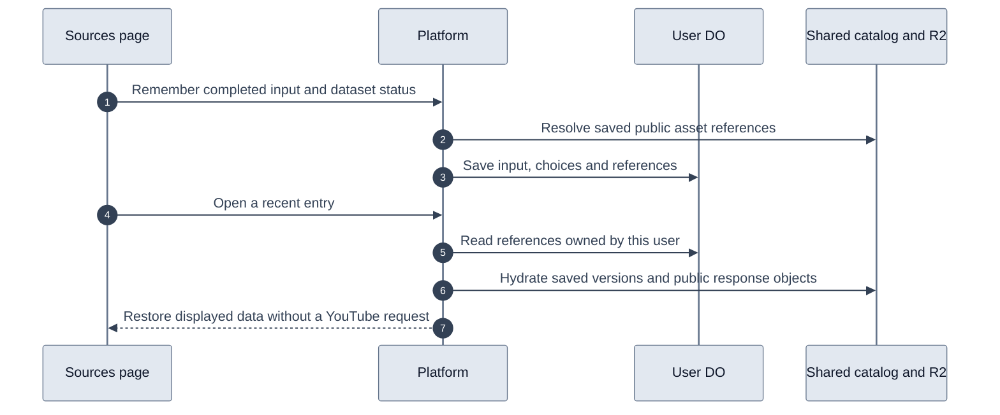

# Recent sources

Sources keeps the thirty most recent successful searches and inspections for each user. The user account Durable Object stores the original input, display title, dataset choices, errors, and shared asset references. It never stores video metadata, transcript segments, comments, or search result payloads in SQLite.

The platform resolves references from its existing provider storage. Browser requests submit only source identity and dataset status. They cannot supply asset keys or write video payloads into the catalog.

Video datasets reference immutable catalog versions through `(videoId, kind, variant, contentHash)`. Refreshing another user's copy cannot change the dataset restored by a recent entry. A user's explicit refresh updates that user's entry to the new version.

Search, playlist, and channel caches expire. When remembering them, the platform copies the existing public response into a content-addressed JSON object under `youtube/source-history/<hash>.json` in `VIDEO_ASSETS`. Search objects contain only public results, without the user's query. Original inputs, user IDs, selections, and errors stay in the user DO. This extends persistence for history without changing the provider cache policy.

Fresh channel, playlist, and Sources-compatible video-search responses attempt to write a public response under `youtube/source-responses/v1/<hash-of-cache-key>.json` before extraction reports success. Only searches whose filters are exactly `{ type: 'video' }` make this copy, matching the history reader's cache key. A successful R2 record makes immediate history saves independent of KV propagation and cached negative lookups, including after coordinator eviction. Search records contain only public video results, never the query, filters, or operation.

Each record is eligible for history saves for the same retention window as its KV entry, at least seven days. Its deadline does not expire already-saved history objects. History reads both R2 and KV and uses the response with the latest fetch timestamp. Existing KV responses from before rollout remain usable.

The R2 copy is best effort. Write errors are logged with safe error metadata, and the fresh response still proceeds to the KV write and caller. Read or JSON parse errors are logged and treated as a missing copy so history can use KV. If neither store has a usable response, history keeps its existing retry error. The provider cache and freshness policies are unchanged. Only the platform needs deployment, with no migration or new binding.

Follow-up: `retainedUntil` limits reads but does not delete R2 objects. Configure a bucket lifecycle rule for only `youtube/source-responses/v1/` to expire objects about eight days after their last write, covering the current seven-day response retention. No such rule is configured by this change. Do not apply it to `youtube/source-history/` or immutable catalog assets, which saved sources still reference.

The browser-session routes are `GET /v1/sources/recent`, `POST /v1/sources/recent`, and `GET /v1/sources/recent/:id`. Opening an entry moves it to the top of history and does not charge credits. Inputs deduplicate by normalized search terms or provider entity identity. Zero-result searches and inspections with failed datasets retain their displayed state; failures remain retryable.

Account deletion removes the user's references along with the other user DO data. Shared assets remain available to other accounts. Pruning the oldest entries removes only user references. Shared response objects follow the catalog's existing policy of retaining public assets, with no blanket bucket expiration or garbage collector.

No new Cloudflare binding or class migration is required. `UserAccountDO` creates the history table when initialized. The platform and web changes must both be deployed to enable the feature.

Recent inspection summaries carry a thumbnail URL reference from saved metadata. Older entries resolve that reference from their existing catalog version on the first list read. The user DO caches the URL without changing history order or copying image bytes. Missing thumbnails do not block the history list.

Selecting Sources in the sidebar opens the input and recent list, clears the displayed query or inspector, and cancels its outstanding browser request. Ordinary navigation away from Sources still allows requests to finish in the background. The history loader uses shared skeleton bars within rows that match the loaded layout.

## Project sources

`POST /v1/sources/recent` accepts an optional `projectId`. The platform verifies project ownership before resolving shared assets. The user DO saves history and the project reference in one synchronous transaction, including history pruning. A failed project write rolls back the history write and pruning. Both tables contain references, never copied video payloads.

Project references retain their own snapshots by `(project_id, source_key)`. Refreshing Recent sources or saving the same input to another project does not change an existing project's snapshot. `GET /v1/projects/:id/sources/:itemId` restores the selected project item without writing history or relinking it. Project URLs use the project item ID, not the Recent source ID. Saved items survive the thirty-entry history limit.

Project detail and exports share the same reader for legacy D1 items and user-DO source references. Legacy moments retain their timestamps; full source references do not become subtitle cues. Failed browser saves retain their original input and project destination independently, so another save cannot clear their retry state.

Deploy the platform before the web application. No new binding or class migration is required.

Project detail renders its known name and Add sources action before the source list resolves. The sidebar and project page share an account-scoped browser cache with a sixty-second freshness window. Hover and keyboard focus can start a read before opening. Stale lists stay visible during background refresh; successful source writes invalidate the affected project and supersede older in-flight reads. The cache lives only for the signed-in dashboard provider and is cleared on account changes or full reloads.

Project selection follows the URL: `/dashboard/projects` always shows the list, while `?project=…` opens one project. Selection is not retained in dashboard draft state. Native history updates preserve immediate rendering and browser Back/Forward behavior; the shared source cache remains independent of navigation.
