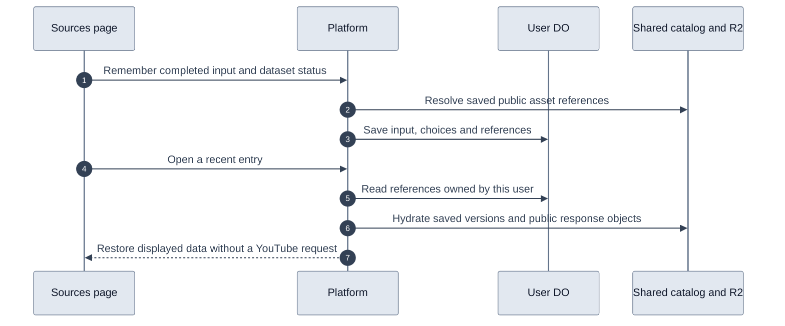
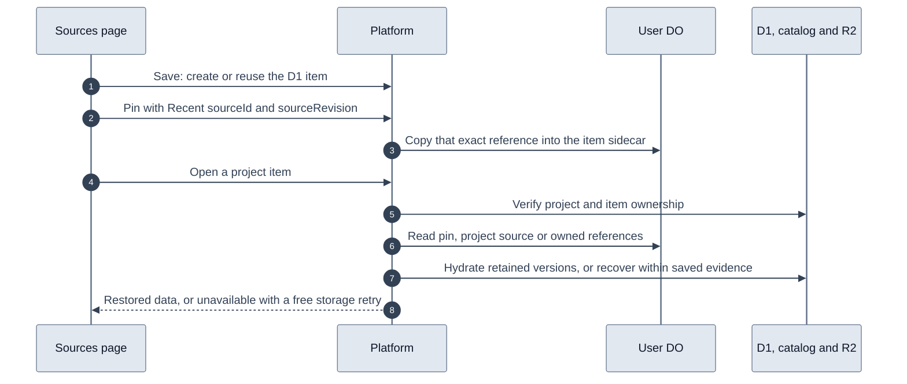

# Recent sources

Sources keeps the thirty most recent successful searches and inspections for each user. The user account Durable Object stores the original input, display title, dataset choices, errors, and shared asset references. It never stores video metadata, transcript segments, comments, or search result payloads in SQLite.

The platform resolves references from its existing provider storage. Browser requests submit only source identity and dataset status. They cannot supply asset keys or write video payloads into the catalog.

Video datasets reference immutable catalog versions through `(videoId, kind, variant, contentHash)`. Refreshing another user's copy cannot change the dataset restored by a recent entry. A user's explicit refresh updates that user's entry to the new version.

Search, playlist, and channel caches expire. When remembering them, the platform copies the existing public response into a content-addressed JSON object under `youtube/source-history/<hash>.json` in `VIDEO_ASSETS`. Search objects contain only public results, without the user's query. Original inputs, user IDs, selections, and errors stay in the user DO. This extends persistence for history without changing the provider cache policy.

Fresh channel, playlist, and Sources-compatible video-search responses attempt to write a public response under `youtube/source-responses/v1/<hash-of-cache-key>.json` before extraction reports success. Only searches whose filters serialize to `{"type":"video"}` make this copy, matching the history reader's cache key. Undefined optional filters are ignored by the same JSON serialization used for the cache key. A successful R2 record makes immediate history saves independent of KV propagation and cached negative lookups, including after coordinator eviction. Search records contain only public video results, never the query, filters, or operation.

Each record is eligible for history saves for the same retention window as its KV entry, at least seven days. Its deadline does not expire already-saved history objects. History reads both R2 and KV and uses the response with the latest fetch timestamp. Existing KV responses from before rollout remain usable.

The R2 copy is best effort. Write errors are logged with safe error metadata, and the fresh response still proceeds to the KV write and caller. Read or JSON parse errors are logged and treated as a missing copy so history can use KV. If neither store has a usable response, history keeps its existing retry error. The provider cache and freshness policies are unchanged. Only the platform needs deployment, with no migration or new binding.

Follow-up: `retainedUntil` limits reads but does not delete R2 objects. Configure a bucket lifecycle rule for only `youtube/source-responses/v1/` to expire objects about eight days after their last write, covering the current seven-day response retention. No such rule is configured by this change. Do not apply it to `youtube/source-history/` or immutable catalog assets, which saved sources still reference.

The browser-session routes are `GET /v1/sources/recent`, `POST /v1/sources/recent`, and `GET /v1/sources/recent/:id`. Opening an entry moves it to the top of history and does not charge credits. Inputs deduplicate by normalized search terms or provider entity identity. Zero-result searches and inspections with failed datasets retain their displayed state; failures remain retryable.

Account deletion removes the user's references along with the other user DO data. Shared assets remain available to other accounts. Pruning the oldest entries removes only user references. Shared response objects follow the catalog's existing policy of retaining public assets, with no blanket bucket expiration or garbage collector.

No new Cloudflare binding or class migration is required. `UserAccountDO` creates the history table when initialized. The platform and web changes must both be deployed to enable the feature.

Recent inspection summaries carry a thumbnail URL reference from saved metadata. Older entries resolve that reference from their existing catalog version on the first list read. The user DO caches the URL without changing history order or copying image bytes. Missing thumbnails do not block the history list.

Selecting Sources in the sidebar opens the input and recent list, clears the displayed query or inspector, and cancels its outstanding browser request. Ordinary navigation away from Sources still allows requests to finish in the background. The history loader uses shared skeleton bars within rows that match the loaded layout.

## Project sources

`POST /v1/sources/recent` accepts an optional `projectId`. The platform verifies project ownership before resolving shared assets. The user DO saves history and the project reference in one synchronous transaction, including history pruning. A failed project write rolls back the history write and pruning. Both tables contain references, never copied video payloads.

Project references retain their own snapshots by `(project_id, source_key)`. Refreshing Recent sources or saving the same input to another project does not change an existing project's snapshot. `GET /v1/projects/:id/sources/:itemId` restores the selected project item without writing history or relinking it. Project URLs use the project item ID, not the Recent source ID. Saved items survive the thirty-entry history limit.

Project detail and exports share the same reader for legacy D1 items and user-DO source references. Legacy moments retain their timestamps; full source references do not become subtitle cues. Failed browser saves retain their original input and project destination independently, so another save cannot clear their retry state.

Deploy the platform before the web application. No new binding or class migration is required.

Project detail renders its known name and Add sources action before the source list resolves. The sidebar and project page share an account-scoped browser cache with a sixty-second freshness window. Hover and keyboard focus can start a read before opening. Stale lists stay visible during background refresh; successful source writes invalidate the affected project and supersede older in-flight reads. The cache lives only for the signed-in dashboard provider and is cleared on account changes or full reloads.

Project selection follows the URL: `/dashboard/projects` always shows the list, while `?project=…` opens one project. Selection is not retained in dashboard draft state. Native history updates preserve immediate rendering and browser Back/Forward behavior; the shared source cache remains independent of navigation.

## Opening saved project items

Every project item, including legacy D1 rows and moments, opens through `GET /v1/projects/:id/sources/items/:itemId`. The browser-session route verifies project and item ownership, then restores from storage only. It makes no provider request, credit charge, import, indexing or write; Recent order and catalog request bookkeeping are untouched. Both outcomes return 200: `state: 'restored'` with the snapshot, or `state: 'unavailable'` with the item and its input. Links use `?openProject=…&saved=<itemId>`, never `project=`, so opening never turns on Add sources auto-save. Older `?project=…&saved=…` links are rewritten to `openProject` before opening.

Standalone **Save to project** groups retained data. It keeps the D1 row and indexes the already-loaded transcript `content`, but starts no import or provider request. Playlist and channel saves retain the returned entity and member list; they do not fetch member transcripts. Repeating the same provider, type, entity and start time returns the existing row (`start_ms IS ?`), so whole-source retries no longer add duplicates while each moment, including `start_ms` 0, stays distinct. Both representations count: a standalone Save of a whole source that the project already holds as a project source row returns and refreshes that row, and Add sources auto-save or linking a Recent source into a project that already holds the whole source as a D1 item retains the reference with that item (Recent save and sidecar in one user-DO transaction). Existing duplicates are untouched. Project-scoped saves keep their separate path without an import. Save then calls `PUT /v1/projects/:id/sources/items/:itemId/snapshot` with the Recent `sourceId` and `sourceRevision` returned when that inspection was remembered. The revision fingerprints the selected asset references, dataset choices, errors and shared copies; the thumbnail URL that the history list caches lazily is excluded, so that enrichment never stales a receipt. The user DO copies that exact reference into `project_item_snapshots`, keyed by project and item and never listed as another row. A Recent entry whose references changed is rejected rather than silently pinned. When an open recovered from an owned reference, Save sends `savedRevision` instead. The platform resolves that fingerprint only among references owned by the account for this source in the current project, including Recent. It copies those references into the same item or project-source row and rejects a revision that is no longer owned. Recovery from raw storage has no revision. In that case, or when the browser's Recent save failed, it sends the dataset descriptor instead, which is resolved from stored data and requires the same saved evidence as recovery. If a pin fails, the browser keeps that project and item for "Retry retaining data" and announces "Saved to …" only after the pin succeeds.

Restores read pins, project sources and owned references in that order. A video reference without its requested transcript also checks the project's private document. This keeps recovered saved text visible after a metadata-only pin is saved, without fabricating a caption track. A missing optional dataset keeps everything else visible. **Reload saved data** retries storage at no cost. Corrupt bytes and store errors are retryable failures, never evidence that data is absent. An item without usable references recovers only within the user's saved evidence: another owned reference to the same source (project source, pin or Recent entry, even if its bytes are gone), a private project document, or a successful project import. With that evidence the platform reads the newest stored catalog versions, the import workflow's transcript copy, a retention-expired source response, or the project's private Markdown, shown as saved text without an invented track or timing. Such recovery is `origin: 'storage'` with an `evidence` label and no `sourceRevision`: newer stored data, never presented as the original immutable snapshot. Content whose storage is genuinely absent is not recovered. A bookmark alone never exposes shared storage. When nothing is retained, the item shows an unavailable message and offers a storage-only retry. Project views have no paid recovery, refresh, or pagination controls. Opening a member of a saved result list uses its saved project item when present and otherwise explains that only the list was retained. The user can leave through Recent sources to begin a separate live inspection.

Pins are deleted with their project and with the account. Deploy the platform before the web application; `UserAccountDO` creates the sidecar table on initialization and no D1 migration or new binding is required.

Links from PR149 with `legacy=1&type&id` carry no item ID. They direct the user to open the item from its project and never offer a provider fetch. A background completion cannot replace a newer route.

## Retaining comment pages

The first comments response remains in `assets.comments`. Each additional page requested during a live inspection is retained in order in `commentPages`, as an immutable catalog reference. `POST /v1/sources/recent/:id/comments` accepts the owned Recent revision, the previous page's continuation, and an optional project destination. It verifies that the continuation follows the retained page and reads the exact immutable version in `pageReceipt`. The dashboard requests this receipt with `retain=true` when fetching another comments page. The platform signs the version returned by that fetch, binding its hash to the account, video and continuation. A later shared refresh cannot change which page a retry saves. Missing receipt versions fail without selecting a newer page. The user DO atomically compares the previous references, appends the page, and updates the project source or D1 sidecar when applicable. A lost successful response can be retried without duplicating the page. The retry must name the same page version.

The dashboard blocks further pagination and Save while retention is pending. Retry saving repeats only the retention request, never the paid page fetch. Reads merge all retained pages in order and deduplicate comment IDs. Retrying another dataset passes an owned `commentsReceipt` so its save preserves the comment chain instead of selecting the latest shared first page. A successful explicit comments refresh in live Sources starts a new chain.

Saving waits for all requested datasets to finish. Previously loaded pages that were never persisted by older dashboard versions cannot be reconstructed as the exact viewed version. Missing bytes remain unavailable; opening or retrying them from a project never spends credits.

Ordinary saves that reuse a `commentsReceipt` carry the validated references into the account write. The transaction compares them with current Recent references immediately before saving Recent and the project link. Descriptor-based project pins perform the same check before writing. If another request has appended or refreshed the source, the stale save returns `409 SOURCE_REVISION_MISMATCH` and writes nothing. This check is separate from the earlier ownership and schema validation.

Receipts use the existing authentication secret with a comments-specific signature payload. They are returned only to browser sessions and never enter shared R2 payloads. They have no time-based expiry; secret rotation invalidates outstanding receipts. Deploy the platform before the dashboard. Older tabs that omit `pageReceipt` must reload before loading more comments; retention never falls back to selecting the newest shared page.
