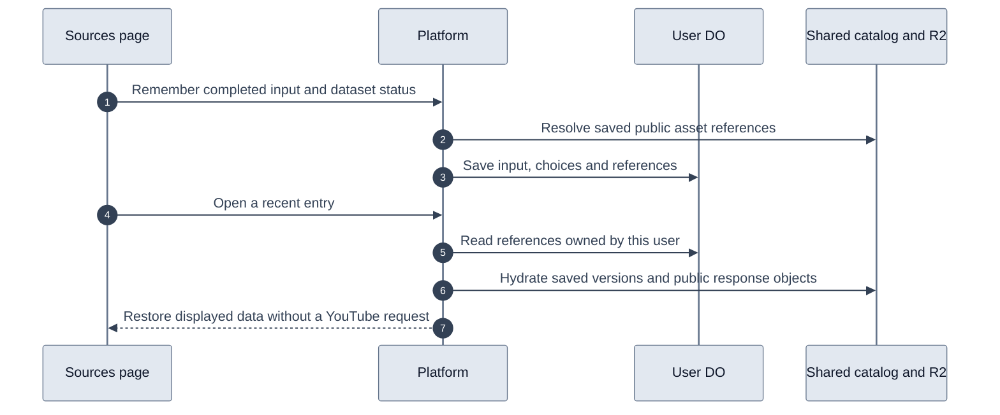

# Recent sources

Sources keeps the thirty most recent successful searches and inspections for each user. The user account Durable Object stores the original input, display title, dataset choices, errors, and shared asset references. It never stores video metadata, transcript segments, comments, or search result payloads in SQLite.

The platform resolves references from its existing provider storage. Browser requests submit only source identity and dataset status. They cannot supply asset keys or write video payloads into the catalog.

Video datasets reference immutable catalog versions through `(videoId, kind, variant, contentHash)`. Refreshing another user's copy cannot change the dataset restored by a recent entry. A user's explicit refresh updates that user's entry to the new version.

Search, playlist, and channel caches expire. When remembering them, the platform copies the existing public response into a content-addressed JSON object under `youtube/source-history/<hash>.json` in `VIDEO_ASSETS`. Search objects contain only public results, without the user's query. Original inputs, user IDs, selections, and errors stay in the user DO. This extends persistence for history without changing the provider cache policy.

The browser-session routes are `GET /v1/sources/recent`, `POST /v1/sources/recent`, and `GET /v1/sources/recent/:id`. Opening an entry moves it to the top of history and does not charge credits. Inputs deduplicate by normalized search terms or provider entity identity. Zero-result searches and inspections with failed datasets retain their displayed state; failures remain retryable.

Account deletion removes the user's references along with the other user DO data. Shared assets remain available to other accounts. Pruning the oldest entries removes only user references. Shared response objects follow the catalog's existing policy of retaining public assets, with no blanket bucket expiration or garbage collector.

No new Cloudflare binding or class migration is required. `UserAccountDO` creates the history table when initialized. The platform and web changes must both be deployed to enable the feature.

Recent inspection summaries carry a thumbnail URL reference from saved metadata. Older entries resolve that reference from their existing catalog version on the first list read. The user DO caches the URL without changing history order or copying image bytes. Missing thumbnails do not block the history list.

Selecting Sources in the sidebar opens the input and recent list, clears the displayed query or inspector, and cancels its outstanding browser request. Ordinary navigation away from Sources still allows requests to finish in the background. The history loader uses shared skeleton bars within rows that match the loaded layout.
