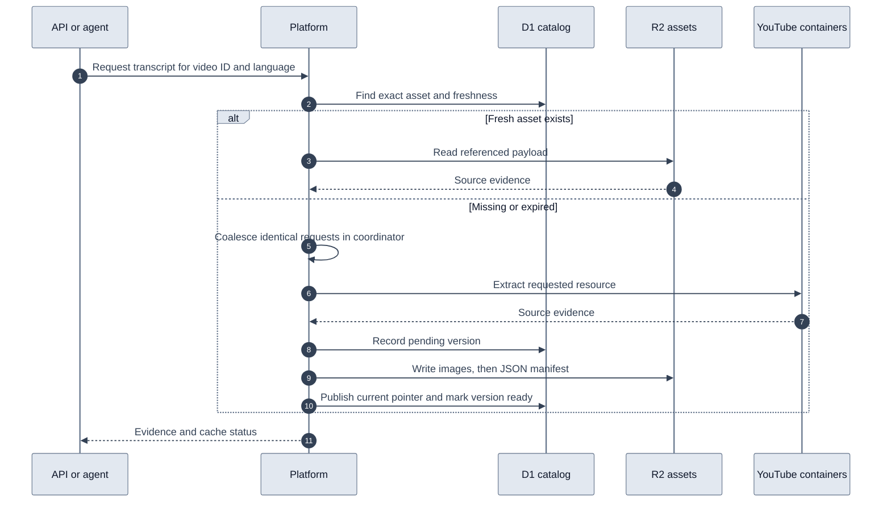

# Shared video asset catalog

A video accumulates source evidence as callers request it. D1 locates the exact asset variant; R2 holds the payload and downloaded images. API requests, source imports, dashboard calls through the platform adapters, and agent provider calls use this path. A transcript request does not download comments, storyboards, or frames.

The application owns freshness, asset identity, coalescing, and persistence. The existing processor and frame containers own YouTube extraction. R2 and D1 do not perform extraction or analysis.

For example, a transcript request creates a video record and an English transcript reference. A later comments request adds a comments reference to that video. Another agent asking for the English transcript reads the existing object if it is fresh.



## Stored evidence

| Resource | Variant identity | Default freshness |
| --- | --- | --- |
| Video metadata (`video_metadata`) | Video ID | 30 minutes |
| Video signals | Video ID | 15 minutes |
| Caption tracks | Video ID | 1 day |
| Transcript | Language and granularity | 7 days |
| Comment page | Continuation token | 15 minutes |
| Collected comments | Page limit | 15 minutes |
| Storyboard manifest | Video ID | 7 days |
| Storyboard sheet | Manifest geometry hash and sheet index | 7 days |
| Extracted frame | Requested timestamp and maximum width | 7 days |
| Endscreen elements | Video ID | 1 day |

Existing adapter TTLs remain authoritative for their calls. Missing resources are fetched independently. For example, requesting frames at 10 and 20 seconds after 10 seconds was already extracted downloads only the missing 20-second frame. A partial extraction preserves successful frames for subsequent requests.

Metadata includes the fields returned by the provider, such as title, description, channel references and thumbnail URLs. Only returned image bytes are copied into R2. Referenced URLs are not automatically downloaded. Search, channel and playlist responses retain the existing KV path. Discovering a video in search does not proactively populate its catalog.

## Data layout

- `videos` has one case-sensitive primary key per video ID, first request time and last request time. Last request time is updated at most once per minute per active video. Session evidence reads also touch it, so it is approximate to a minute and contains no user identity.
- `video_assets` holds the current pointer for each `(video_id, kind, variant)`. The composite primary key supports exact lookups without scanning video histories.
- `video_asset_versions` retains payload versions and pending writes. Partial responses cannot replace complete current evidence; a late older response cannot replace a newer response of the same completeness.

There is one root row per video, plus multiple asset and version rows. Database sizing must count all of these rows and their indexes.

R2 object keys use these prefixes:

```text
youtube/videos/abcdefghijk/
  video_metadata/<variant-hash>/<payload-hash>.json
  transcript/<variant-hash>/<payload-hash>.json
  comments/<variant-hash>/<payload-hash>.json
  storyboard_manifest/<variant-hash>/<payload-hash>.json
  storyboard_sheet/<variant-hash>/<payload-hash>.json
  frame/<variant-hash>/<payload-hash>.json
  images/<image-hash>.jpg
```

A manifest references binary JPEG objects. Reads reconstruct the provider response expected by existing callers. Byte-identical payloads share a content hash. New snapshots remain available in the version inventory.

`video_metadata` means the get-video-details response, not a video file. Migration `0002_video_metadata_kind.sql` renames existing D1 asset and version records. Their R2 object keys stay unchanged, so historical objects under `video/` remain readable; new writes use `video_metadata/`. Reads also accept the legacy kind during rollout. The processor operation remains `video` for compatibility with its existing contract.

## Consistency and recovery

D1 and R2 have no cross-service transaction. The pending version is written first, followed by all images and then the manifest. A D1 batch publishes the pointer and marks the version ready. The hourly task reconciles up to 50 pending versions older than five minutes, independently of monitor reconciliation.

Missing objects and manifests with mismatched hashes cause a cache miss. Failed persistence returns an error instead of pretending the new evidence was saved. A normal upstream failure may serve existing evidence with `cacheStatus: stale`; an explicit refresh reports upstream failure. Partial sources are saved but never treated as fresh complete hits.

Legacy fresh KV entries are promoted on demand with their original fetch timestamp. API and agent helpers use the same canonical coordinator identity. Identical requests coalesce; overlapping but different frame or sheet batches may still perform duplicate extraction concurrently. Canceling a frame waiter does not cancel extraction shared with another caller; the container time budget still bounds it.

Recovery retains historical objects. Images written before a failed manifest write can remain unreferenced. There is no garbage collector or retention policy in this first version. Do not attach a blanket bucket expiration rule: it could delete current evidence. Add reference-aware cleanup and capacity monitoring before sustained large ingestion.

## Session boundary

Only reusable public provider evidence enters the shared catalog. Prompts, user IDs, private analysis, citations and conversation packets remain in the existing session store. Frame analysis still runs in the session against reusable source images. Deleting a session deletes its private evidence according to the existing lifecycle; it does not purge shared public video sources.

This version does not add timeline summaries, embeddings, similarity search or a catalog management API. Those can build on these durable source references. Existing session assets are not bulk backfilled; new provider reads and legacy KV promotions populate the catalog.

## Local setup and deployment

The dedicated bindings are `VIDEO_CATALOG` and `VIDEO_ASSETS`. Keeping them separate from account D1 and private research R2 allows independent capacity planning and retention. If both bindings are absent in older test environments, adapters retain their previous behavior. Configuring only one is an error.

From `platform/`:

```sh
npm run db:migrate:local
npm run test:video-catalog
npm run build
```

The local migration script applies account migrations and catalog migrations. For only the catalog, use `npm run db:catalog:local`. The agent Postman configuration uses the same catalog migration directory and local database ID.

The hosted production and preview databases and private R2 buckets are provisioned. `wrangler.jsonc` contains their real IDs and names; the catalog retains `remote: false` for local development. That flag does not change remote migration or deployment targets.

| Resource | Production | Preview |
| --- | --- | --- |
| D1 database | `video2ctx-video-catalog` | `video2ctx-video-catalog-preview` |
| D1 ID | `90fdc3eb-c76f-4dfe-a0cd-503f7606b4c3` | `1439902b-2ee3-4cb3-9719-d18b409cb62e` |
| Private R2 bucket | `video2ctx-video-assets` | `video2ctx-video-assets-preview` |

The initial catalog migration has been applied to both hosted databases. `deploy:production` applies both account and catalog migration sets; direct `deploy` does not apply migrations. Subsequent migration runs skip applied files. Self-hosted deployments must create their own resources, update the bindings, and apply the catalog migrations before deployment.

D1 is suitable for this initial exact-key catalog, but its [per-database size limit](https://developers.cloudflare.com/d1/platform/limits/) is 10 GB on Workers Paid. Millions of video roots do not imply millions of total rows. Measure database bytes, read latency, write queueing and asset/version counts during rollout. Plan sharding or PostgreSQL before the catalog approaches that limit. This implementation does not claim a measured production throughput or latency target.

The tests exercise real SQLite query plans, mixed complete/partial versions, concurrent misses, legacy promotion, refresh failure, missing objects, binary image reconstruction and interrupted commits. A separate Workers integration suite applies the actual migration to local D1 and writes and reads local R2 objects.
