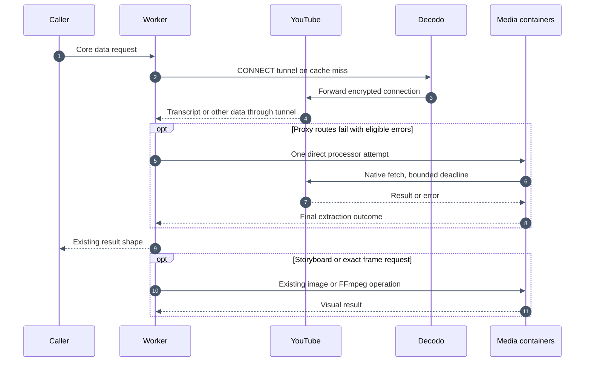

# Worker YouTube extraction

The Worker can execute core YouTube operations using the shared extraction library. Initial attempts use the configured proxy gateways. Eligible failures retry through the proxy pool, then receive one direct attempt in a configured processor container. The proxy provider selects the proxy exit IP; the Worker runs the YouTube client and verifies YouTube's TLS certificate on proxied attempts.

The rollout switch defaults to `worker`. `YOUTUBE_EXTRACTION_BACKEND=worker` moves search, browse, video metadata and signals, channels, playlists, comments, caption catalogs, transcripts and end screens into the Worker. Storyboards remain in the processor container, including its image conversion. Exact frames remain in the FFmpeg container. Caching, coalescing, authentication, billing and public result shapes stay at their existing boundaries.

## Transport and source ownership

`youtube-worker-runtime.ts` dispatches the same operations as the processor using repository source from `packages/all-things-youtube`. Library source dependencies must be installed before bundling the Worker; `npm --prefix platform run build` does this through its prebuild script. CI jobs that bundle without building install those dependencies explicitly. This permits a platform change without publishing a library release first. The processor continues using its exact npm version and committed storyboard bundle.

The library adds the supported `all-things-youtube/client` export for client operations such as browse and video signals. That export will be available to external consumers in the next package release. No package publication is required for this platform PR.

All core Worker extraction uses pinned `tunnelfetch@1.13.0` with `cloudflare:sockets`, HTTP CONNECT and its JavaScript TLS implementation. System-root certificate verification remains enabled. A native CONNECT plus `startTls()` prototype failed after CONNECT succeeded in the deployed runtime; the alternative transport completed transcript downloads. There is no certificate-verification bypass.

Each operation attempt owns a fresh transport and closes it before the next route. No sockets are shared across Worker invocations. The library's request retry count is one, so the operation runner controls retry count and fresh metadata discovery.

## Configuration

Existing `video2ctx` secrets are reused. `OUTBOUND_PROXY_URLS` is a JSON array of one to four distinct HTTP(S) URLs and takes precedence over the legacy single `OUTBOUND_PROXY_URL`. Do not put credentials in Wrangler vars or commit `.dev.vars`. Invalid configuration fails without echoing the URL. Worker extraction requires a proxy setting. Missing configuration fails with `PROCESSOR_UNAVAILABLE` before any YouTube request. Missing or invalid configuration does not enable direct fallback.

### Final direct attempt

After eligible proxy failures, the operation uses one configured processor slot with a private `x-processor-egress: direct` request. It reuses the container's native-fetch extraction path with library retries limited to one. Concurrent proxy operations retain their own transports. This applies to core data operations and storyboards, including when the primary backend is `container`; exact frames use a separate container and are unchanged.

The fallback uses all remaining time before the caller deadline, including startup and response-body reads. Agent transcripts pass the research deadline through the cache coordinator. Storyboards pass the earlier retrieval deadline: at most 45 seconds, while preserving 35 seconds for image analysis and completion. The same budget controls tool availability and execution. Other callers use the configured operation deadline. A caller can join an extraction whose deadline is at least as late as its own. Callers without explicit deadlines retain ordinary request coalescing. Each caller with a deadline stops waiting independently without cancelling shared work. This rule deliberately favors preserving caller budgets over maximum sharing: an agent with a later research deadline starts a separate extraction instead of joining a public API extraction whose configured deadline ends sooner. The proxy phase reserves five seconds within its operation budget, or half the total for budgets below ten seconds, but this is not a cap on direct recovery. Direct transcript and storyboard helpers use that same deadline instead of their shorter proxy limits. The container receives an absolute deadline and passes its abort signal through the storyboard helper, including retry waits. The helper respects lower caller retry limits, so direct storyboard extraction makes at most one request per player profile and does not retry a failed profile. No new container slot or proxy secret is needed. Confirmed missing captions, region/authentication restrictions, invalid input, and terminal not-found errors do not trigger direct fallback. If the direct attempt fails, the operation rethrows the original proxy error, retaining its code, status, retryability, retry delay, and safe structured reason. Specific content restrictions discovered on the direct route take precedence. The friendly availability message belongs to the agent layer, not public data extraction.

The container acknowledges the selected route in its response header. An old image that ignores direct routing cannot be accepted as direct recovery. Deploy the updated processor image with the Worker. Direct attempts log `youtube_direct_fallback` and append `backend: container`, `egress: direct` diagnostics using the same extraction ID and the next attempt number. Direct success does not clear proxy cooldowns. The cache forwards all five attempt diagnostics.

Set `YOUTUBE_DIRECT_FALLBACK=off` to bypass the direct route and give the proxy phase its full original budget. This changes Worker configuration only; it does not require an image rebuild or proxy-secret changes. Cloudflare still needs to apply the updated Worker configuration. Keep the setting in deployment configuration so the next deployment does not restore `on` unexpectedly.

A configured slot is not necessarily warm. A direct request can wake a sleeping container and still exhaust the remaining caller deadline. The container can then remain idle for the existing `sleepAfter = '30m'` window. `youtube_direct_container_state` records whether the process was already running before the request, its extraction ID, and container ID. `youtube_processor_started` records completed starts. These logs distinguish cold-start attempts from successful starts without an extra routing RPC. Production cold-start frequency and cost have not been measured.

For rollout, deploy the updated processor image before enabling the Worker fallback. For rollback, set the flag to `off` first; the processor image can remain deployed. Old images that omit the routing acknowledgement produce `INVALID_PROCESSOR_RESPONSE` in the direct-attempt log while the caller retains the original proxy error.

### Operation settings

| Variable | Default | Meaning |
| --- | --- | --- |
| `YOUTUBE_DIRECT_FALLBACK` | `on` | Set to `off` to disable direct fallback without changing the backend or image |
| `YOUTUBE_EXTRACTION_BACKEND` | `worker` | Set to `container` to roll back core extraction |
| `YOUTUBE_EXTRACTION_TIMEOUT_MS` | `120000` | Entire operation including retry waits |
| `YOUTUBE_PROXY_TIMEOUT_MS` | `25000` | Budget for each proxy attempt |
| `YOUTUBE_PROXY_MAX_ATTEMPTS` | `4` | Maximum proxy attempts, including the first |
| `YOUTUBE_EXTRACTION_RETRY_BASE_MS` | `250` | Initial jittered exponential delay |

The pool starts at a random slot and visits every configured slot before repeating. A single gateway can receive several attempts; a changed exit IP depends on the Decodo session configuration. The runner honors `Retry-After`, bounded by the total deadline. Invalid input and confirmed authorization restrictions are terminal. Transcript failures otherwise retain the existing fallback policy because missing-caption labels can result from blocked upstream requests. Partial empty caption catalogs probe distinct routes once. Bot-challenged video metadata triggers fallback; ordinary private-video metadata does not.

Limits are 8 MiB per response and 32 MiB across an attempt. Timeouts cover response reads as well as connection setup. The proxy library has additional per-request timeouts, including a 25-second total; increasing the operation setting does not raise that transport ceiling. Cleanup is attempted even after cancellation, with at most one second spent waiting for it.

Safe attempt logs contain route, slot, outcome, duration, byte count and status, without proxy credentials or signed YouTube URLs. Transcript and storyboard diagnostics include `backend` and `egress` fields. New operations have at most four proxy attempts and one direct container attempt. An earlier upstream transcript failure is retained when a later proxy route reports `NOT_FOUND`.

## Verification and rollout

`platform/test/youtube-worker-extraction.test.ts` covers proxy-only routing, missing configuration, retry ordering, terminal failures, time budgets, cleanup, body limits, redaction, translation through the real library and retained storyboard routing. `platform/test/worker-extraction-live/worker.ts` provides token-protected, fixed test cases for an isolated deployment with no production resource bindings. It must receive its own `TEST_TOKEN` and a copied proxy secret, and be deleted after use.

Local checks include the full platform and container suites, library packed-package tests, auth integration, documentation generation and Worker startup profiling. See `WORKER_EXTRACTION_RESULTS.md` for the deployed checks.

Deploying the merged configuration enables Worker extraction by default. No additional toggle is required. Existing production proxy secrets are reused; local Worker extraction also requires a proxy setting. Watch success rate, latency, proxy usage and CPU for uncached operations after deployment. Sustained load testing and independent review of the new TLS dependency remain follow-up work. Set the switch back to `container` and deploy to roll back core extraction; retain processor bindings and image configuration throughout this rollout. Both primary backends support the final direct attempt when proxies are configured.

### Caption availability in video metadata

Video metadata includes an optional `captionAvailability` observation with status
`available`, `unavailable`, or `unknown`, track languages, and an ISO `checkedAt`.
The Worker bundles the library source. Existing cached video records and the
published processor fallback may omit the field; agents treat that as unknown.
No schema migration or processor package upgrade is required for the default
Worker path.

The metadata player lookup tries the supported caption clients. Usable caption
tracks establish availability without downloading caption text. If primary
metadata is playable but no usable tracks are present, the desktop player is
checked too, overlapping the remaining alternate player checks. Metadata retains
the first playable profile even when another profile supplies captions. Only playable empty catalogs confirm absence. Restrictions,
malformed track URLs, and failed desktop checks remain unknown. These additional
metadata requests can increase get_video latency for videos without captions.

The agent exposes the observation and languages in get_video. Observations older
than five minutes become unknown in the tool result. Recent confirmed absence
marks the video unavailable for this run. Single-video inspection then returns a
non-error skipped result if transcript retrieval is requested anyway, without a
provider request, transcript charge, or fabricated transcript evidence. Topic
research retains its captionless-source replacement behavior. A positive status
means tracks were observed, not that a future caption download is guaranteed.

### Confirmed country restrictions

An UNPLAYABLE caption response with an explicit country-block reason becomes
`REGION_RESTRICTED`, not generic `UNAVAILABLE` or `CAPTIONS_UNAVAILABLE`. The
Worker preserves the safe message and code in tool errors and diagnostics and
does not repeat the operation across its proxy retry loop. Unrecognized or
generic unavailability keeps the existing retry policy.

Fresh video metadata with `availability.restriction: "region"` premarks the
video as restricted for the current run. A restriction discovered by transcript
retrieval is reported once and remembered for that run. Subsequent transcript
requests return a skipped warning with no provider request or transcript charge,
even if their language differs. Topic research replaces restricted candidates when
replacement is allowed, and preserves the restriction code for explicit videos.
Replacement selection excludes videos already marked captionless or restricted.
Metadata older than five minutes cannot establish
this guard. The restriction describes the current retrieval route, not worldwide
availability or proof that captions are absent. The library currently recognizes
explicit English reasons; unrecognized localized reasons remain generic
unavailability. Configured language/country is not proof of the proxy exit
country, so country allowlists alone do not establish a block. The platform no
longer parses reason strings. No proxy secrets are changed.

### Frame persistence and timings

Frame catalog writes, session lookups, and session pins use the shared evidence
I/O batch size of four. This changes storage concurrency only; it does not add
YouTube download concurrency. Each batch settles every started operation before
propagating an error. Generation checks before each pin, inside the evidence
store, and after the batch prevent deleted evidence from returning. Successful
shared catalog writes remain reusable if another frame write fails.

Successful frame tool traces retain `timingsMs` for session lookup, provider
retrieval, session pinning, previews, and total tool work. Extraction diagnostics
also include `catalog_lookup` and `catalog_write` stages for container retrievals.
Extraction attempts are forwarded immediately, before catalog persistence.
Catalog timings arrive as a separate `phase: "catalog"` diagnostic, with its own
storage outcome, including failed writes. The cache coordinator still returns
diagnostics with its response; this does not introduce streaming across that boundary. The provider
measurement includes extraction and catalog storage; these nested durations must
not be added together. Immediate model output and recovery summaries omit these
debugging fields. The corresponding log event is `frame_stage_timing`.

The motivating run `1e23b37e-1790-49c7-bd27-eddab6b64b6e` took 34.403 seconds
for six frames, while its container diagnostic measured 11.272 seconds. The
remaining time included catalog persistence and session attachment. Tests verify
bounded overlap, ordering, failure settling, and deletion during frame pinning.
A cold production run is still required to measure the speedup. This change does
not promise a ten-second end-to-end result or alter FFmpeg extraction.

### Storage failures and transcript pages

A transcript that was extracted successfully but could not be saved to the video catalog returns `VIDEO_CATALOG_UNAVAILABLE` with HTTP 503. It remains retryable and is not persisted as an exhausted YouTube retrieval. The original storage exception stays in internal logs.

Exhausted transcript failure reuse is scoped to run, video, and language. Changing an evidence page offset cannot restart upstream extraction. Successful evidence pages keep separate cache keys, so their returned excerpts remain distinct.
