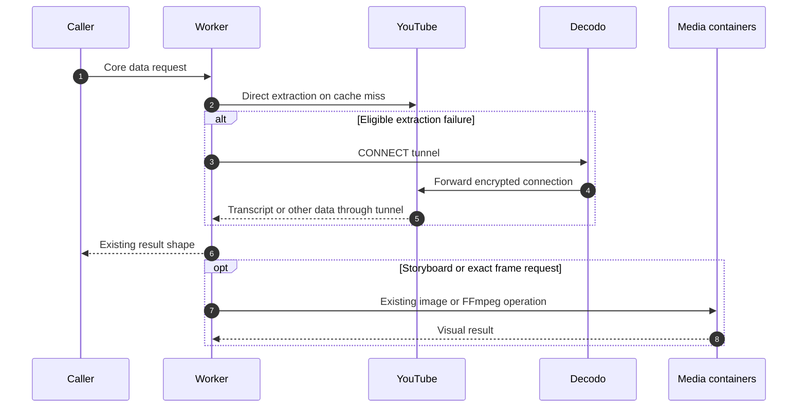

# Worker YouTube extraction

The Worker can execute core YouTube operations using the shared extraction library. It tries YouTube directly, then retries eligible failures through the configured Decodo gateways. Decodo selects the exit IP; the Worker still runs the YouTube client and verifies YouTube's TLS certificate.

The rollout switch defaults to `worker`. `YOUTUBE_EXTRACTION_BACKEND=worker` moves search, browse, video metadata and signals, channels, playlists, comments, caption catalogs, transcripts and end screens into the Worker. Storyboards remain in the processor container, including its image conversion. Exact frames remain in the FFmpeg container. Caching, coalescing, authentication, billing and public result shapes stay at their existing boundaries.

## Transport and source ownership

`youtube-worker-runtime.ts` dispatches the same operations as the processor using repository source from `packages/all-things-youtube`. Library source dependencies must be installed before bundling the Worker; `npm --prefix platform run build` does this through its prebuild script. CI jobs that bundle without building install those dependencies explicitly. This permits a platform change without publishing a library release first. The processor continues using its exact npm version and committed storyboard bundle.

The library adds the supported `all-things-youtube/client` export for client operations such as browse and video signals. That export will be available to external consumers in the next package release. No package publication is required for this platform PR.

Direct access uses native Worker `fetch`. Proxy access uses pinned `tunnelfetch@1.13.0` with `cloudflare:sockets`, HTTP CONNECT and its JavaScript TLS implementation. System-root certificate verification remains enabled. A native CONNECT plus `startTls()` prototype failed after CONNECT succeeded in the deployed runtime; the alternative transport completed transcript downloads. There is no certificate-verification bypass.

Each operation attempt owns a fresh transport and closes it before the next route. No sockets are shared across Worker invocations. The library's request retry count is one, so the operation runner controls retry count and fresh metadata discovery.

## Configuration

Existing `video2ctx` secrets are reused. `OUTBOUND_PROXY_URLS` is a JSON array of one to four distinct HTTP(S) URLs and takes precedence over the legacy single `OUTBOUND_PROXY_URL`. Do not put credentials in Wrangler vars or commit `.dev.vars`. Invalid configuration fails without echoing the URL. Without a proxy setting, the runner performs only the direct attempt.

| Variable | Default | Meaning |
| --- | --- | --- |
| `YOUTUBE_EXTRACTION_BACKEND` | `worker` | Set to `container` to roll back core extraction |
| `YOUTUBE_EXTRACTION_TIMEOUT_MS` | `120000` | Entire operation including retry waits |
| `YOUTUBE_DIRECT_TIMEOUT_MS` | `5000` | Direct attempt budget |
| `YOUTUBE_PROXY_TIMEOUT_MS` | `20000` | Budget for each proxy attempt |
| `YOUTUBE_PROXY_MAX_ATTEMPTS` | `4` | Proxy attempts after direct access |
| `YOUTUBE_EXTRACTION_RETRY_BASE_MS` | `250` | Initial jittered exponential delay |

The pool starts at a random slot and visits every configured slot before repeating. A single gateway can receive several attempts; a changed exit IP depends on the Decodo session configuration. The runner honors `Retry-After`, bounded by the total deadline. Invalid input and confirmed authorization restrictions are terminal. Transcript failures otherwise retain the existing fallback policy because missing-caption labels can result from blocked upstream requests. Partial empty caption catalogs probe distinct routes once. Bot-challenged video metadata triggers fallback; ordinary private-video metadata does not.

Limits are 8 MiB per response and 32 MiB across an attempt. Timeouts cover response reads as well as connection setup. The proxy library has additional per-request timeouts, including a 20-second total; increasing the operation setting does not raise that transport ceiling. Cleanup is attempted even after cancellation, with at most one second spent waiting for it.

Proxy request phase limits are 5 seconds for connection/proxy setup, 8 seconds for TLS handshake, 12 seconds for response headers, and 8 seconds without incoming body data. The idle limit measures silence, not the total download duration. The platform explicitly sets the shared library's per-request deadline to 20 seconds as well; leaving its default would abort caption requests after 10 seconds despite the larger runner budget. A progressing request can still succeed after 10 seconds within the 20-second attempt budget.

Transcript request errors record the allowlisted transport timeout code and phase before the library wraps them. They also record whether the fetch was waiting for headers or reading the body, and the request duration. Library request deadlines are labeled `request`; runner deadlines are labeled `attempt` or `extraction`. These optional fields preserve compatibility with historical diagnostics. All five attempts survive coordinator forwarding.

Safe attempt logs contain route, slot, outcome, duration, byte count and status, without proxy credentials or signed YouTube URLs. Transcript diagnostics add optional `backend` and `egress` fields and allow five attempts, preserving older records. An earlier upstream transcript failure is retained when a later route reports `NOT_FOUND`.

## Verification and rollout

`platform/test/youtube-worker-extraction.test.ts` covers fallback ordering, terminal failures, time budgets, cleanup, body limits, redaction, translation through the real library and retained storyboard routing. `platform/test/worker-extraction-live/worker.ts` provides token-protected, fixed test cases for an isolated deployment with no production resource bindings. It must receive its own `TEST_TOKEN` and a copied proxy secret, and be deleted after use.

Local checks include the full platform and container suites, library packed-package tests, auth integration, documentation generation and Worker startup profiling. See `WORKER_EXTRACTION_RESULTS.md` for the deployed checks.

Deploying the merged configuration enables Worker extraction by default. No additional toggle is required. Watch success rate, latency, proxy usage and CPU for uncached operations after deployment. Sustained load testing and independent review of the new TLS dependency remain follow-up work. Set the switch back to `container` and deploy to roll back core extraction; retain processor bindings and image configuration throughout this rollout. There is no automatic container fallback in Worker mode.
