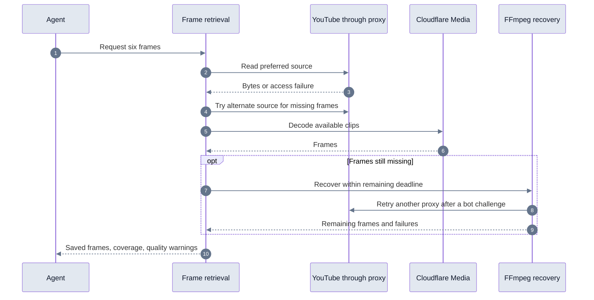

# Frame recovery validation, October 4, 2026

## Result and scope

Seven production extraction batches across three videos returned all 42 requested
frames. Each batch completed in one `get_video_frames` call, including four batches
on the previously failing video. The first six used previously unrequested
timestamps; the seventh explicitly refreshed existing evidence. A separate cache
check returned another six frames. All 48 private previews returned HTTP 200 with
JPEG bytes. One additional request failed classification before reaching any tool.
That failure is retained below and prevents declaring the whole agent ready to ship.

This validates recovery for the observed bot challenges and blocked adaptive
ranges. It does not establish a failure-rate SLA, sustained concurrency capacity,
or a sub-10-second latency guarantee. The failing video still needs FFmpeg and
lower-resolution sources. Successful extraction is separate from successful visual
analysis; the six-frame analysis bug found during these checks is described below.

## What changed

The Worker prefers the sharpest supported source, then prioritizes progressive
MP4 when that source fails. The caller retains completed frames and resumes source
discovery only for missing timestamps. At most three prepared sources and four
proxy routes share the existing Media deadline and 40 MiB source-read bound.
Cancellation, admission limits, source validation, and the FFmpeg time reserve
remain enforced.

The frames container can now move to another configured proxy after a confirmed
bot challenge. Ordinary authentication restrictions do not trigger this retry.
Media source discovery records the same safe bot-challenge category. Reading an
index alone no longer reports a proxy success, and failed frame reads cannot clear
a cooldown. A format-specific 403 does not mark the whole proxy rate limited.

Before this fix, a bot challenge could end the tool call and leave the agent to
retry it; recovery now stays within the original request budget.

## Production frame tests

All requests used maxWidth 1280 except the explicit 360p control, which used 640.
Tool times include retrieval, catalog publication, session attachment, and private
preview creation. They exclude model classification, visual analysis, and answer
composition. A 1280 width limit is a ceiling, not a guarantee of 720p output.

| Run | Video | Requested timestamps in ms | Decoder path | Returned quality | Complete tool time | Coverage |
| --- | --- | --- | --- | --- | ---: | --- |
| `b08aef74-dd9d-4a0b-a1ba-05c8c1625e3f` | `tXcT3OE7G1g` | 56375 + 30,000 × 0…5 | Media + FFmpeg | 480p/360p | 26.141s | 6/6 |
| `7d413786-ec7c-453b-ba94-a7c020c433db` | `tXcT3OE7G1g` | 57625 + 30,000 × 0…5 | Media + FFmpeg | 480p/360p | 41.012s | 6/6 |
| `e222c83a-7c61-4e79-bc44-33f3eb783903` | `dQw4w9WgXcQ` | 58875 + 30,000 × 0…5 | Media | 720p | 9.502s | 6/6 |
| `fe56f78d-b506-4e64-a87f-78911f3de335` | `dQw4w9WgXcQ` | 59625 + 30,000 × 0…5 | Media | 360p | 10.613s | 6/6 |
| `8e5454d4-7567-428f-ae64-f6f6bd8b957d` | `tXcT3OE7G1g` | 58125 + 30,000 × 0…5 | Media + FFmpeg | 480p/360p | 29.349s | 6/6 |
| `f354de12-2ccd-4eb2-b11c-a771bd5d0ef1` | `Ct-mtWqV3Ro` | 60375 + 30,000 × 0…5 | Media + FFmpeg | 360p | 24.701s | 6/6 |
| `d282ac4d-1f73-4c47-ba21-5b8889ae24b8` | `tXcT3OE7G1g` | 58125 + 30,000 × 0…5 (refresh) | Media + FFmpeg | 480p/360p | 23.002s | 6/6 |

The first two failing-video batches encountered confirmed bot challenges inside
FFmpeg recovery and successfully advanced to another proxy. The second also
advanced past bot-challenged routes inside Media source discovery. The 720p control
completed entirely through Media in 9.502 seconds. The 360p control used progressive
format 18 entirely through Media in 10.613 seconds, confirming this format can use
managed decoding without FFmpeg.

For `tXcT3OE7G1g`, format 136 adaptive reads repeatedly returned 403. Its progressive
format 18 was accessible but rejected by the bounded MP4 preparation path, before
Cloudflare decoding. An alternate 480p source supplied one frame; FFmpeg supplied
the remaining five at 360p. This remains supported fallback behavior, not a claim
that Media supports every progressive file. The exact parser restriction for this
video was not established by the safe stored diagnostics.

The original run `fe52fe8c-6b51-4864-9ef8-b987a250b791` used three frame-tool calls
and 43.987 seconds of combined tool work, excluding model delays between calls.
Its first call failed, its second returned one frame, and its third returned five.
The new batches returned all six inside one call, but recovery still took 23–41
seconds on that video. Extra containers or decoder workers would not remove its
YouTube access failures.

## Deployment

- Worker `fbec2562-2fd4-4e9a-b869-79ce3b183a2d` introduced recovery.
- Worker `72e7d024-0e31-4eba-bca3-27b57b46bf8e` prioritized progressive recovery.
  All subsequent extraction tests use this behavior.
- Worker `7409f071-1a70-4bf4-a6e1-85c85880e688` added analysis-batch scope.
- Current Worker `61f4983a-16a3-4c83-bb3c-c0189d2c3175` adds six findings and
  individual image labels. The refresh and cache rechecks below use this version.
- Frames application `video2ctx-youtubeframescontainer`, version 97, completed its
  rollout with no health errors. Image digest:
  `sha256:3d4083f5d02a60bdf7ce6bf5585b6261b41ee0db4b230b861cbc4e2a957cbd0e`.
- The processor image was pinned to its existing digest during the container
  deployment. Wrangler reported no processor changes. No D1 migrations, secrets,
  container size, or instance-count changes were made.

## Additional analysis issue

Despite receiving six image attachments, the visual analyst repeatedly described
the sixth image as absent. The analysis schema allowed only five findings. A test
returning six individually grounded findings reproduced a schema rejection.
Explicit batch-scope guidance alone did not fix the live symptom. Run
`8e5454d4-7567-428f-ae64-f6f6bd8b957d` returned all frames but a partial answer.

The analyst now accepts six findings and labels each JPEG immediately before its
attachment with its one-based image number and timestamp. The prompt distinguishes
selected-batch scope from extraction coverage. Model claims about missing images
must not be mistaken for a provider failure.

On the final deployment, refreshed run `d282ac4d-1f73-4c47-ba21-5b8889ae24b8`
and cached control `f9677d69-6e7c-4e83-a24e-0501ffb007c8` each described all six
timestamps in one analysis call. Neither claimed an image was missing. Both
finished with `answered` outcomes. The cache control took 3.750 seconds for frame
retrieval and previews; it is not included in fresh extraction latency. These
checks establish complete descriptions, not independently graded visual accuracy.

## Remaining launch blocker

Run `794f5142-153f-4d36-8f6d-67fcf93938af` failed with an invalid classifier
`route` after one repair. It executed zero model research steps and zero tools,
so it is not a frame extraction failure. A repeat request completed successfully,
but retry success does not resolve the classifier defect. The classifier was not
changed in this frame fix. Investigate its candidate and repair diagnostics and
add a regression before claiming end-to-end launch readiness. The local issue is
tracked as `frame-reliability/issues/01-invalid-classifier-route.md`.

## Local verification

Verification passed: 1,277 Node tests, 4 catalog integration tests, 180 Worker
integration tests, 49 processor tests, 49 frames-container tests, and 38
authentication/billing tests, totaling 1,597. The full Node suite and TypeScript
were rerun after the final analyst correction; the unchanged integration and
container suites passed earlier. There were 39 skipped Node tests. Documentation
consistency checks also passed.

Regression coverage includes blocked high-resolution sources, progressive fallback
order, retaining completed frames, limiting source attempts, proxy-health reports,
bot challenges reaching the fourth route, ordinary auth restrictions, exhausted
budgets, cancellation, and preserving shared admission leases.
