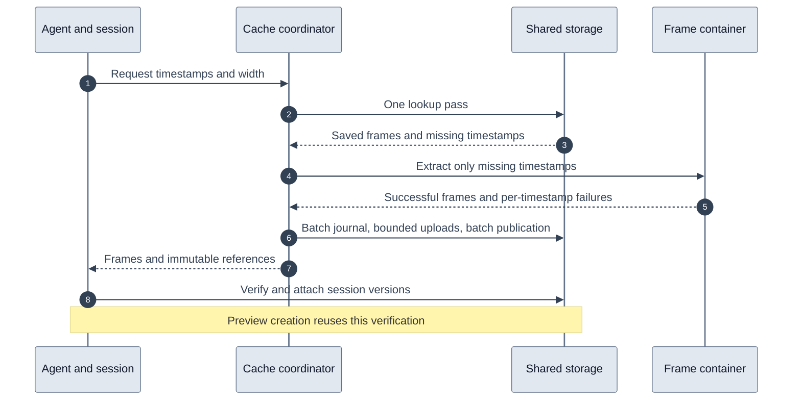

# Frame retrieval storage improvements

Frame retrieval now uses the same single-pass cache lookup, batched catalog writes,
and preview verification reuse as storyboard retrieval. The application owns these
storage operations. The frame container still performs one extraction job for all
missing timestamps; its media extraction, proxy selection and timeout policy are
unchanged.

## Request flow

The outer provider delegates catalog lookup to the coordinator. The coordinator
reads current frame versions in one D1 batch and, where necessary, historical
versions plus one video activity update in a second batch. A request-local result
retains successful hits, missing timestamps and lookup duration. The loader uses
that result directly, preserving the original timestamps of cached assets.

Only missing timestamps are extracted. Successful frames from a partial response
are saved together using one journal batch and one publication batch, with no more
than four R2 uploads active at once. Uploads finish before publication. Started
uploads drain on failure, completed assets remain reusable, and journal recovery
handles interrupted publication.

Session attachment still verifies exact source versions. Newly pinned frames pass
request-local image verification to preview creation, which skips HEAD only when
both image identity and R2 bucket match. Existing session hits and unverified paths
retain the HEAD fallback. Private preview writes and revocation remain unchanged.
Explicit frame refresh now bypasses session hits, and cancellation propagates into
session pinning so completed shared extraction cannot attach evidence after an
aborted request.



Repeated catalog passes and per-frame D1 write calls are removed. All storage,
verification and extraction components remain.

## Simulation and regression results

The cold simulation runs the actual provider, coordinator and catalog SQL with
SQLite, in-memory R2 transport and a mocked extraction backend. It failed on the
previous implementation with 54 lookup-related SQL statements before extraction.
It now passes with 13 statements in two D1 batches.

| Six-frame cold request | Before | After |
| --- | ---: | ---: |
| Catalog lookup passes | 3 | 1 |
| Lookup SQL statements | 54 | 13 |
| Lookup D1 transport calls | 54 individual calls across concurrent frames | 2 batches |
| Journal/publication D1 calls | 12 | 2 batches |
| Preview HEAD requests after new session verification | 6 | 0 |
| Successful extraction jobs | 1 | 1 |

The 13 lookup statements comprise six current-version queries, six historical
queries, and one activity update. SQL statement counts are not sequential wait
counts. The two write batches contain seven journal/activity statements and twelve
publication statements. R2 JPEG and JSON uploads are still required.

Tests also cover coalescing, partial extraction and retrying only failed timestamps,
width variants, warm reuse, refresh failure without stale fallback, bounded uploads,
draining failed batches, prompt extraction diagnostics, and cancellation during
extraction and pinning. Local workerd tests follow six frames through real D1/R2
storage, session verification and preview creation with zero HEAD calls.

Validation from `platform/`:

```sh
npx vitest run
npm run test:video-catalog
npm run test:user-account
npm --prefix youtube-frames test
npm run build
```

Results: 1,085 unit tests passed with 38 skipped, 145 local Cloudflare integration
tests passed, 45 frame-container tests passed, and the TypeScript build passed.
These are correctness and operation-count simulations, not production latency
measurements.

## Rollout

Only the platform Worker needs deployment. No container image, schema migration,
secret or library release is required. Shared-cache hits now pass through the
coordinator RPC; an RPC failure falls back to a complete saved catalog selection,
marked stale. Missing selections and explicit refresh still fail. Existing session
hits continue to reuse session evidence.

After deployment, compare cold, partially cached and warm frame requests. Existing
frame diagnostics retain catalog lookup/write times, session lookup/pin times,
provider time and preview time. The loader now reports the coordinator's actual
lookup duration instead of measuring another lookup. Production replay is still
required to quantify the elapsed-time improvement, including container startup and
media extraction.

## Persisted diagnosis

Both visual tools now save bounded `visualDiagnostics` on retrieval artifacts and failed tool traces. Request-local spans distinguish session work, coordinator wait, extraction, catalog calls and previews. Shared coordinator work has a separate operation ID and clock, with links from each caller. Counters measure dispatched catalog D1/R2, preview R2 and container operations. Overlapping children use interval union; late work cannot mutate the completed snapshot. Diagnostics remain outside model output and shared KV/catalog content. Private traces and session evidence packets retain them.

Historical traces without these diagnostic fields remain incomplete.

Validation for this addition: 1,090 platform unit tests, 4 catalog integration tests, 142 session/runtime integration tests and TypeScript compilation. The existing container suites passed earlier in this change. Production replay and the 10-second target remain unverified until deployment.
