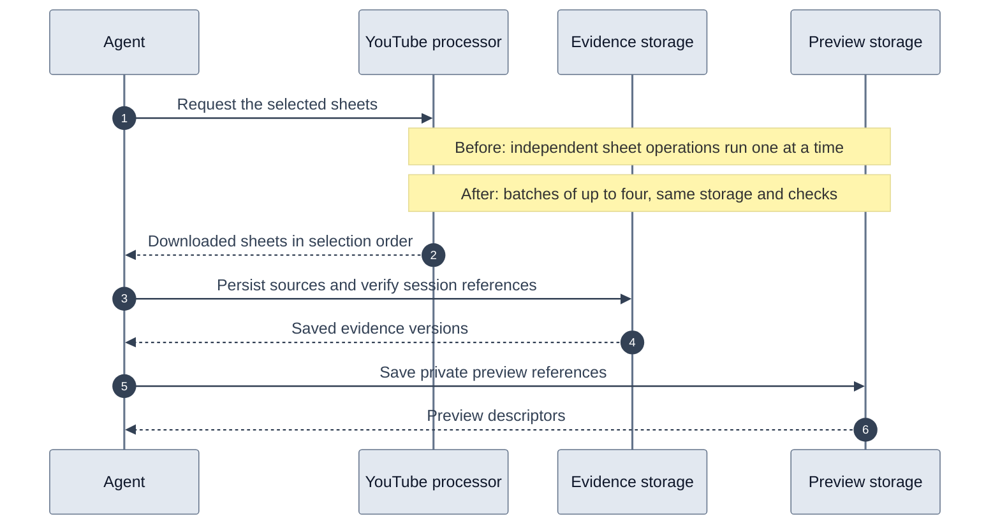

# Storyboard latency and rollout

A storyboard request retrieves sampled images from YouTube, saves shared evidence,
attaches immutable references to a session, and creates private preview references.
YouTube supplies the images. The application owns persistence, integrity checks,
preview access, and deadlines.

## What changed

Independent downloads, storyboard saves, session lookups and pins, and preview
writes now run in batches of at most four. Results retain input order. A failed
batch settles all started work before returning its error. Later batches do not
start, and preview cleanup waits for outstanding uploads. Successful shared source
writes remain available for retries. Session generation checks still prevent a
concurrent deletion from restoring evidence.

The initial video row and pending asset version now share one atomic D1 batch.
Images still precede their JSON manifest, and publication still follows the R2
writes. Recovery and historical-only publication use the same ordering.

Fresh storyboard metadata is parsed before both persistence and return. Previously,
the provider's extra `level` field survived in the returned metadata but was removed
from its stored representation. Session verification could reject that first result.
The fix preserves the existing schema and all source-integrity checks.

Concurrency changes how independent work is scheduled; no storage component is removed.

## Measurements and limits

Video `Fls_onRviPM`, twelve sheets with 548,280 JPEG bytes:

| Experiment | Sequential baseline | Batches of four |
| --- | ---: | ---: |
| Local processor extraction through configured proxy | 5.084 s | 2.370 s prototype; 2.635 s final implementation |
| Cached read, integrity checks and previews, trial 1 | 16.753 s | 5.948 s |
| Same cached comparison, reversed test order | 18.057 s | 5.686 s |

The extraction prototype returned identical image bytes, selection and ordering.
The final committed processor bundle also retrieved all twelve sheets successfully.
The control video `6vzKDtKs5EM` returned its five sheets in 1.537 seconds in the final
live check.

Storage comparisons used the original application functions with a local workerd
process, real Cloudflare assets and temporary preview keys removed after each test.
Development relay latency is included. The concurrency prototype performed the
same 25 D1 lookups, 49 R2 gets, 12 heads and 12 preview writes as the serial baseline.
It did not measure cold catalog persistence, session SQLite updates, trace storage,
agent planning or visual analysis. These small samples are not production p95 figures.
Do not add extraction and cached-storage numbers and label the sum a cold run.

This PR retains the verification reads. Sharing verified payloads across the provider,
coordinator and session boundaries would require a separate lifetime/ownership design;
the measured concurrency improvement does not depend on weakening verification.

## Validation and production check

Regression tests cover fresh metadata pinning, bounded download order, draining
failed batches, preview rollback and cancellation, and session deletion during
concurrent storyboard pinning. Existing recovery tests exercise failures after R2
writes but before publication. Platform unit tests, local Durable Object/catalog
integration tests, extraction-library tests, processor tests, type checks, bundle
checks and documentation generation checks pass.

No schema migrations or new secrets are required. Deploy both the platform Worker
and the processor image containing the regenerated storyboard bundle. No npm release
is needed for that committed container bundle. Generated local skill bundles are
updated too; the independently published library follows its normal release process.

After deployment, test the original question in a new agent session. Inspect
`youtube_storyboard_retrieval.data.timingsMs` in the tool trace for retrieval, previews
and total milliseconds. Retrieval includes an automatic metadata call when needed;
it overlaps nested metadata timings and should not be summed with them. These values
end before outer tool tracing and billing persistence. Worker event
`storyboard_stage_timing` adds catalog-write, session-lookup and session-pin detail.
Retrieval and preview events carry run/tool IDs. Inner stages carry video ID; use the
enclosing Worker invocation to correlate concurrent runs. Provider diagnostics retain
player/download and retry information.

Verify both a complete uncached request and a cached request before claiming a
sub-ten-second production target. Confirm that saved images can be analysed, and
that the original clothing question receives visual evidence. Provider variability,
container startup, source persistence and model analysis remain separate concerns.
