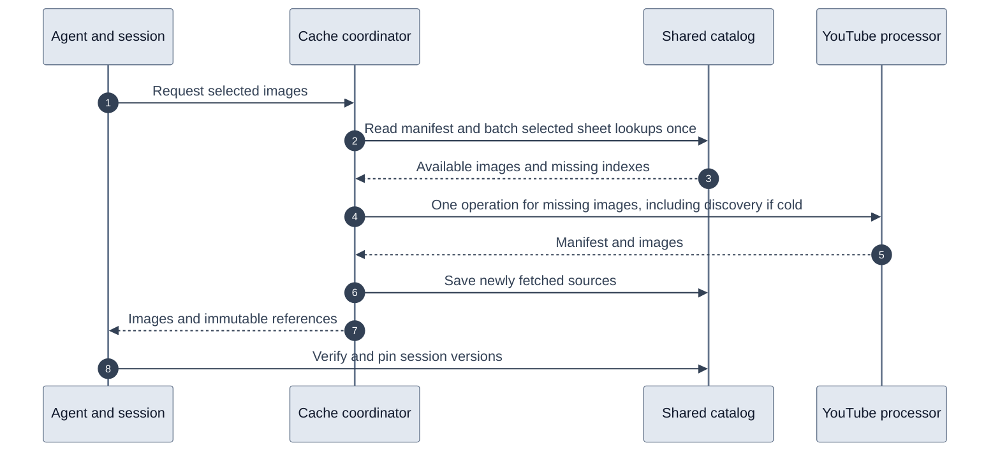

# One-pass storyboard retrieval

Storyboard selections now check the shared catalog once, retain partial hits, and
fetch missing images in one processor operation. On a cold request, that operation
also discovers the manifest. The application still saves immutable sources,
verifies session references, and creates previews. The container handles YouTube
metadata discovery and downloads within that single operation.

## Changes

The tool no longer recursively requests metadata before an image selection. The
session provider derives and pins the manifest from the combined response, then
pins its images. Explicit metadata-only calls still work. A known session manifest
still lets the tool reject invalid selections before calling the provider. On a
cold request, the processor validates selections against the discovered manifest.
The tool records one provider usage entry for a combined selection.

The outer provider delegates storyboard catalog lookup to the request coordinator.
The coordinator passes a request-local lookup, including partial hits, to the
loader. No process-global cache or cross-request image lifetime is introduced.
Concurrent identical misses still coalesce. Batched D1 reads check current pointers
in one call and missing historical versions in a second call, sharing one activity
update per video. R2 reads remain bounded to four concurrent assets.
Shared-cache hits now pass through the coordinator RPC, so warm latency also needs
checking after rollout. On an RPC failure, the Worker reads the catalog and serves
a complete saved selection as stale; missing selections and explicit refresh still
fail. Metadata-only hits keep the Worker fast path. Reuse of already pinned session
assets stays local to the session path.

Successful cold and explicit-refresh selections use one container invocation. Existing
metadata lets the loader request only missing sheets. Legacy KV promotion includes
both manifest and sheet references with their original timestamps. Saved JPEGs,
JSON manifests, write journals, publication ordering, session reference verification,
and generation/cancellation checks retain their existing behavior.



The former metadata-only container call and repeated catalog passes are removed.
All storage and verification components remain.

## Storage follow-up

A selection now journals all sheet versions in one D1 batch, uploads each JPEG
before its JSON manifest with at most four assets in flight, then publishes the
completed versions in one D1 batch. A failed upload drains its started siblings
and publishes successful assets before rejecting. Later upload groups do not start.
A failed publication leaves the journal available for reconciliation. Single-asset
and historical writes share the same preparation and publication SQL as batches.

Cold metadata and sheet persistence now run concurrently. Both finish before the
caller receives success or failure, so metadata failure cannot leave unobserved
sheet writes in flight. They remain separate assets with independent publication.

Session attachment still reads and compares the exact shared payload. That read
can now issue a request-local `VerifiedImage` after matching the JPEG bytes to their
content-addressed key. Preview creation accepts this evidence only for the same
R2 bucket and image key, eliminating a repeated HEAD call. The evidence is neither
persisted nor included in tool output. Serialized objects, different buckets,
different images, and paths without this evidence retain the HEAD check. Existing
saved-session hits currently use that fallback. Private preview writes, rollback,
and revocation are unchanged; the session verification reads are still required.

## Simulation results

Tests execute the actual provider/cache/loader functions and catalog SQL with a
mocked external processor. Additional integration tests use local workerd, D1, R2,
and Durable Objects. They do not contact YouTube or measure production latency.

| Scenario | Before | After |
| --- | ---: | ---: |
| Cold selection, successful container invocations | 2 | 1 |
| Partial-cache selection, catalog lookup passes | 3 | 1 |
| Eight missing sheets, sheet lookup SQL statements | 72 | 17 |
| Eight missing sheets, D1 transport calls for sheet lookup | 72 individual calls across parallel sheets | 2 batches |
| Concurrent identical cold selections | Coalesced | Coalesced, one extraction |
| Complete saved selection | No extraction | No extraction |
| Eight new sheets, journal and publication D1 calls | 16 | 2 batches |
| Cold metadata and sheet persistence | Sequential | Concurrent, both drained |
| Eight newly pinned sheets, preview R2 HEAD calls | 8 | 0 with matching verification evidence |

The 17 sheet statements are eight current-pointer SELECTs, eight historical
SELECTs, and one activity upsert. The manifest lookup is additional. The old 72
statements were three passes of eight sheets with three statements per miss;
they were not 72 sequential network waits. A fully cold request with no saved
manifest skips sheet lookups entirely.

Regression coverage includes partial reuse, refresh and refresh failure, legacy
promotion, exact shared-version pinning, metadata-only requests, invalid known
selections, missing images, historical fallback, and deletion/cancellation during
both extraction and session pinning. Existing journal recovery tests still run.

Validation commands, run from `platform/`:

```sh
npx vitest run
npm run test:video-catalog
npm run test:user-account
npm --prefix youtube-processor test
npm run build
```

After the storage follow-up, the full unit run passed 1,081 tests with 38 skipped.
Local Cloudflare suites passed 141 tests and the final TypeScript build passed.
The processor's 39 tests passed during the earlier container-call consolidation;
no processor code changed in the storage follow-up. New tests cover journal and
publication failures, partial upload recovery, write overlap, drain-on-failure,
and preview verification matching, fallback and serialization. Local workerd tests
exercise the verified-read path through real session pinning and preview creation.

`storyboard_stage_timing` now includes `catalog_lookup`, covering manifest lookup,
sheet queries and hydration. Existing container attempt/timing events distinguish
container startup/transport from extraction. Existing catalog-write, session-pin,
and preview timings remain available. Correlate inner stages using the enclosing
Worker invocation and video ID.

## Rollout and remaining measurement

### Follow-up: concurrent videos

Production run `7fb4a7e5-0e17-4ed8-9a48-bb1b31d36952` on October 4 confirmed
the one-pass lookup and preview verification improvements were deployed. Its two
six-sheet storyboard tools took 18.78 and 35.54 seconds. Both tools started together,
but the second waited 14.95 seconds in the session provider's shared visual queue
before its lookup began. This was the entire first video's retrieval and session
attachment interval. The first video's preview writes overlapped the second retrieval.

The session provider now admits two different videos at a time. Storyboard and
frame requests for the same video remain ordered, so overlapping selections can
reuse pinned assets and refresh decisions. A waiter for a busy video does not
consume the other slot. A canceled queued request rejects immediately and never
dispatches extraction. An active request retains its slot until its work settles.
Session generation checks still invalidate both active and queued work after deletion.
The new `session_queue_wait` diagnostic span isolates admission time from retrieval.

Deterministic integration tests hold one video's extraction open and require the
other to complete, covering storyboards, frames, and a mix of both. The storyboard
test failed with the global queue and passes with bounded admission. Queue tests
cover the two-video limit, ordering, cancellation, failures, and diagnostic isolation.
These tests do not establish a new production latency figure.

Shared source writes, session integrity verification, and private preview references
remain required. In the measured run they took roughly 11–12 seconds per video.
The second video's first proxy attempt also hit a YouTube bot challenge before
another proxy succeeded. This change addresses the independent-video queue; it
does not claim that cold retrieval now meets the ten-second target. Verify that
with a deployed cold run and a saved-asset follow-up.

### Deployment

Only the platform Worker needs deployment. No processor image, library release,
schema migration, secret, or container-size change is needed. The deployed processor
already supports combined discovery and downloads.

A production cold and warm replay is still required to verify the ten-second goal.
Simulations confirm removal of duplicate work, not production elapsed time. The
remaining container startup, YouTube latency, source writes, session verification,
and previews must be measured after deployment. Do not add earlier isolated timing
samples and present their sum as a measured end-to-end improvement.

## Review corrections

The Worker catalog and session provider share one selection function. A one-sheet
spread selects the middle sheet, matching the deployed processor. Invalid selections
include available sheet indexes and timestamp bounds. A cold selection rejected by
the processor makes one metadata-only recovery request for that guidance; it does
not download images again, and preserves the original error if metadata fails.

Catalog hit/miss counters count images, excluding the manifest. Storyboard tools
record requested image counts once metadata is available. Batch session spans and
per-asset spans have distinct names; use exclusive durations for aggregation across
nested stages. Image hashing for preview proofs is opt-in during session pinning.
Normal catalog reads still verify JSON integrity without computing unused image proofs.

Diagnostics stay out of shared KV/catalog content and model output. Private tool
traces and session evidence packets retain them.

Review validation: 1,110 platform unit checks passed, including the regenerated
OpenAPI check; 147 local Cloudflare integration tests, 39 processor tests, 45 frame
container tests, and TypeScript compilation passed. The new simulations cover
single-sheet cold/warm/refresh retrieval, restored-session reuse, coordinator outage
fallback, range guidance, and opt-in image verification. Production replay remains
required after deployment.
