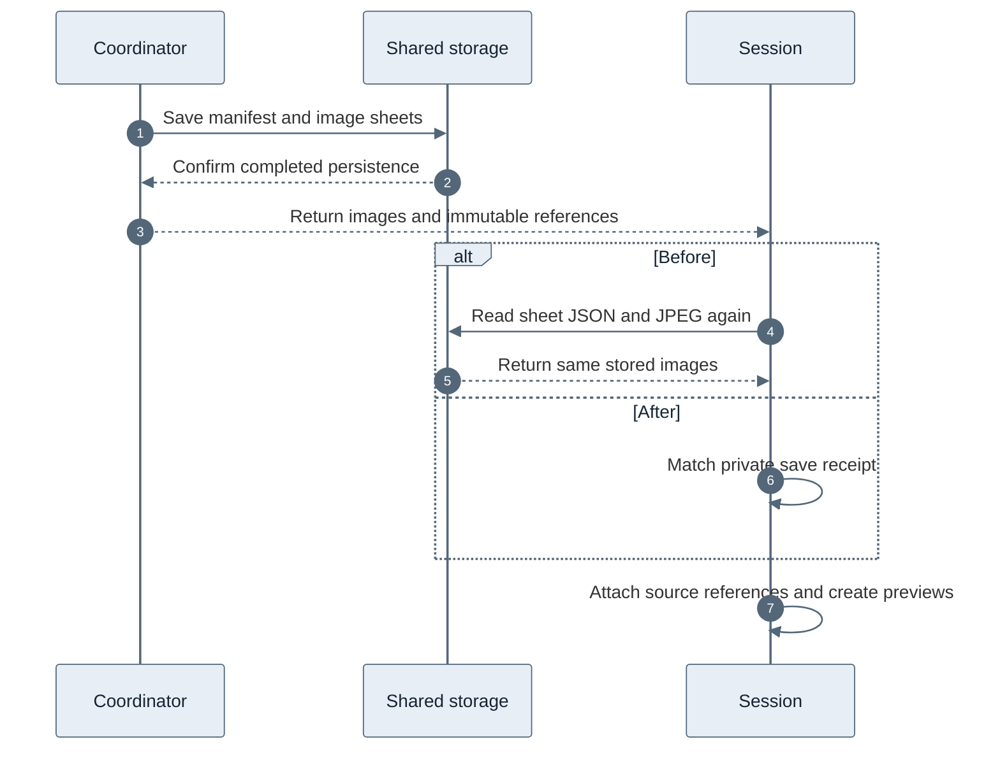

# Storyboard session attachment without image readback

A storyboard already contains image sheets supplied by YouTube. The processor
fetches those sheets, and the application saves them in the shared catalog before
attaching them to a session. This change removes redundant storage operations
between that completed save and the tool response.

## Before and after

Previously, session attachment downloaded each newly saved sheet's JSON and JPEG
again. That verified the shared version, even though the private coordinator had
just confirmed its completed save and returned the same bytes. Saved-session
reads also downloaded the images, then issued separate HEAD requests before
creating previews.

The provider creates a private, request-local receipt only when the reconstructed
per-sheet source hashes to the returned catalog reference. Persistence and receipt
verification share the same serializer and per-sheet source builder. Session attachment checks that receipt against
the bucket, immutable reference, video identity, image bytes, and grid mapping.
A match avoids the repeated downloads. The manifest still uses independent
storage verification. Restored sessions hash the JPEGs they already download and
carry that verification into preview creation, avoiding the extra HEAD requests.

Shared storage and session references remain; only the redundant sheet reads are
removed from new-save attachment.

## Measured storage operations

A local workerd integration test uses real D1, R2, and Durable Object bindings,
with a stub coordinator that performs real catalog saves. Its fixture has six
sheets. The production diagnostic counters measure these operations:

| Phase | Before | After |
| --- | ---: | ---: |
| Cold attachment: catalog R2 GETs | 13 | 1 |
| Cold previews: shared R2 HEADs | 0 | 0 |
| Restored selection: catalog R2 GETs | 13 | 13 |
| Restored previews: shared R2 HEADs | 6 | 0 |

The regression failed on main with 13 GETs where the new behavior requires one.
The six-HEAD fallback is also measured with the same fixture without preview
verification receipts. Shared writes and private preview writes are unchanged.
The test isolates session
attachment and preview overhead; it does not emulate YouTube or measure container
startup, proxy latency, or production R2 latency. An identical refresh that aliases
existing session evidence retains the existing preview HEAD fallback rather than
adding image downloads solely to create verification receipts.

## Trust and compatibility

Receipts have private fields and exist only within a request. A serialized object
cannot authorize the fast path. Cache hits, coalesced or stale results, missing
references, and legacy results still use storage verification. A mismatched
receipt falls back to the verifier, which rejects changed bytes or mapping.
Only metadata, selection, and freshness envelopes can differ. Receipts retain a
snapshot of the verified source, so session overrides contain only actual changes.
An oversized override falls back to normal storage verification in both storyboard
and frame paths. Envelope size limits and cancellation/session-generation checks
remain in effect.

Partial-cache misses can include verified older sheets as well as newly saved
sheets. Matching per-sheet hashes permit receipts for both. Merged warning metadata
may differ from an individual stored source, in which case readback verifies the
projection. Normalization strips unknown content fields while preserving the
supported freshness and provider metadata.

Tests cover cold and restored selections, receipt serialization, byte/reference/
bucket/mapping mismatches, extra payload fields, envelope changes, oversized
envelopes, fallback results, cancelled requests, session deletion, and coordinator
save failures. Existing partial-selection tests remain in the suite.

## Rollout and remaining work

This is a Worker-only change. No migration, container build, proxy setting, or
storage-format change is required. The change was deployed for the authorized production validation below.
The measured operation reduction holds in production, but complete retrieval
latency remains above ten seconds for fresh source requests in this sample.

Container download retries, shared-storage writes, and preview writes still
contribute to latency. This change does not promise a sub-10-second tool response
or address upstream partial-download recovery.

## Production validation

On October 4, 2026, the owner authorized a direct Wrangler deployment and live
production tests. Baseline Worker: `e889d1fe-8a16-4dc2-9138-34272bc6660d`.
Tested Worker: `5d6a0f0d-f3ff-4d21-bbe7-f26f070eec71`, deployed at
17:30:40 UTC to 100% of traffic from implementation commit `d0b5dad`.
The deployment used `--containers-rollout=none`. No container image, migration,
or secret changed. This deployment remains active.

The timings below precede the review hardening that adds the explicit hash check.

The tests used the authenticated production agent API and its real storyboard
tool. Fresh requests explicitly requested source refresh; classification confirmed
`refreshEvidence: true`, coordinator diagnostics confirmed `miss`, and each made
container requests. Follow-up requests selected the same sheets by explicit
indexes without refresh. Those requests confirmed `sessionReused: true`, made no
container calls, and had newly recorded diagnostics rather than replayed timings.
Requests ran sequentially. Video A is `Fls_onRviPM`, selecting six of 13 sheets at
indexes 0, 2, 5, 7, 10, 12. Video B is `6vzKDtKs5EM`, selecting all five available
sheets. The requested bound was six in both fresh tests.

| Case | Sheets | Extraction attempts | Complete storyboard tool | Whole agent run, polled |
| --- | ---: | ---: | ---: | ---: |
| Before: fresh A | 6 | 2 | 23.622 s | 67.379 s |
| Before: fresh B | 5 | 1 | 13.003 s | 47.105 s |
| Before: saved A | 6 | 0 | 6.485 s | 33.234 s |
| After: fresh A | 6 | 1 | 11.076 s | 48.380 s |
| After: fresh B | 5 | 3 | 17.523 s | 46.638 s |
| After: fresh B repeat | 5 | 2 | 13.862 s | 41.832 s |
| After: saved A | 6 | 0 | 7.438 s | 47.499 s |
| After: saved B | 5 | 0 | 7.067 s | 32.782 s |

Tool time includes retrieval, completed shared writes, session attachment, and
preview creation. It excludes model reasoning and final-answer generation. The
agent column includes these phases and polling delay; it is not a measure of the
storyboard optimization alone.

All five post-deployment tool calls returned every selected sheet and created
previews. Twelve preview GET checks across the five new runs and one baseline
run returned HTTP 200, `image/jpeg`, and complete JPEG markers. This also verified
that old previews remain readable. Some agent answers were marked partial or
visually incomplete because these prompts requested retrieval and coverage only,
without image analysis. None of the five storyboard calls failed or returned
fewer sheets than its resolved selection.

### What improved, and what did not

- New-save attachment reduced catalog R2 GETs from 13 to 1 for A and from 11 to
  1 for B. The sheet-pinning span fell from 3.126 / 2.588 seconds to 0 milliseconds
  recorded, with no sheet readbacks. Zero is the timer reading, not a claim that
  hashing or local session work has no cost. Manifest verification remains.
- Saved-session preview HEADs fell from six to zero for A; B also needed zero.
  Saved JPEG reads remain. The paired A tool time increased from 6.485 to 7.438
  seconds despite eliminating HEADs. These samples do not demonstrate a saved-session
  wall-clock improvement.
- The fresh A total fell from 23.622 to 11.076 seconds, but the baseline needed
  two extraction attempts and the new run needed one. Do not attribute the
  complete reduction to this PR. B increased from 13.003 to 17.523 seconds with
  three attempts, then took 13.862 seconds with two attempts.
- Failed extraction attempts recorded YouTube `LOGIN_REQUIRED` bot challenges
  across player profiles, ending as `UNAVAILABLE` / HTTP 503. Later attempts
  succeeded. These were internal extraction retries, not repeated agent tool
  calls. The behavior occurred both before and after deployment.
- Fresh post-deployment catalog writes took 3.909, 3.933, and 4.476 seconds.
  Preview writes took 3.201, 3.166, and 3.332 seconds. Together they account for
  roughly 7–8 seconds in addition to extraction and other application overhead.

The change is verified to remove redundant work and preserves successful source
attachment and preview serving. It is **not a consistent sub-ten-second solution**:
all three fresh post-deployment calls exceeded ten seconds. The next latency
experiment should reduce successive storyboard catalog/preview write rounds with
bounded concurrency. Recurring player bot challenges need a separate reliability
investigation. This small two-video sample is not a load test or latency percentile.

### Run evidence

- Before: fresh A: `6c86b91e-0082-4be4-9e26-11fd4a736899`.
- Before: fresh B: `23dfd918-e6cb-4abd-adc8-d4d498f965e2`.
- Before: saved A: `0ae083a9-2d8a-411c-aed1-912b4be7a3c8`.
- After: fresh A: `904db2d4-02f0-406d-ad22-35cc19c79422`.
- After: fresh B: `796c2752-b5c2-4092-b902-85b65d862325`.
- After: fresh B repeat: `de3269a8-b278-45b2-a612-9801d1892c3a`.
- After: saved A: `70283008-3f82-48f9-969f-71a7c9921cf6`.
- After: saved B: `883d6cb3-e827-4305-9c59-567e848b99d5`.
