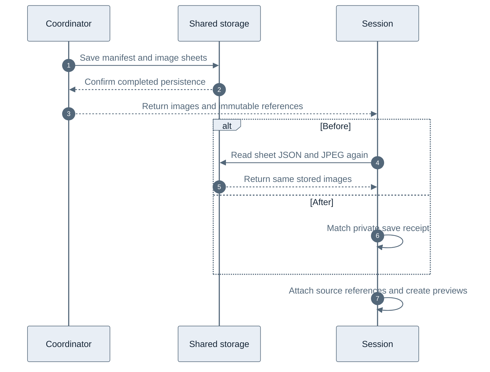

# Storyboard session attachment without image readback

A storyboard already contains image sheets supplied by YouTube. The processor
fetches those sheets, and the application saves them in the shared catalog before
attaching them to a session. This change removes redundant storage operations
between that completed save and the tool response.

## Before and after

Previously, session attachment downloaded each newly saved sheet's JSON and JPEG
again. That verified the shared version, even though the private coordinator had
just confirmed its completed save and returned the same bytes. Saved-session
reads also downloaded the images, then issued separate HEAD requests before
creating previews.

The provider now creates a private, request-local receipt for each returned sheet
with an exact catalog reference. Session attachment checks that receipt against
the bucket, immutable reference, video identity, image bytes, and grid mapping.
A match avoids the repeated downloads. The manifest still uses independent
storage verification. Restored sessions hash the JPEGs they already download and
carry that verification into preview creation, avoiding the extra HEAD requests.

Shared storage and session references remain; only the redundant sheet reads are
removed from new-save attachment.

## Measured storage operations

A local workerd integration test uses real D1, R2, and Durable Object bindings,
with a stub coordinator that performs real catalog saves. Its fixture has six
sheets. The production diagnostic counters measure these operations:

| Phase | Before | After |
| --- | ---: | ---: |
| Cold attachment: catalog R2 GETs | 13 | 1 |
| Cold previews: shared R2 HEADs | 0 | 0 |
| Restored selection: catalog R2 GETs | 13 | 13 |
| Restored previews: shared R2 HEADs | 6 | 0 |

The regression failed on main with 13 GETs where the new behavior requires one.
The six-HEAD fallback is also measured with the same fixture without preview
verification receipts. Shared writes and private preview writes are unchanged.
The test isolates session
attachment and preview overhead; it does not emulate YouTube or measure container
startup, proxy latency, or production R2 latency. An identical refresh that aliases
existing session evidence retains the existing preview HEAD fallback rather than
adding image downloads solely to create verification receipts.

## Trust and compatibility

Receipts have private fields and exist only within a request. A serialized object
cannot authorize the fast path. Cache hits, coalesced or stale results, missing
references, and legacy results still use storage verification. A mismatched
receipt falls back to the verifier, which rejects changed bytes or mapping.
Only metadata, selection, and freshness envelopes can differ. Envelope size
limits and cancellation/session-generation checks remain in effect.

Tests cover cold and restored selections, receipt serialization, byte/reference/
bucket/mapping mismatches, extra payload fields, envelope changes, oversized
envelopes, fallback results, cancelled requests, session deletion, and coordinator
save failures. Existing partial-selection tests remain in the suite.

## Rollout and remaining work

This is a Worker-only change. No migration, container build, proxy setting, or
storage-format change is required. After merge and deployment, compare the
existing `session_pin`, `previews`, and tool-level diagnostic timings for cold
and saved-session requests. The operation reduction is verified locally;
production wall-clock improvement has not yet been measured.

Container download retries, shared-storage writes, and preview writes still
contribute to latency. This change does not promise a sub-10-second tool response
or address upstream partial-download recovery.
