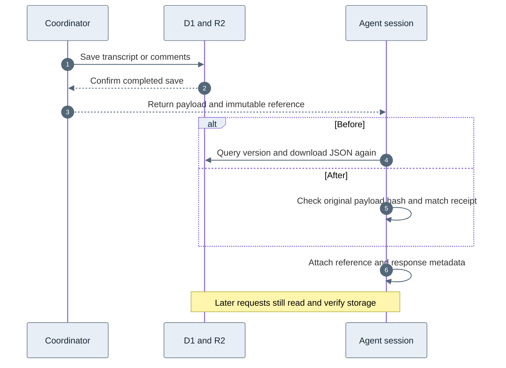

# Transcript and comment attachment receipts

Fresh agent retrievals already have the source in memory when the coordinator
confirms persistence. Session attachment then looks up the same immutable version
in D1 and downloads its JSON from R2. Removing that second read is worthwhile,
but the measured saving is around 0.15 seconds per source in this sample. It is
much smaller than the 7–8 seconds of storyboard catalog and preview writes
measured for PR #141.

## Production measurement

An explicitly authorized temporary Worker read four existing public catalog
assets through the production D1/R2 bindings. It called the actual
`SessionCatalog.pin` method with existing immutable references. It made no
storage writes, YouTube requests, model calls, or session changes. Authentication
used a separate random secret; requests without it returned 404.

The baseline at 18:23:42 UTC on October 4, 2026 measured three attachment reads
per asset. The final comparison at 18:28:17 UTC repeated those reads and compared
each result with the implemented receipt path. It included receipt creation,
content hashing, and `pin`, and required identical overrides and omissions.
All twelve comparisons passed. Both requests ran in Cloudflare's BOM location.

| Source | Stored JSON bytes | Segments/comments | Initial readback samples, ms | Final readback samples, ms |
| --- | ---: | ---: | --- | --- |
| Transcript `OKNmWvAzdLk` | 67,857 | 139 | 155, 148, 316 | 141, 172, 160 |
| Transcript `7AmK6QeiUY8` | 107,323 | 451 | 158, 149, 167 | 214, 159, 150 |
| Comments `e2rivwGE68I` | 11,497 | 20 | 152, 154, 159 | 160, 142, 155 |
| Comments `aircAruvnKk` | 11,476 | 20 | 136, 143, 158 | 144, 175, 135 |

Final median readback time was 159.5 ms for transcripts and 149.5 ms for comments.
A successful receipt removes one D1 query and one R2 GET per newly attached source.
It still hashes and compares the payload locally. The receipt's reported zero
milliseconds is **not** a CPU measurement: deployed Workers
[timers advance only after I/O](https://developers.cloudflare.com/workers/runtime-apis/performance/).
The final invocation used 113 ms of CPU across all setup, twelve normal reads,
and twelve receipt comparisons. That aggregate cannot isolate receipt CPU cost.

This is an attachment benchmark, not an end-to-end agent speedup or a load test.
The production agent may execute in another location. YouTube extraction,
coordinator writes, session indexing, model reasoning, and later evidence reads
remain outside the measured saving. The application Worker was not deployed
as part of this follow-up; live agent-route validation remains a rollout step.

The final benchmark identified itself as `receipt-v1` and ran Worker version
`48273aac-d0a5-4332-ab52-aae87cd2092a`. The temporary Worker
`video2ctx-text-attachment-probe-20261004` and its secret were deleted after testing.
Production application code and secrets were unchanged.

## Behavior and trust

The agent opts into a request-local receipt for transcripts, comment pages, and
all-comments collections. Only a successful coordinator `miss` with one matching
catalog reference can issue it. The original payload must match the stored hash
using the existing catalog serializer. This happens before response metadata can
change the storage shape. Hydrated objects can have different property order,
so reconstructing a receipt from an ordinary storage read is deliberately avoided.

The receipt binds the bucket, video, kind, variant, immutable hash, and a snapshot
of the source. Session attachment verifies the payload against that snapshot and
stores only the existing bounded envelope projection. Changed content, serialized
receipts, wrong references, and large overrides fall back to normal verification.
Cancellation and session-generation checks still guard the final attachment.

Shared storage and immutable session references remain; only immediate readback
of a verified fresh response is removed. Public API callers do not request or
compute receipts. Cache hits, coalesced responses, stale fallbacks, legacy results,
and restored sessions keep their existing read verification. There are no schema,
storage-format, migration, container, preview, retry, or concurrency changes.

## Reproduction and validation

`benchmark-worker.ts` preserves the read-only comparison. It requires a separate
Worker with `nodejs_compat`, `VIDEO_CATALOG` and `VIDEO_ASSETS` bindings, and a new
`BENCH_TOKEN` secret. Deploying it against shared resources requires explicit
operator authorization. POST with bearer authentication; do not mount it on the
application Worker. It selects the two newest complete assets of each kind, so
later runs can select different sources. Delete the temporary Worker afterward.
The JSON files contain only timings, counts, public video IDs, and invocation
metadata. No payloads, tokens, or request headers are retained here.

The regression first failed for both tools with one `readVersion` call where zero
was expected. Local Workers integration tests now verify no attachment readback
for fresh and refreshed saves, identical restored values, and one verified read
when restoring a session. Additional coverage exercises changed coordinator
payloads, bucket/reference mismatches, serialized receipts, cache states,
language and pagination variants, large metadata, cancellation, and deletion.

The full platform build and suite passed: 1,660 tests, with 39 intentional skips.
This includes 85 session-catalog tests, authentication integration, and both
container suites. Documentation checks also passed.
